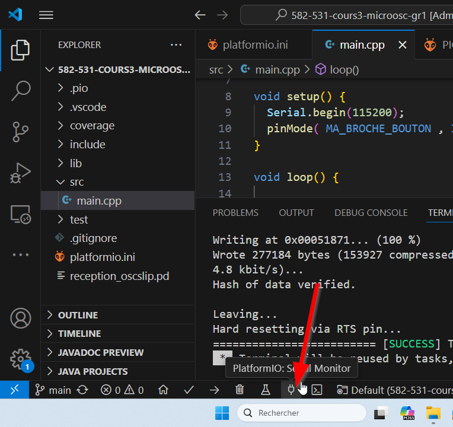

# Communication sérielle

Utilisé pour la communication entre la carte Arduino et un ordinateur ou d’autres périphériques.
Toutes les cartes Arduino possèdent au moins un port série (également appelé UART ou USART), et certaines en ont plusieurs.


## `Serial.begin()`

Définit le débit en bits par seconde (baud) pour la transmission de données série. À utiliser dans `setup()`.

Utiliser la fonction suivante **dans setup()** pour initialiser et configurer la communication série :
```cpp
Serial.begin(baud)
```
La fonction accepte les paramètres suivants :
- **baud** : le débit de communication en bits par seconde (baud). Type de données : `long`. Le débit utilisé dans les exemples de ce site est de `115200`.

### Moniteur série dans Visual Studio Code + PlatformIO 

Configurer le débit de la communication sérielle dans `platformio.ini` :
```
monitor_speed = 115200
```

Pour ouvrir le moniteur série :


## `Serial.print()`

Imprime des données sur le port série sous forme de texte ASCII lisible par un humain.
- Cette commande peut prendre plusieurs formes. Les nombres sont imprimés en utilisant un caractère ASCII pour chaque chiffre.
- Les nombres à virgule flottante sont imprimés de la même façon, par défaut avec deux décimales.
- Les octets sont envoyés comme un seul caractère.
- Les caractères et les chaînes sont envoyés tels quels.

Syntaxe :
```cpp
Serial.print(val)
```
Paramètres :
`val` : la valeur à imprimer. Types de données autorisés : tout type de données.

Exemples :
```cpp
Serial.print(78) // donne « 78 »

Serial.print(1.23456) // donne « 1.23 »

Serial.print('N') // donne « N »

Serial.print("Hello world.") // donne « Hello world. »
```

## `Serial.println()`

Cette commande est identique à `Serial.print()`. En plus, elle imprime à la suite un caractère de retour chariot (ASCII 13, ou '\r') et un caractère de nouvelle ligne (ASCII 10, ou '\n').

## Notes et avertissements

La transmission série est asynchrone. Si le tampon d’émission contient suffisamment d’espace libre, `Serial.print()` retournera avant que les caractères ne soient transmis sur la liaison série.
Si le tampon d’émission est plein, alors `Serial.print()` sera bloqué jusqu’à ce qu’il y ait assez d’espace disponible dans le tampon.
Pour éviter les appels bloquants à `Serial.wriprintte()`, vous pouvez d’abord vérifier la quantité d’espace libre dans le tampon d’émission en utilisant `availableForWrite()`.