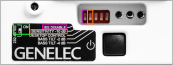

# Haut-parleurs Genelec

## ISS («Intelligent Signal Sensing»)

Certains haut-parleurs, dont les [8010A Studio Monitor de Genelec](https://www.genelec.com/8010a) tombent en mode veille si le signal audio n'est pas assez puissant. Pour désactiver le ISS et aussi réduire la sensibilité de l'entrée (ce qui permet d'envoyer un signal audio plus fort) il faut activer des commutateurs DIP. Pour activer, mettre les positions à «ON», c'est à dire vers le haut.

