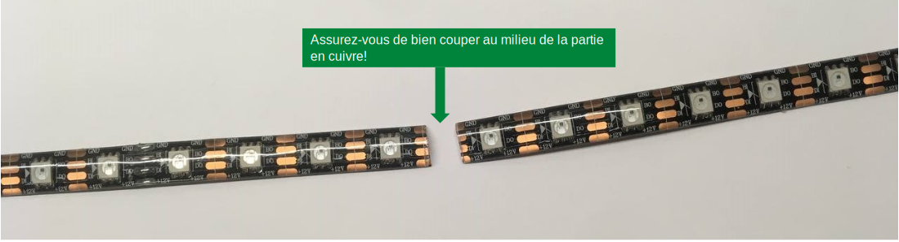
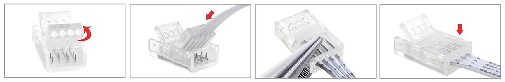
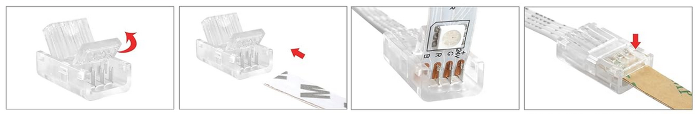
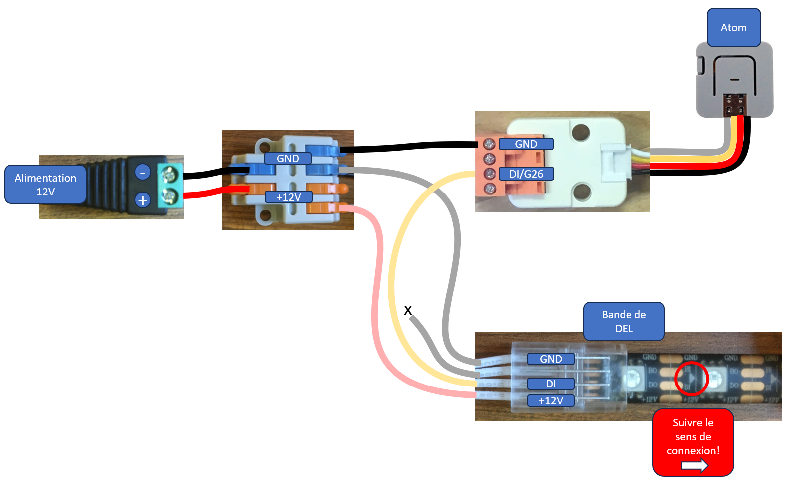
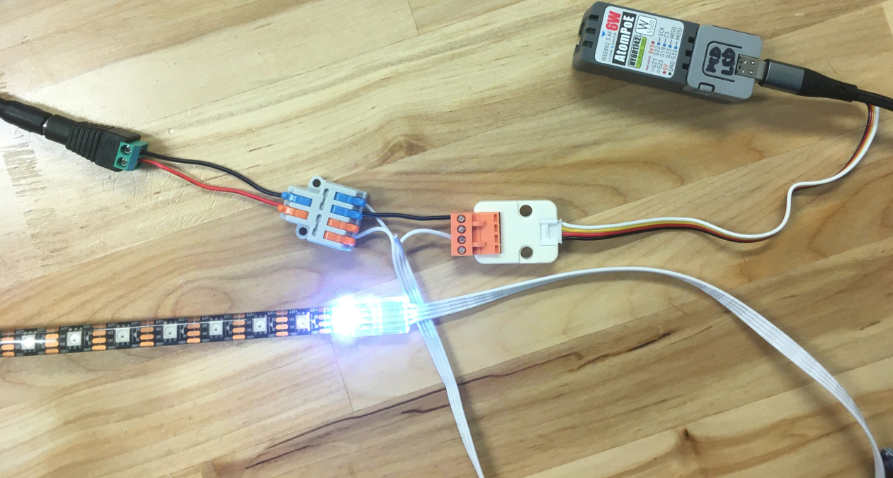
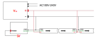

# Les bandes de pixels

## Introduction

Une bande de pixels regroupe plusieurs LED pouvant être contrôlées avec une ou deux broches. Chaque pixel est composé de plusieurs LED, généralement une rouge, une verte et une bleue. Certains modèles intègrent également des LED supplémentaires blanches, ambrées ou ultraviolettes. De plus, pour chaque modèle de bande de pixels, l'ordre des couleurs peut varier : RGB, GRB, BGR, etc.  

Aussi connue sous le nom de **NeoPixel**, ce type de produit a été popularisé par la société Adafruit, qui propose [de nombreux modèles de NeoPixels](https://www.adafruit.com/category/168). Attention, les NeoPixels d'Adafruit fonctionnent à 5 volts.

| Fonction / Puce           | **WS2801**              | **WS2811**                | **WS2818**                | **WS2812**               | **SK6812**            | **APA102**               |
| ------------------------- | ----------------------- | ------------------------- | ------------------------- | ------------------------ | --------------------- | ------------------------ |
| **Protocole**             | SPI (Données + Horloge) | Monofil (une seule ligne) | Monofil                   | Monofil                  | Monofil               | SPI (Données + Horloge)  |
| **Fils requis**           | 3 (VCC, GND, CLK+DATA)  | 3 (VCC, GND, DATA)        | 4 (VCC, GND, DATA+BACKUP) | 3 (VCC, GND, DATA)       | 3 (VCC, GND, DATA)    | 4 (VCC, GND, DATA, CLK)  |
| **Canaux de couleur**     | RGB                     | RGB                       | RGB                       | RGB                      | RGB / RGBW            | RGB                      |
| **Résolution PWM**        | 8 bits                  | 8 bits                    | 8 bits                    | 8 bits                   | 8 bits                | 8 bits                   |
| **Débit de données**      | Rapide (jusqu’à MHz)    | 800 kHz                   | 800 kHz                   | 800 kHz                  | 800 kHz               | Jusqu’à 20 MHz           |
| **Sensibilité au timing** | ❌ Non                   | ✅ Oui                     | ✅ Oui                     | ✅ Oui                    | ✅ Oui                 | ❌ Non                    |
| **Ligne de secours**      | ❌ Non                   | ❌ Non                     | ✅ Oui (ligne backup)      | ❌ Non                    | ❌ Non                 | ❌ Non                    |
| **Support RGBW**          | ❌ Non                   | ❌ Non                     | ❌ Non                     | ❌ Non                    | ✅ Oui                 | ❌ Non                    |
| **Intégré dans la LED**   | ❌ Souvent externe       | ✅ Souvent intégré         | ✅ Intégré                 | ✅ Intégré                | ✅ Intégré             | ❌ Contrôleur externe     |
| **Compatibilité FastLED** | ✅ Oui                   | ✅ Oui                     | ⚠️ Partielle / manuelle   | ✅ Oui                    | ✅ Oui                 | ✅ Oui                    |
| **NeoPixel ?**            | ❌ Non                   | ❌ Non                     | ❌ Non                     | ✅ Oui (Adafruit)         | ✅ Oui (NeoPixel RGBW) | ❌ Non (Adafruit DotStar) |
| **Idéal pour**            | Montages SPI fiables    | Bandes longues peu chères | Bandes longues robustes   | La plupart des NeoPixels | Pixels RGBW / blancs  | Animations haute vitesse |

## Broches

Les NeoPixels possèdent au moins trois broches qui doivent être connectées :  
- **GND** (masse)  
- **Alimentation** (5 V, 12 V ou 24 V selon les modèles)  
- **Entrée de données** (*Data In*)  

Les modèles WS281X fonctionnant en 12 V comportent parfois une quatrième broche optionnelle :  
- **GND**  
- **+12V** (alimentation)  
- **DI** (entrée de données)  
- **BI** (utilisée uniquement en cas de défaillance d’un segment).

## Branchement

Dans cet exemple, nous utilisons une bande de pixels WS281X fonctionnant avec une tension d’alimentation de 12 V.

  

 

  

  

  

  

  

### Bonnes pratiques

Adafruit recommande de suivre [ces bonnes pratiques de connexion](https://learn.adafruit.com/adafruit-neopixel-uberguide/best-practices) pour éviter les problèmes.

