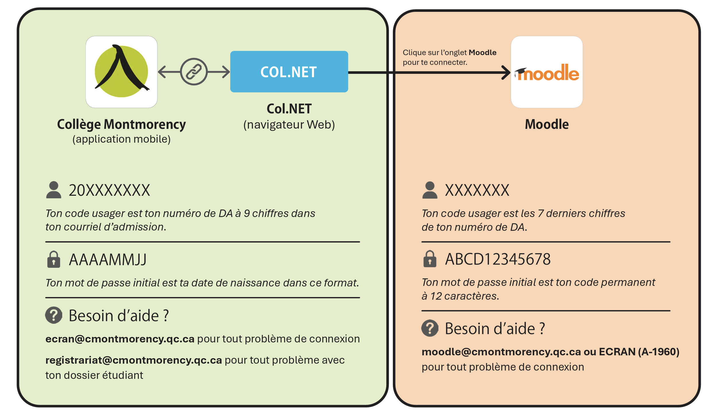

# COURS : 582-501 CONCEPTION D’UNE EXPÉRIENCE MULTIMÉDIA

<!-- toc -->

- Numéro de cours : 582 501 MO
- Nombre d’heures d’enseignement : 90
- Pondération : 3-3-2
- Programme : Techniques d’intégration multimédia
- Département du programme : Techniques d’intégration multimédia
- Session : Automne 2026
- Professeure ou professeur : Thomas O. Fredericks
- Département de la professeure ou du professeur : Techniques d’intégration multimédia
- Courriel : ThomasOuellet.Fredericks@cmontmorency.qc.ca
- Bureau : C-1649
- Plateforme(s) pédagogique(s) utilisée(s) :  Teams, GitHub et [t-o-f.info/aide](https://t-o-f.info/aide/)
- Coordination : Lora Boisvert
- Contact de la coordination : lora.boisvert@cmontmorency.qc.ca (C-1651)

## Présentation du cours

### Description du cours

Ce cours prépare l’élève à concevoir un projet multimédia. L’élève participe au processus d’idéation, à l’analyse du scénario et du scénarimage, à son adaptation, à la planification des besoins en ressources humaines et techniques et à la vérification de sa faisabilité technique. Il développe ainsi sa créativité, son esprit critique et son sens de l’organisation afin de présenter la conception d’une expérience multimédia interactive.

### Objectif intégrateur

Concevoir une expérience multimédia.

### Compétence(s) ministérielle(s)

- 015N Analyser la conception du projet (éléments 1 à 8).
- 015S Vérifier la faisabilité technique du projet (éléments 1, 4).

### Objectifs d’apprentissage

1. Analyser la conception d’une expérience multimédia.
2. Planifier la stratégie d’intégration d’une expérience multimédia.
3. Vérifier la faisabilité technique d’une expérience multimédia.

### Cours liés

Les cours suivants sont préalables absolus au présent cours :

- 570 V11 MO Œuvres et dispositifs multimédias en exposition 
- 582 401 MO Réalité mixte
- 582 414 MO Animation 3D
- 582 412 MO Traitement audiovisuel
- 582 431 MO Audio 2

Les cours suivants sont corequis au présent cours :

- 582 521 MO Installation multimédia
- 582 531 MO Objets interactifs

Le présent cours est préalable absolu au cours suivant :

- 582 601 MO Expérience multimédia

### Volets transversaux

- Compétence langagière : L’élève adapte son discours à la situation de communication, communique adéquatement à l’oral et à l’écrit, soigne ses productions écrites et utilise le lexique de la profession.
- Compétence numérique : L’élève exploite les TIC de manière efficace et responsable. Il recherche, traite et présente de l’information.

### Attitudes professionnelles

- Adaptation
- Débrouillardise
- Créativité
- Rigueur

### Dates importantes

- 18 septembre : Date limite de désinscription au cours sans mention au bulletin.
- 4 novembre : Date limite d’abandon de cours sans échec entraînant une mention au bulletin.

## Contexte d’apprentissage et méthodes pédagogiques

- [x] Exposés magistraux
- [x] En laboratoire informatique
- [x] Apprentissage et utilisation de logiciels sous forme de démonstrations, d’exercices, de travaux pratiques
- [x] Projets multimédias
- [x] Exposés interactifs
- [ ] Écoute de pistes sonores
- [x] Activités coopératives
- [x] Tutorat individuel ou de petits groupes
- [x] En présence
- [ ] En ligne
- [ ] Stage en milieu de travail
- [x] Discussions en groupe (tables rondes)

## Matériel, comptes et volumes requis

- [x] Disque dur portatif
- [x] Carte SD
- [x] Clé USB
- [x] Cahier ou papiers divers, pour griffonner, conceptualiser, réaliser des croquis et noter vos inspirations
- [x] Compte GitHub

Pour le travail à la maison avec les logiciels et les outils du programme, l’étudiante ou l’étudiant doit disposer d’un ordinateur permettant de poursuivre les travaux réalisés en classe.

Pour les détails du matériel requis, voir le [guide des étudiants](https://cmontmorency365.sharepoint.com/:w:/r/sites/TIM-TTP/Documents%20partages/comite_politiques/guides/guide_etudiants.docx?d=w48119bb75aec438cbb23c7da3ee1061d&csf=1&web=1&e=mN0PFI).

## Réservation du matériel spécialisé

Lorsque vous êtes autorisée ou autorisé par votre professeure ou professeur à emprunter le matériel spécialisé, vous pouvez le réserver auprès des TTP en suivant la procédure suivante : [Procédure de prêt – TTP.pptx](https://cmontmorency365.sharepoint.com/:p:/r/sites/TIM-programmeTIM752/Documents%20partages/TTP%20-%20R%C3%A9servations/Proc%C3%A9dure%20de%20pr%C3%AAt%20-%20TTP.pptx?d=wce77a41cd0db4bb8862e11adba23c93b&csf=1&web=1&e=UPLDTD).

## Règles d’identification des travaux

Les travaux non identifiés ne seront pas corrigés et les pénalités de retard s’appliqueront. À moins d’indication contraire, les remises de travaux doivent être nommées de la manière suivante :

### Travail individuel

Suivre le modèle suivant : 

- `[nom de famille]- [prénom]_[nom du travail]_[#travail]_[#cours]`

Exemple : 

- `gilbert-charlene_polychromes_01_582-314MO`

### Travail d’équipe

Suivre le modèle suivant : 

- `[les noms de famille en ordre alphabétique séparés par -]_[nom du travail]_[#travail]_[#cours]`

Exemple : 

- `boisvert-gilbert-hubert_polychromes_01_582-314MO`


## Slogan du cours

> **CRÉATIVITÉ = LITTÉRATIE + LIBERTÉ + COURAGE**
> 
> Pour être créatif, il faut connaître le monde, être libre de l’imaginer autrement et avoir le courage de partager ce que l’on imagine, même lorsque cela semble étrange ou ridicule.

## Déroulement

### Semaine 1 

À préparer avant la classe :

- Rien.

Activités en classe :

- Présentation du cours et de son fonctionnement.
- Présentation de la première évaluation.
- [Parcours](https://village-numerique.mutek.org/fr/parcours) du Village numérique de MUTEK (du 20 août au 3 septembre 2026). [Vidéo 2025](https://www.youtube.com/watch?v=emNvwGw16gk). [Carte](https://drive.google.com/file/d/1rfLHU-OJuefqdz3NiOz-1ektID6X9z4y/view). Les projets à visiter sont :
	- Jeu(x) de lumières par Marie LeBlanc Flanagan et Société des arts technologiques
	- SOLSTICE par Ottomata
	- Twenty Twenty-Five par Ghazal Majidi
	- Escale Musicale par Daily tous les jours
	- DÉSASSEMBLAGE par Iregular
	- Parallèles par TRANSVERSAL
	- Sacred Tags par Quinn Hopkins
	- Composition par Vincent Morisset
	- Waves par BADANG
	- Marche marche danse par Daily tous les jours
- Le [Pecha Kucha](https://t-o-f.info/aide/#/creation/pecha_kucha/)
- Récupération des comptes GitHub ([groupe 1](https://cmontmorency365-my.sharepoint.com/:x:/g/personal/tofredericks_cmontmorency_qc_ca/IQAhhh1huXXNS6mejZaAqGCRAevyc-VzIaQq5CLgrbV0V3w) du lundi, [groupe 2](https://cmontmorency365-my.sharepoint.com/:x:/g/personal/tofredericks_cmontmorency_qc_ca/IQBuuHJ6nW4CQLQAOj9YeXYYAWfZ069QFMpPGIEezv_DKCY?e=0MKYoA) du jeudi)
- Qu’est-ce qu’une [expérience multimédia](https://t-o-f.info/aide/#/creation/interactivite/experience/) ?

|  | Cinéma | Arts plastiques | Expérience multimédia interactive |
|---|---|---|---|
| **Temps** |  |  |  |
| **Espace** |  |  |  |
| **Progression** |  |  |  |
| **Contrôle** |  |  |  |

- Quelques [types](https://t-o-f.info/aide/#/creation/interactivite/types/) d’interaction.
- [Contiuum](https://t-o-f.info/aide/#/creation/interactivite/continuum/) du niveau d’interactivité.
- Analyse d’expériences (formatif) :
	- [Pointer Pointer](https://pointerpointer.com/)
	- [Rafael Lozano-Hemmer - Pulse Room](https://www.lozano-hemmer.com/pulse_room.php)
	- [Johann Sebastian Joust](http://www.jsjoust.com/)
		- [Johann Sebastian Joust at MagFest 2016](https://www.youtube.com/watch?v=YUDEi2dZUV8)
		- *JS Joust JS*.
	
### Semaine 2 

À préparer avant la classe :

- Visite du Village numérique avant le 3 septembre.

Activités en classe :

- Courte [histoire](https://t-o-f.info/aide/#/creation/interactivite/histoire/) de l’interactivité.
- Analyse d’expériences (formatif) :
	- *La légèreté de l’être*
	- *Face à faces* 
- Le [public cible](https://t-o-f.info/aide/#/creation/interactivite/public/).
- Réaliser des maquettes de plans de déploiement dans l’espace avec [draw.io](https://app.diagrams.net/).
	- Version bureau à télécharger : [github.com/jgraph/drawio-desktop](https://github.com/jgraph/drawio-desktop/releases)
- [Banque de mots pour l’esthétique](https://t-o-f.info/aide/#/creation/esthetique/banque/) 
- [Esthétique et public cible de DOOM Eternal](https://t-o-f.info/aide/#/creation/esthetique/doom/)
- Esthétique et public cible des expériences suivantes (formatif) :
	- Super Mario : [Super Mario Bros - Complete Walkthrough - YouTube](https://www.youtube.com/watch?v=c_b9Yn34pdI)
	- Animal Crossing: New Horizons : [Cozy Rainy Longplay Pt 43 | Working on the Market (no commentary) ~ Animal Crossing New Horizons - YouTube](https://www.youtube.com/watch?v=J4YKntliYuY)
	- Gran Turismo 7 : [Gran Turismo 7 - Nissan GT-R NISMO GT3 2018 - Gameplay (PS5 UHD) [4K60FPS] - YouTube](https://www.youtube.com/watch?v=7dYJ4IZFC4U)

|  | Super Mario | Animal Crossing | Gran Turismo |
|---|---|---|---|
| **Capture d’écran de l’interface utilisateur** |   |   |   |
| **Observations sur l’interface utilisateur** |   |   |   |
| **3 mots pour décrire l’émotion** |  |   |   |
| **3 mots pour décrire le timbre** |  |   |   |
| **3 mots pour décrire la structure** |  |   |   |
| **3 mots pour décrire les références** |  |   |   |
| **Intention esthétique** |   |   |   |
| **Public cible** |   |   |   | 
	
- Six [qualités](https://t-o-f.info/aide/#/creation/interactivite/qualites/) recherchées d’une expérience multimédia.
- Trouver un modèle de PowerPoint pour le travail.
	
	
### Semaine 3

À préparer avant la classe :

- Visite du Village numérique avant le 3 septembre.
- Terminer son évaluation.

Activités en classe :

- **Évaluation**
- Jeux du livre [The Rules We Break d’Eric Zimmerman](https://theruleswebreak.com/) :  *Five Fingers*, *Wolf and Sheep* et *Rock Paper Scissors+* dehors si la météo le permet.

### Semaine 4

À préparer avant la classe :

- Rien.

Retours :

- *Five Fingers* 
	- Une complexité d’émotions et de situations émerge de règles simples.
	- Les jeux peuvent servir de contexte temporaire à des interactions sociales cruelles et ludiques.
	- La créativité émerge de systèmes structurés.
- *Wolf and Sheep* 
	- Concevoir une expérience de coopération et de compétition
	- Le jeu comme forme de contrat social
	- L’application de la [théorie des jeux](https://fr.wikipedia.org/wiki/Th%C3%A9orie_des_jeux) (*game theory*) à la conception des jeux
- *Rock Paper Scissors+* 
	- Le fait de ralentir le choix et de révéler le résultat progressivement donne plus d’importance à chaque décision et ajoute une dimensions dramatique.  
	- L’expérience collective et l’affrontement par représentants crée une narration collective et immersive. Cela stimule le dialogue stratégique et l’anticipation des choix. Ce qui a pour effet de décupler l’investissement émotionnel (surprise, cris de joie, etc.) des joueurs face au résultat.
	- Pour être créatif il ne faut pas avoir peur du ridicule
	
Activités en classe :

- [The Rules We Break - a book by Eric Zimmerman | PA Press](https://theruleswebreak.com/)
	- Balancer le jeu *Utopia2099*.
	- Expérimenter une histoire avec le jeu *Village Zombie*.

### Semaine 5 : 29 septembre / 24 septembre

À préparer avant la classe :

- Penser à former les équipes pour la prochaine évaluation.

Retours :

- *Utopia2099* : 
	- Complexité : Un jeu peut être captivant, même s’il est totalement aléatoire. La tension ou la complexité d’un système peut parfois suffire à maintenir l’intérêt du joueur, et ce, même en l’absence de structure décisionnelle.
		- [Roulette](https://www.youtube.com/watch?v=u9hESWMykp0) 
		- [Pachinko](https://www.youtube.com/shorts/aygM12xe9vA)
	- Comment équilibrer un jeu ?
		- Itération : Répéter plusieurs fois.
		- Établir un « point pivot » : Il est difficile de maintenir l’équilibre entre les Experts si chacun d’eux ne cesse de changer — chaque modification doit être vérifiée et revérifiée par rapport à toutes les autres. Une bonne technique consiste à considérer l’un des Experts comme un point pivot fixe et à équilibrer tous les autres par rapport à celui-ci.
- *Zombie Village* :
	- Narrativité : Il est tellement facile d’imaginer des superpouvoirs capables de nettoyer le plateau de tous les ennemis ! Les questions plus profondes sont les suivantes : ces pouvoirs conviennent-ils au personnage ? Expriment-ils sa personnalité et son esprit ? Aidez les concepteurs à accepter la mort tragique et quasi certaine de leur personnage bien-aimé.
	- Immersion : L’immersion ne se résume pas à des graphismes photoréalistes et à des effets visuels sophistiqués. Elle relève plus souvent d’un engagement émotionnel, psychologique et social.

Activités en classe :

- Exemple de normes graphiques : 
	- [Guide des normes graphiques du collège Montmorency](https://www.cmontmorency.qc.ca/wp-content/uploads/images/college/logos-et-normes-graphiques/guide-normes-graphiques.pdf)
	- [Guide Utilisation et normes graphique de l’INRS](https://inrs.ca/wp-content/uploads/2020/08/INRS-Guide-de-normes-graphiques-identite-visuelle.pdf)
- Esthétique et fonctionnalité.
	- [The Hidden Design of Stop Signs - YouTube](https://www.youtube.com/shorts/x5OhJHlzyh4)
- Présentation de la prochaine évaluation.
	- Trouver une thématique pour le jeu de carte.
	- Préparer le [document de normes graphiques (à remettre avec la fin du cours)](https://t-o-f.info/aide/#/creation/visuel/guide/cartes/).

### Semaine 6 : 6 octobre / 1 octobre

À préparer avant la classe :

- Terminer un premier jet du prototype d’une carte.

Activités en classe :

- *Travail en classe*.
- Tests d’impressions. 

### Semaine 7 : 15 octobre / 8 octobre

À préparer avant la classe :

- Travail sur le jeu de cartes.

Annonces : 

- ELEKTRA MONTRÉAL | Biennale 2026 - F(R)ICTION : art et jeux -  [https://www.elektramontreal.ca/evenement/biennale-2026](https://www.elektramontreal.ca/evenement/biennale-2026)


Activités en classe :

- *Travail en classe*.
- Tests d’impressions. 

### Semaine 8 : 19 octobre / 22 octobre

À préparer avant la classe :

- Rien

Activités en classe :

- **Évaluation**.
- Concevoir des règles avec *Bortak*.
- Design génératif :
	- [alien language generator](https://codepen.io/p5art/details/XKWyob)
	- [Universal LPC Sprite Sheet Character Generator](https://liberatedpixelcup.github.io/Universal-LPC-Spritesheet-Character-Generator)
- *Wonder Wander*.


### Semaine 9 : 26 octobre / 29 octobre

À préparer avant la classe :

- Rien.

Activités en classe :

- Développer son sens de communauté avec *L’année de la veille*.
- Partage des histoires des communautés.

### Semaine 10 : 2 novembre / 5 novembre

À préparer avant la classe :

- Visionner les exemples :
	- [Toribash](https://toribash.com/)
	- [Data Chromesthesia | Felipe Pantone](https://www.acuteart.com/discover/felipe-pantone)
	- [Hand from Above - Chris O’Shea](https://www.chrisoshea.org/portfolio/hand-from-above)
	- [PainStation - Wikipedia](https://en.wikipedia.org/wiki/PainStation)
	- [Jump! de Yacine Sebti](https://legacy.imal.org/en/project/jump)
	- [Daniel Rozin Interactive Art](https://www.smoothware.com/danny/index.html)
	- [Messa di Voce (Performance version, 2003) - YouTube](https://www.youtube.com/watch?v=STRMcmj-gHc)
	- [Dash Dodge Dive - Chris O’Shea](https://www.chrisoshea.org/portfolio/dash-dodge-dive)
	- [ARcade | Moment Factory](https://momentfactory.com/products/arcade)
	- [Sketch Aquarium | teamLab Learn and Play! Future Park](https://futurepark.teamlab.art/en/playinstallations/sketch_aquarium/)

Activités en classe :

- Détermination des valeurs de groupe.
- Présentation des critères pour la prochaine évaluation.
- Rétroaction en interactivité.
- *Toolchain* pour la conception de projet :
	- Environnement de développement principal (cerveau) :
		- Unity (possiblement Godot ou Three.js)
		- OSC 
		- Spout
	- Transducteurs :
		- Carte Arduino
		- Arduino Terminals
		- OSC
		- Raspberry PI ou M5Stack ATOM POE
		- Pure Data
	- Détection d’utilisateurs par caméra : 
		- TouchDesigner avec MediaPipe ou Kinect
			- OSC
			- Spout
	- Mapping :
		- OBS
			- Spout
			- HyperHDR	
	- Lumières DMX/ArtNet :
		- Pure Data
    	- QLC+
    	- OSC
- *Travail en classe*.


### Semaine 11 : 16 novembre / 12 novembre

À préparer avant la classe :

- Terminer son «pitch».

Activités en classe :

- **Évaluation**.

### Semaine 12 : 23 novembre / 19 novembre

À préparer avant la classe :

- Former son équipe pour l’évaluation finale.

Activités en classe :

- Activités formatives sur l’esthétique :
	- *Hues*, *Telestrations* et *A game about WEE WHIMSICAL CREATURES and trying to identify them after someone makes noises.*
- Rédaction de la mission d’équipe.
	
### Semaine 13 : 30 novembre / 26 novembre

À préparer avant la classe :

- Récupérer le matériel nécessaire aux tests.

Activités en classe :

- *Travail en classe*.
- Normes esthétiques de l’équipe.

### Semaine 14 : 6 décembre / 3 décembre

À préparer avant la classe :

- Poursuivre et finaliser les maquettes esthétiques.
- Effectuer les tests techniques.

Activités en classe :

- *Travail en classe*.

### Semaine 15 : 14 décembre / 10 décembre

À préparer avant la classe :

- Préparer la présentation de l’évaluation.

Activités en classe :

- **Évaluation**.

## Évaluation des apprentissages

Les évaluations formatives jouent un rôle crucial dans le processus d’apprentissage en offrant à l’étudiant une occasion continue de perfectionner ses connaissances, de comprendre ses points forts et ses domaines à améliorer. Ces évaluations visent à soutenir activement le développement des compétences en offrant des conseils personnalisés pour renforcer la compréhension des concepts enseignés et améliorer la capacité de les appliquer de manière pratique.

D’un autre côté, les évaluations sommatives sont utilisées pour évaluer les acquis et les connaissances de l’étudiant à un moment donné. Elles servent à mesurer la réussite et la maîtrise des objectifs d’apprentissage à la fin d’une période déterminée. Les résultats des évaluations sommatives fournissent une évaluation globale du niveau de compétence atteint par l’étudiant.

Dans le cas où des étudiants auraient formulé une demande en raison de besoins spécifiques pour bénéficier de temps supplémentaire lors des évaluations, l’enseignant essayera de respecter les recommandations émises pour favoriser le succès de l’étudiant. Cette mesure vise à garantir l’équité et l’accessibilité, permettant à tous les apprenants de démontrer leur compréhension de manière juste et équitable. Cependant c’est la responsabilité de l’étudiant de faire une demande au SAA (Service d’aide à l’apprentissage) au moins 7 jours avant l’évaluation sommative afin de disposer de leur temps supplémentaire accordé dans leurs locaux.

## Évaluations formatives

Des évaluations formatives sont prévues au calendrier. Elles sont sous la forme de pratiques dont le résultat est connu par l’étudiant, mais non comptabilisé pour la note finale. Ce sont des pratiques pour les évaluations sommatives. 

## Évaluations sommatives

### Sommaire des évaluations

| Évaluation | Titre | Date | % |
| --- | --- | --- | ---: |
| EVAL-1 | Analyse de projet | Séance 3 | 24 % |
| EVAL-2 | Jeu de carte | Séance 7 | 24 % |
| EVAL-3 | Pitch | Séance 11 | 24 % |
| EVAL-4 | Hypothèse * | Séance 15 | 28	 % |
| | **Total** | | **100 %** |

* : intégration des apprentissages.

### Évaluation 1 : Analyse de projet

| Identification | Forme | Individuel ou en équipe | Date de l’évaluation ou de la remise | % |
| --- | --- | --- | --- | ---: |
| EVAL-1 | Exposé oral | Individuel | Semaine 3 | 24 % |

Savoirs essentiels et critères d’évaluation :

- Objectif d’apprentissage : **Analyser la conception d’une expérience multimédia.**
- Analyser une expérience multimédia unique.
- Présenter l’analyse dans un format [Pecha Kucha](https://t-o-f.info/aide/#/creation/pecha_kucha/) **vidéo**.
- Démontrer sa capacité à analyser la conception d’une expérience multimédia.


Directives :

- Visitez **toutes** les œuvres suivantes du [parcours](https://village-numerique.mutek.org/fr/parcours) du Village numérique de MUTEK ([CARTE](https://drive.google.com/file/d/1rfLHU-OJuefqdz3NiOz-1ektID6X9z4y/view)) :
	- Jeu(x) de lumières par Marie LeBlanc Flanagan et Société des arts technologiques
	- SOLSTICE par Ottomata
	- Twenty Twenty-Five par Ghazal Majidi
	- Escale Musicale par Daily tous les jours
	- DÉSASSEMBLAGE par Iregular
	- Parallèles par TRANSVERSAL
	- Sacred Tags par Quinn Hopkins
	- Composition par Vincent Morisset
	- Waves par BADANG
	- Marche marche danse par Daily tous les jours
- Prendre 1 selfie devant chaque projet (vous allez les remettre au professeur comme preuve).
- Choisir une oeuvre.
- Dans le document de choix ([groupe 1](https://cmontmorency365-my.sharepoint.com/:x:/g/personal/tofredericks_cmontmorency_qc_ca/IQCp6lUcWePGRIC971ZlBypTAUQ4o1EPzxoq5wXu3kWxL6c?e=Q5akxb) du lundi, [groupe 2](https://cmontmorency365-my.sharepoint.com/:x:/g/personal/tofredericks_cmontmorency_qc_ca/IQD7Fr-WKOLUQZjcbHJVnnEmAVmtdGGBWe0eF5jB-9Xg36k?e=tvxq0n) du jeudi), inscrire votre prénom et nom dans la rangée de l’oeuvre. Il ne peut y avoir plus que deux personnes par oeuvre.
- Réalisez un PowerPoint :
	- Ne pas avoir trop de texte explicatif écrit. Le gros des explications se fait verbalement dans un enregistrement audio.
	- Votre présentation doit :
		- Être cohérent d’une diapositive à l’autre : être uniformes au niveau esthétique (même taille de texte, même fonte de texte, couleurs cohérentes, etc).
		- Avoir un style visuel qui correspond à l’oeuvre.
		- Utiliser 1 ou 2 polices différentes maximum.
		- Se limiter à 2 tailles de polices différentes.
	- Faire attention aux majuscules et à la ponctuation.
	- Portez attention à la **disposition et l’alignement** des éléments dans l’espace.
	- Il doit y avoir exactement **15 diapositives**.
	- Les explications verbales sont de **20 secondes** pour chaque diapositive.
	- Donnez un titre à chaque diapositive.
- Les diapositives :
    - 1 diapositive de titre avec votre nom, le nom du cours, l’oeuvre analysée et quand vous l’avez visitée.
	- 1 à 2 diapositives qui présente la personne ou l’équipe derrière oeuvre. Indiquez si c’est une ouvre d’une personne artiste indépendante, ou si c’est une oeuvre d’une boîte de production. 
	- 1 à 2 diapositive avec deux photos de vous qui interagi avec l’oeuvre. Racontez votre expérience. Décrivez comment vous avez vécu l’oeuvre et ce qui se passait. Comment le système détecte vos actions ? Comment est-ce qu’il réagit ? Ne parlez pas encore de votre appréciation. Restez sur le fonctionnement.
	- 1 diapositive qui présente le [type](https://t-o-f.info/aide/#/creation/interactivite/types/) de cette oeuvre interactive. Démontrez pourquoi.
	- 2 à 3 diapositives qui décrivent l’esthétique avec les 4 dimensions de 
l’émotion, le timbre, la structure, les références en utilisant la [banque de mots pour l’esthétique](https://t-o-f.info/aide/#/creation/esthetique/banque/).
	- 1 diapositive sur ce que vous croyez est le [public cible](https://t-o-f.info/aide/#/creation/interactivite/public/) de cette oeuvre. Expliquez pourquoi. Mettre un point sur le Graphique de la taxonomie de Richard Bartle qui représente ce public cible.
	- 1 à 2 diapositive qui présente **visuellement** la disposition dans l’espace. Indiquez le plus d’éléments possible (à l’exception des câbles et des interconnexions). Indiquez le nombre de projecteurs et où ils se trouvent, où se trouvent les haut-parleurs,  la position des interfaces, etc.
	- 2 à 3 diapositives qui présentent votre évaluation personnelles des 6 [qualités](https://t-o-f.info/aide/#/creation/interactivite/qualites/) recherchées d’une expérience multimédia. Expliquer pourquoi.
	- 2 à 4 diapositives sur 2 autres œuvres qui sont similaires. Montrez des images de ces œuvres. Expliquez en quoi ces œuvres sont similaires. Montrez des images en lien avec vos explications. Ces œuvres ne doivent **pas** avoir été présentées en classe et ne sont **pas** des créations des personnes étudiantes des années précédentes. 
- Exportez le PowerPoint :
	- Le PowerPoint doit être remis en format vidéo.
	- Enregistrez avec un microphone de qualité votre présentation verbale (pas de voix générée par IA générative). Vous pouvez effectuer un montage de votre voix (dans Reaper par exemple).
	- Portez attention aux volumes (garder le son fort mais éviter la saturation) et à la qualité du son.
	- Pas de bande sonore musicale. 
	- Pas de vidéo autre que l’exportation du PowerPoint.
- Remettez dans le dossier de remise, dans votre groupe et dans un dossier qui suit la nomenclature (voir plus haut dans la section *Règles d’identification des travaux*) les selfie qui prouvent que vous avez visité les œuvres ainsi que votre vidéo de présentation.

### Évaluation 2 : Jeu de cartes

| Identification | Forme | Individuel ou en équipe | Date de l’évaluation ou de la remise | % |
| --- | --- | --- | --- | ---: |
| EVAL-2 | Document imprimé | Équipe | Semaine 7 | 24 % |

Savoirs essentiels et critères d’évaluation :

- Réaliser un [document de normes graphiques](https://t-o-f.info/aide/#/creation/visuel/guide/cartes/).
- Réaliser un jeu de cartes thématique qui permet de jouer à des jeux de carte traditionnels, l’imprimer et l’assembler.
- Objectif d’apprentissage : **Planifier la stratégie d’intégration d’une expérience multimédia.**

### Évaluation 3 : Pitch

| Identification | Forme | Individuel ou en équipe | Date de l’évaluation ou de la remise | % |
| --- | --- | --- | --- | ---: |
| EVAL-3 | Exposé oral | Individuel | Séance 11 | 24 % |

Savoirs essentiels et critères d’évaluation :

- Concevoir et planifier la réalisation d’une vidéo pour projection architecturale.
- Développer le scénario et le scénarimage.
- Planifier les médias nécessaires à la réalisation.
- Adapter la conception aux contraintes de réalisation et de diffusion.
- Démontrer une compréhension du public, du produit, de l’équipe et du contexte de diffusion.

### Évaluation 4 : Hypothèse (intégration des apprentissages)

| Identification | Forme | Individuel ou en équipe | Date de l’évaluation ou de la remise | % |
| --- | --- | --- | --- | ---: |
| EVAL-4 | Exposé oral | Individuel au sein d’une équipe | Séance 15 | 28 % |

Concevoir une expérience interactive dans laquelle les actions de la personne visiteuse influencent le comportement ou l’état du système, de manière à créer une relation évolutive entre la personne et l’œuvre. L’expérience doit répondre aux actions de façon signifiante, produire des conséquences perceptibles et permettre une progression, de sorte que la personne ait le sentiment de participer à une forme de conversation avec le système.

Le projet doit être non seulement réactif, mais interactif :

- Réactif : Je fais quelque chose → le système me montre quelque chose.
- Interactif : Je fais quelque chose → le système répond → cette réponse modifie ce que je peux ou veux faire ensuite.

> Par exemple, une caméra qui filme la personne et affiche son image sur un écran est réactive, mais pas nécessairement interactive. Il manque notamment une conséquence qui transforme la suite de l’expérience.

L’expérience interactive devrait idéalement créer une boucle qui donne l’impression d’une conversation :

```
Personne → action → réponse du système → nouvelle situation → nouvelle action → …
```

Savoirs essentiels et critères d’évaluation :

- Développer l’aspect technique d’une expérience multimédia.
- Identifier les ressources humaines nécessaires.
- Identifier les ressources matérielles et logicielles disponibles.
- Choisir les logiciels, équipements et techniques en fonction des exigences du projet.
- Documenter la faisabilité technique à l’aide d’exemples et de preuves techniques.
- Objectif d’apprentissage : **Vérifier la faisabilité technique d’une expérience multimédia.**


## Médiagraphie

### Livres

- Schell, J. (2022). *L’art du game design — Nouvelle édition : Se focaliser sur les fondamentaux*.
- Albinet, M. (2022). *Concevoir un jeu vidéo*.
- Le Breton, R. (2017). *Design narratif : scénario et expérience de jeu*.
- Kholeif, O. (2023). *Internet_Art: From the Birth of the Web to the Rise of NFTs*.
- Kief, H. (2020). *Internet ou le retour à la bougie*.
- Burckhardt, A., Galloway, P., et Antonelli, P. (2022). *Never Alone: Video Games as Interactive Design*.
- Pereyra, I. (2023). *Universal Principles of UX: 100 Timeless Strategies to Create Positive Interactions between People and Technology*.
- Farnell, A. (2010). *Designing Sound*.
- Bjørn, K. (2021). *PUSH TURN MOVE*.
- Bardiot, C., Derobert, L., Farcet, C., et Guillois, P. (s. d.). *La neige n’a pas de sens — Adrien M et Claire B.*
- Reas, C., et McWilliams, C. (2010). *Form+Code in Design, Art, and Architecture: Introductory Book for Digital Design and Media Arts*. New York, NY: Princeton Architectural Press.
- Reas, C., et Fry, B. (2014). *Processing: A Programming Handbook for Visual Designers and Artists* (2e éd.). Cambridge, MA: The MIT Press.
- Leach, N., et Yuan, P. F. (2018). *Computational Design*. Shanghai: Tongji University Press Co., Ltd.
- Paquin, L.-C. (s. d.). *Comprendre les médias interactifs*. Récupéré de http://www.lcpaquin.com/livre/tdm.html
- Levin, G., et Brain, T. (2021). *Code as Creative Medium*.
- Bianchini, S., et Verhagen, E. (2016). *Practicable: From Participation to Interaction in Contemporary Art*.
- Thiery, E. *Les bases de Git*. Récupéré de http://www2.ift.ulaval.ca/~eude/Gif-1003/Initiation_a_git/Labo%20sur%20Git_fichiers/Les%20bases%20de%20Git.pdf
- *Aide-mémoire GIT*. Récupéré de https://training.github.com/downloads/fr/github-git-cheat-sheet.pdf
- Lostritto, C. (2019). *Computational Drawing: From Foundational Exercises to Theories of Representation*. Novato: Applied Research & Design.
- McCarthy, L., Reas, C., et Fry, B. (2015). *Getting Started with p5.js: Making Interactive Graphics in JavaScript and Processing*. San Francisco, CA: Make Community, LLC.

### Art et références professionnelles

- Alice Jarry. « Alice Jarry ». Consulté le 15 janvier 2020. https://alicejarry.com/.
- Aurélie Pédron. « Lilith & Cie ». Consulté le 15 janvier 2020. http://lilithetcie.com/.
- Cinzia Campolese. « Cinzia Campolese | Artist ». Consulté le 15 janvier 2020. https://www.cinziac.net.
- Daily tous les jours. « Projets ». Consulté le 15 janvier 2020. https://www.dailytouslesjours.com/fr/projets.
- Erin Gee. « Human Voices in Electronic Bodies ». Consulté le 15 janvier 2020. https://eringee.net/.
- Gentilhomme. « Les productions ». Consulté le 15 janvier 2020. http://gentilhomme.ca/fr.
- Jonathan Villeneuve. « Projets ». Consulté le 15 janvier 2020. http://jonathan-villeneuve.com/.
- La boîte interactive. « Stratégies multimédia créatives ». Consulté le 15 janvier 2020. http://laboiteinteractive.com/.
- La Camaraderie. « Design d’expériences participatives et narratives ». Consulté le 15 janvier 2020. https://www.lacamaraderie.com.
- Marie Brassard. « Marie Brassard and Infrarouge company performances ». Infrarouge. Consulté le 15 janvier 2020. https://infrarouge.org/?locale=fr.
- Nicolas Bernier. « Laboratoire son / matière ». Consulté le 15 janvier 2020. https://www.son-matiere.org.
- Porte Parole. « Théâtre documentaire ». Consulté le 15 janvier 2020. https://porteparole.org/fr/.
- Projet EVA. « Art numérique ». Consulté le 15 janvier 2020. http://projet-eva.org/.
- Samuel St-Aubin. « Artiste en nouveaux médias ». Consulté le 15 janvier 2020. http://www.samuelstaubin.com/.

### Guides et bases de connaissances

- Guide pour les étudiants dans le programme TIM : [guide_etudiants.docx](https://cmontmorency365.sharepoint.com/:w:/r/sites/TIM-TTP/Documents%20partages/comite_politiques/guides/guide_etudiants.docx?d=w48119bb75aec438cbb23c7da3ee1061d&csf=1&web=1&e=mN0PFI)
- [Carrefour de l’information étudiante](https://www.cmontmorency.qc.ca/etudiants/carrefour-info/).
- [Le métier étudiant, ça s’apprend !](https://www.cmontmorency.qc.ca/etudiants/carrefour-info/metier-etudiant/)
- [Écran : Base de connaissances | étudiantes et étudiants](https://cmontmorency365.sharepoint.com/sites/bdc-etudiants?xsdata=MDV8MDF8fDdiMzI5ZDFlYzMwMTRhYWMzOTgzMDhkYWZhNmE3NTBhfGZmYTk5NWM3MTBkZTRlYzg5NWRiMjhlZDA1NzY0NTVkfDB8MHw2MzgwOTc2MzIzNjM0MjgyMjd8VW5rbm93bnxWR1ZoYlhOVFpXTjFjbWwwZVZObGNuWnBZMlY4ZXlKV0lqb2lNQzR3TGpBd01EQWlMQ0pRSWpvaVYybHVNeklpTENKQlRpSTZJazkwYUdWeUlpd2lWMVFpT2pFeGZRPT18MXxNVFkzTkRFMk5qUXpOVEkwT0RzeE5qYzBNVFkyTkRNMU1qUTRPekU1T20xbFpYUnBibWRmVG5wWmVWcHFUbWxhYlZsMFRrUmtiVTVwTURCUFYwMHpURmRKTTFscVdYUk9SMWswVG1wV2FGcEVUbXhPUkZaclFIUm9jbVZoWkM1Mk1nPT18YjU0ZjQ1ZjM0NGFlNGEzYjM5ODMwOGRhZmE2YTc1MGF8MjliMTg3ZDZjMDdlNGZkZDgzZTI5ZTA4YjU5YWZmNTE%253D&sdata=U3paQ3hqVkJTc3h5UmZxUlRGMFdyZHpXbkZRVzZmcUIydEh3UjVXME9MZz0%253D&ovuser=ffa995c7-10de-4ec8-95db-28ed0576455d%252Ctofredericks%2540cmontmorency.qc.ca&OR=Teams-HL&CT=1674166416457&clickparams=eyJBcHBOYW1lIjoiVGVhbXMtRGVza3RvcCIsIkFwcFZlcnNpb24iOiIyNy8yMzAxMDUwNTYwMCIsIkhhc0ZlZGVyYXRlZFVzZXIiOmZhbHNlfQ%253D%253D)

## Règles d’évaluation des apprentissages 

Tous les articles de la [Politique institutionnelle d’évaluation des apprentissages (PIÉA)](https://www.cmontmorency.qc.ca/wp-content/uploads/images/college/regles-et-reglements/Politique_institutionnelle_evaluation_des_apprentissages_PIEA_2023.pdf) s’appliquent à ce cours. 

### Français, méthodologie et plagiat

- [Article 5.4 Évaluation de la langue française](https://www.cmontmorency.qc.ca/wp-content/uploads/images/college/regles-et-reglements/Politique_institutionnelle_evaluation_des_apprentissages_PIEA_2023.pdf#page=12)
- [Article 6.1.2 Sanction pour manquement à l’intégrité intellectuelle](https://www.cmontmorency.qc.ca/wp-content/uploads/images/college/regles-et-reglements/Politique_institutionnelle_evaluation_des_apprentissages_PIEA_2023.pdf#page=14)

L’étudiante ou l’étudiant doit garder une copie de sécurité de ses travaux tant qu’elle ou il n’a pas reçu le corrigé de son travail. 

L’étudiante ou l’étudiant doit aussi conserver tous les fichiers sources et ses originaux qui lui ont permis d’effectuer son travail. Si l’étudiante ou l’étudiant n’a pas les fichiers sources entre les mains, le professeur se réserve le droit d’attribuer la note zéro pour le travail concerné. 

Comme les fichiers sources des travaux remis par la population étudiante doivent pouvoir être consultés par le corps professoral, les professeurs peuvent refuser tout travail réalisé à partir de bibliothèques, logiciels ou plugiciels piratés. 

Le matériel visuel, sonore ou textuel créé par une IA générative est considéré comme étant « créé par l’IA générative » et dans ce sens doit être cité correctement en mentionnant le nom et la version de l’IA générative. Ne pas le mentionner constitue du plagiat. Il faut aussi citer la requête utilisée pour générer le contenu.

### Climat en classe, éthique et travail en équipe


- [Article 6.2.1 Manquement à la sécurité](https://www.cmontmorency.qc.ca/wp-content/uploads/images/college/regles-et-reglements/Politique_institutionnelle_evaluation_des_apprentissages_PIEA_2023.pdf#page=15)
- [Article 6.3.1 Manquement à l’éthique](https://www.cmontmorency.qc.ca/wp-content/uploads/images/college/regles-et-reglements/Politique_institutionnelle_evaluation_des_apprentissages_PIEA_2023.pdf#page=16)

Le travail et l’esprit d’équipe sont des piliers importants de la création en multimédia. Lors des périodes d’atelier, les étudiants sont invités à se comporter comme s’ils étaient dans le milieu professionnel. 

- Lors des périodes d’atelier, les étudiants sont invités à discuter entre eux tout en maintenant un niveau de voix normal pour échanger sur la matière et développer des relations. Pour aider à la concentration pendant les périodes d’atelier, les étudiants sont invités à utiliser des écouteurs.
- Aucune forme d’agressivité, d’intimidation ou de violence ne sera tolérée en classe, cela entraînera l’expulsion. Si des étudiants ne se sentent pas à l’aise en classe, ils sont invités à en discuter avec le professeur et à sortir de classe pour prendre un moment pour eux.

Seuls les logiciels et le matériel enseignés peuvent être utilisés dans le cadre du cours. Les téléphones cellulaires et appareils mobiles sont interdits en classe virtuelle et en présentiel et ne font pas partie du matériel enseigné en cours, à moins d’indications contraires de la part du professeur. Lors du non-respect de ces règles, l’étudiante ou l’étudiant est déclaré absent et l’enseignant peut lui demander de quitter la classe.

Lors d’un refus d’assumer sa part de travail pendant un travail d’équipe noté, l’étudiante ou l’étudiant sera rencontré par la professeure ou le professeur qui prendra les mesures appropriées à la situation. 

### Présence et évaluations

- [Article 7.1 Présence en classe](https://www.cmontmorency.qc.ca/wp-content/uploads/images/college/regles-et-reglements/Politique_institutionnelle_evaluation_des_apprentissages_PIEA_2023.pdf#page=17)
- [Article 7.2 Absence à une évaluation sommative](https://www.cmontmorency.qc.ca/wp-content/uploads/images/college/regles-et-reglements/Politique_institutionnelle_evaluation_des_apprentissages_PIEA_2023.pdf#page=17)
- [Article 7.3 Absence à un stage](https://www.cmontmorency.qc.ca/wp-content/uploads/images/college/regles-et-reglements/Politique_institutionnelle_evaluation_des_apprentissages_PIEA_2023.pdf#page=17)
- [Article 7.4 Retard](https://www.cmontmorency.qc.ca/wp-content/uploads/images/college/regles-et-reglements/Politique_institutionnelle_evaluation_des_apprentissages_PIEA_2023.pdf#page=18)
- [Article 7.4.1 Retard à une évaluation sommative](https://www.cmontmorency.qc.ca/wp-content/uploads/images/college/regles-et-reglements/Politique_institutionnelle_evaluation_des_apprentissages_PIEA_2023.pdf#page=18)
- [Article 7.4.2 Retard dans la remise des activités d’évaluation](https://www.cmontmorency.qc.ca/wp-content/uploads/images/college/regles-et-reglements/Politique_institutionnelle_evaluation_des_apprentissages_PIEA_2023.pdf#page=18)

Les présences aux remises de chacune des évaluations sont obligatoires et essentielles à la réussite des activités sommatives. Une absence lors d’une évaluation entraînera la note 0, et ce même si le travail a été remis en ligne ou que le travail a été présenté par le reste de l’équipe. 

La présence en classe lors des remises, des évaluations et des présentations des travaux est très importante pour bénéficier des commentaires du professeur, afin de réussir la session. 

La pénalité imposée pour un retard dans la remise est de 10% par tranche de 24 heures de retard, à partir de l’heure prévue de la remise. Si le retard excède quatre jours, sans égard aux congés, ou dépasse le moment où de la rétroaction est fournie aux
étudiantes et aux étudiants, la note zéro sera attribuée.

Pour les **stages**, les 225 heures de présence sont nécessaires pour la réussite du stage. Si vous devez vous absenter, vous devrez avertir votre employeur et voir comment reprendre les heures. Les jours de congés permis sont ceux de l’employeur et non ceux du collège.

### Corrections

- [Article 8.1 Délais de correction des activités d’évaluation](https://www.cmontmorency.qc.ca/wp-content/uploads/images/college/regles-et-reglements/Politique_institutionnelle_evaluation_des_apprentissages_PIEA_2023.pdf#page=19)

Les délais de correction ne peuvent dépasser dix jours ouvrables suivant la date prévue de remise des activités d’évaluation.

Les étudiantes et étudiants peuvent rencontrer le professeur pour discuter des forces et faiblesses d’un travail corrigé 48 heures après sa remise. La professeure ou le professeur peut être joint par courriel ou par Teams. Teams est privilégié et plus rapide. Comptez un délai de deux journées ouvrables pour obtenir un retour, sauf lors de cas exceptionnels.

## Annexes

[](https://cmontmorency365.sharepoint.com/sites/ZoneMomo/SitePages/tes-etudes/metier-etudiant.aspx)




