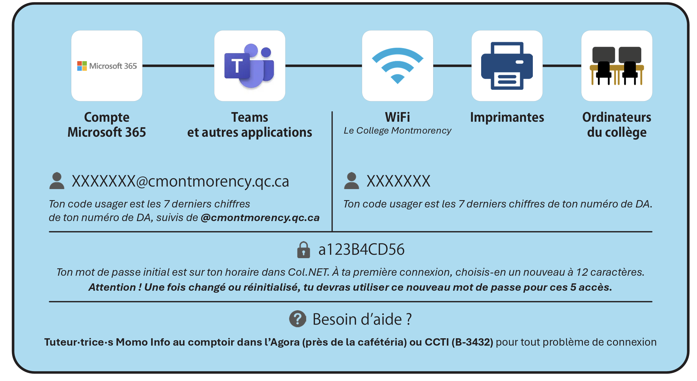

# COURS : 582-531 OBJETS INTERACTIFS

<!-- toc -->

- Numéro de cours : 582 531 MO
- Nombre d’heures d’enseignement : 60
- Pondération : 2-2-2
- Programme : Techniques d’intégration multimédia
- Département du programme : Techniques d’intégration multimédia
- Session : Automne 2026
- Professeure ou professeur : Thomas O. Fredericks
- Département de la professeure ou du professeur : Techniques d’intégration multimédia
- Courriel : ThomasOuellet.Fredericks@cmontmorency.qc.ca
- Bureau : C-1649
- Plateforme(s) pédagogique(s) utilisée(s) : Teams, GitHub et [t-o-f.info/aide](https://t-o-f.info/aide/)
- Coordination : Lora Boisvert
- Contact de la coordination : lora.boisvert@cmontmorency.qc.ca (C-1651)

## Présentation du cours

### Description du cours

Ce cours permet à l’élève de se familiariser avec des technologies électroniques (capteurs, microcontrôleurs, DEL, microprogrammation, microordinateur) et leur intégration à un système multimédia interactif. Au terme de ce cours, l’élève est en mesure d’intégrer des technologies électroniques à une expérience multimédia interactive.

### Objectif intégrateur

Intégrer une technologie électronique à un système multimédia interactif.

### Compétence(s) ministérielle(s)

- 015F Exploiter les langages de programmation utilisés en multimédia (éléments 1, 4, 5).
- 015S Vérifier la faisabilité technique du projet (éléments 2, 3).

### Objectifs d’apprentissage

- Adapter la programmation à une technologie électronique interactive.
- Valider la faisabilité technique d’un système électronique interactif.

### Cours liés

Le cours suivant est préalable absolu au présent cours :

- 582 431 MO Audio 2

### Volets transversaux

- Compétence langagière : L’élève adapte son discours à la situation de communication, communique adéquatement à l’oral et à l’écrit, soigne ses productions écrites et utilise le lexique de la profession.
- Compétence numérique : L’élève exploite les TIC de manière efficace et responsable. Il recherche, traite et présente de l’information.

### Attitudes professionnelles

- Esprit d’équipe
- Créativité
- Autonomie

### Dates importantes

- 18 septembre : Date limite de désinscription au cours sans mention au bulletin.
- 4 novembre : Date limite d’abandon de cours sans échec entraînant une mention au bulletin.

## Contexte d’apprentissage et méthodes pédagogiques

- [x] Exposés magistraux
- [x] En laboratoire informatique
- [x] Apprentissage et utilisation de logiciels sous forme de démonstrations, d’exercices, de travaux pratiques
- [x] Projets multimédias
- [x] Exposés interactifs
- [x] Écoute de pistes sonores
- [x] Activités coopératives
- [x] Tutorat individuel ou de petits groupes
- [x] En présence
- [ ] En ligne
- [ ] Stage en milieu de travail
- [ ] Discussions en groupe (tables rondes)

## Matériel, comptes et volumes requis

- [x] Disque dur portatif
- [x] Carte SD 
- [x] Clé USB
- [x] Cahier ou papiers divers, pour griffonner, conceptualiser, réaliser des croquis et noter vos inspirations
- [x] Prévoir un budget d’environ 50 $ pour l’évaluation finale
- [x] Compte GitHub

Pour les détails du matériel requis, voir le [guide des étudiants](https://cmontmorency365.sharepoint.com/:w:/r/sites/TIM-TTP/Documents%20partages/comite_politiques/guides/guide_etudiants.docx?d=w48119bb75aec438cbb23c7da3ee1061d&csf=1&web=1&e=mN0PFI).

## Réservation du matériel spécialisé

Lorsque vous êtes autorisée ou autorisé par votre professeure ou professeur à emprunter le matériel spécialisé, vous pouvez le réserver auprès des TTP en suivant la procédure suivante : [Procédure de prêt – TTP.pptx](https://cmontmorency365.sharepoint.com/:p:/r/sites/TIM-programmeTIM752/Documents%20partages/TTP%20-%20R%C3%A9servations/Proc%C3%A9dure%20de%20pr%C3%AAt%20-%20TTP.pptx?d=wce77a41cd0db4bb8862e11adba23c93b&csf=1&web=1&e=UPLDTD).

## Règles d’identification des travaux

Les travaux non identifiés ne seront pas corrigés et les pénalités de retard s’appliqueront. À moins d’indication contraire, les remises de travaux doivent être nommées de la manière suivante :

### Travail individuel

Suivre le modèle suivant : 

- `[nom de famille]-[prénom]_[nom du travail]_[#travail]_[#cours]`

Exemple : 

- `gilbert-charlene_polychromes_01_582-314MO`

### Travail d’équipe

Suivre le modèle suivant : 

- `[les noms de famille en ordre alphabétique séparés par -]_[nom du travail]_[#travail]_[#cours]`

Exemple : 

- `boisvert-gilbert-hubert_polychromes_01_582-314MO`

## Déroulement

### Semaine 1 

À préparer avant la classe :

- Rien.

Activités en classe :

- Présentation du cours et de son fonctionnement.
- Inscription à [tinkercad.com/](https://www.tinkercad.com/)
- Identification des composants.
- Introduction à l’électronique :
	- [Platine d’expérimentation (breadboard)](https://t-o-f.info/aide/#/fabrication/electronique/platine/)
	- [Alimenter le *breadboard* avec une carte Arduino](https://t-o-f.info/aide/#/fabrication/electronique/platine/alimenter/carte/).
		- [Fatalités](https://t-o-f.info/aide/#/fabrication/electronique/fatalites/)
	- [DEL](https://t-o-f.info/aide/#/fabrication/electronique/composants/del/) et [résistance](https://t-o-f.info/aide/#/fabrication/electronique/composants/resistance/)
	- [Alimenter une DEL](https://t-o-f.info/aide/#/fabrication/electronique/platine/del/)
	- [DEL](https://t-o-f.info/aide/#/fabrication/electronique/composants/del/), [résistance](https://t-o-f.info/aide/#/fabrication/electronique/composants/resistance/) et bouton de fortune.
- [Soudure](https://t-o-f.info/aide/#/fabrication/electronique/soudure/) :
	- [Potentiomètre](https://t-o-f.info/aide/#/fabrication/electronique/composants/potentiometre/).
	- [Bouton d’Arcade](https://t-o-f.info/aide/#/fabrication/electronique/composants/bouton/arcade/)

### Semaine 2 

À préparer avant la classe :

- Soudure du bouton d’arcade.
- Soudure du potentiomètre si non terminée.

Annonce :

- [LUDODROME 2026 Tickets, Saturday, September 12  •  12 PM - 11:30 PM | Eventbrite](https://www.eventbrite.com/e/ludodrome-2026-tickets-1993647769145?aff=oddtdtcreator)
	- [LUDODROME 2026 | Instagram](https://www.instagram.com/p/DbwzCVxEi2n/?img_index=1)
	- [LUDODROME 2025 | Experimentation Excites Everyone - YouTube](https://www.youtube.com/watch?v=Y76aHOd3Xlo)

Visite : 

- [Club de robotique | Collège Montmorency](https://www.cmontmorency.qc.ca/etudiants/vie-etudiante/clubs-et-comites/club-de-robotique/)

Activités en classe :

- Introduction à [Arduino](https://t-o-f.info/aide/#/fabrication/arduino/).
	- [Arduino Nano R4](https://t-o-f.info/aide/#/fabrication/arduino/nano/r4/).
- [PlatformIO](https://t-o-f.info/aide/#/fabrication/platformio).
	- Nom du premier projet : `arduino_clignotement`
	- Partir un [nouveau projet PlatformIO](https://t-o-f.info/aide/#/fabrication/platformio/nouveau/).
	- [Configuration](https://t-o-f.info/aide/#/fabrication/nano/configuration/) pour un Arduino Nano R4.
- [Coder en C++](https://t-o-f.info/aide/#/fabrication/cpp/code/)

### Semaine 3 

À préparer avant la classe :

- Rien.

Activités en classe :

- Rouvrir son dépôt git `arduino_clignotement`.
	- [Tutoriel clignotement : Arduino, platine, bouton, DEL, Chrono et Bounce2](https://t-o-f.info/aide/#/tutoriels/platine/clignotement/)
	- Ne pas oublier de faire le commit du git !
	- [Quiz sur le tutoriel de clignotement](https://t-o-f.info/quiz/arduino/clignotement/)
	- Références supplémentaires :
		- [Code de base Arduino](https://t-o-f.info/aide/#/fabrication/arduino/code/) 
		- [Chrono](https://t-o-f.info/aide/#/fabrication/arduino/chrono/).
		- [Bounce2](https://t-o-f.info/aide/#/fabrication/arduino/bounce2/).
- Créer un nouveau dépôt git `pd_fichiers_audio`.
	- Introduction à [Pure Data (Pd)](https://t-o-f.info/aide/#/logiciels/pd/).
	- [pdChoco](https://t-o-f.info/aide/#/logiciels/pd/pdchoco/).
	- [Pd : Lecture de fichiers audio avec Pdchoco](https://t-o-f.info/aide/#/logiciels/pd/audio/fichiers/).
	- Ne pas oublier de faire le commit du git !
- [Quiz sur l’audio dans Pd](https://t-o-f.info/quiz/pd/audio/fichiers/).

### Semaine 4

À préparer avant la classe :

- Tester Pure Data et pdchoco à la maison.

Activités en classe :

- Créer un nouveau dépôt git `arduino_pd_audio`.
	- [Communication sérielle ASCII avec Arduino](https://t-o-f.info/aide/#/fabrication/arduino/code/serial/).
	- [Réception sérielle dans Pd avec comport](https://t-o-f.info/aide/#/logiciels/pd/serie/comport).
	- [Réception ASCII dans Pd avec pdchoco](https://t-o-f.info/aide/#/logiciels/pd/serie/ascii).
	- Déclencher des sons dans Pd à partir d’un microcontrôleur.
	- Sauver son patcher Pd dans le dépôt git.
	- Formatif sur la première évaluation (vous pouvez demander de l’aide et des questions) :
		- 60% :
			- Deux boutons.
			- Deux DEL.
			- Quand j’appuie sur un bouton, cela allume une DEL.
		- 80% :
			- Un son déclenché dans Pure Data par chaque bouton.
		- 100% :
			- Quand j’appuie sur un premier bouton, un son est déclenché et la DEL s’illumine tant que ne je relâche pas.
			- Quand j’appuie sur le deuxième bouton, la lecture d’un son est déclenché et la DEL s’illumine en continu. Je dois appuyer de nouveau pour éteindre la DEL et arrêter le son. 
	- Ne pas oublier de faire le commit du git !
	- [Tutoriel ASCII audio : Arduino, ASCII et audio dans Pd](https://t-o-f.info/aide/#/tutoriels/platine/audio)

### Semaine 5 

À préparer avant la classe :

- Se pratiquer pour l’évaluation.

Activités en classe :

- **Évaluation**

Matière non couverte :

- Contrôle de lecture, volume et de panoramique.
- Sélection du son.
- Contrôle de vitesse de lecture.

### Semaine 6 : 30 septembre

À préparer avant la classe :

- Rien.

Activités en classe :

- [Qu’est-ce que l’OSC](https://t-o-f.info/aide/#/fabrication/osc/)
- Bibliothèque [MicroOsc : SLIP](https://t-o-f.info/aide/#/fabrication/arduino/microosc/slip/)
- [Tutoriel MicoOsc audio : Envoi d’OSC SLIP d’un Arduino Nano avec un bouton d’arcade pour déclencher de l’audio dans Pd](https://t-o-f.info/aide/#/tutoriels/arcade/pd/)
- [Tutoriel relais MicroOsc : Envoi d’OSC SLIP d’un Arduino Nano avec un bouton d’arcade vers OSC UDP](https://t-o-f.info/aide/#/tutoriels/arcade/relais/)

- [Unity : OSC UDP avec extOSC](https://t-o-f.info/aide/#/logiciels/unity/osc/extosc/) avec Unity 2022.3.62f3.
- [Tutoriel Flappy Bird : Unity, Pd, OSC et Arduino Nano avec bouton d’arcade](https://t-o-f.info/aide/#/tutoriels/arcade/flappy/)

### Semaine 7 : 7 octobre

À préparer avant la classe :

- Rien.

Activités en classe :

- [Tutoriel Pong : Unity, Pd, OSC et Arduino Nano avec bouton d’arcade et potentiomètre](https://t-o-f.info/aide/#/tutoriels/arcade/pong/)
	- Nom des projets :
		- PlatformIO : `pong_bouton_pot_arduino`
		- Unity : `pong_bouton_pot_unity`

- Exercice : intégrer le bouton et le potentiomètre à la scène `ScrubPitchGlitch` du projet [thomasfredericks/unity-videofx](https://github.com/thomasfredericks/unity-videofx)
	- Nom des projets :
		- PlatformIO : `videofx_bouton_pot_arduino`
		- Unity : `videofx_bouton_pot_unity`

### Semaine 8 : 21 octobre

À préparer avant la classe :

- Rien.

Activités en classe :

- Communication bidirectionnelle.
- Soudure de la photo-résistance.
- Soudure du connecteur Grove.

### Semaine 9 : 28 octobre

À préparer avant la classe :

- Soudure du connecteur Grove si non terminée.
- Soudure de la photo-résistance si non terminée.

Activités en classe :

- Glissement des valeurs.
- Traitement de la photo-résistance.

### Semaine 10 : 4 novembre

À préparer avant la classe :

- Se préparer pour l’évaluation.

Activités en classe :

- **Évaluation**.

### Semaine 11 : 11 novembre

À préparer avant la classe :

- Rien.

Activités en classe :

- I2C :
	- TOF.
	- Encodeur rotatif.
- Utilisation des transducteurs M5Stack :
	- Key.
	- Fader.

### Semaine 12 : 18 novembre

À préparer avant la classe :

- Rien.

Activités en classe :

- Introduction à l’impression 3D.

### Semaine 13 : 25 novembre

À préparer avant la classe :

- Effectuer l’impression 3D.

Activités en classe :

- Travail supervisé.

### Semaine 14 : 2 décembre

À préparer avant la classe :

- Effectuer l’impression 3D si non complétée.

Activités en classe :

- Travail supervisé.

### Semaine 15 : 9 décembre

À préparer avant la classe :

- Terminer son projet d’équipe.

Activités en classe :

- **Évaluation**.

## Évaluation des apprentissages

Les évaluations formatives jouent un rôle crucial dans le processus d’apprentissage en offrant à l’étudiant une occasion continue de perfectionner ses connaissances, de comprendre ses points forts et ses domaines à améliorer. Ces évaluations visent à soutenir activement le développement des compétences en offrant des conseils personnalisés pour renforcer la compréhension des concepts enseignés et améliorer la capacité de les appliquer de manière pratique.

D’un autre côté, les évaluations sommatives sont utilisées pour évaluer les acquis et les connaissances de l’étudiant à un moment donné. Elles servent à mesurer la réussite et la maîtrise des objectifs d’apprentissage à la fin d’une période déterminée. Les résultats des évaluations sommatives fournissent une évaluation globale du niveau de compétence atteint par l’étudiant.

Dans le cas où des étudiants auraient formulé une demande en raison de besoins spécifiques pour bénéficier de temps supplémentaire lors des évaluations, l’enseignant essayera de respecter les recommandations émises pour favoriser le succès de l’étudiant. Cette mesure vise à garantir l’équité et l’accessibilité, permettant à tous les apprenants de démontrer leur compréhension de manière juste et équitable. Cependant c’est la responsabilité de l’étudiant de faire une demande au SAA (Service d’aide à l’apprentissage) au moins 7 jours avant l’évaluation sommative afin de disposer de leur temps supplémentaire accordé dans leurs locaux.

## Évaluations formatives

Des évaluations formatives sont prévues au calendrier. Elles sont sous la forme de pratiques dont le résultat est connu par l’étudiant, mais non comptabilisé pour la note finale. Ce sont des pratiques pour les évaluations sommatives.

## Évaluations sommatives

### Sommaire des évaluations

| Évaluation | Titre | Date | % |
| --- | --- | --- | ---: |
| EVAL-1 | Pure Data | Séance 5 | 33 % |
| EVAL-2 | Engin de jeu | Séance 10 | 33 % |
| EVAL-3 | Intégration * | Séance 15 | 34 % |
| | **Total** | | **100 %** |

* : Intégration des apprentissages.

### Évaluation 1 : Pure Data

| Identification | Forme | Individuel ou en équipe | Date de l’évaluation ou de la remise | % |
| --- | --- | --- | --- | --- |
| EVAL-1 | Laboratoire Pd | Individuel | Séance 5 | 33 % |

Savoirs essentiels et critères d’évaluation :

- Démontrer pendant le cours l’intégration de capteurs avec un logiciel interactif sonore.
- Démontrer le contrôle de la panoramique et du volume du son.
- Valider la faisabilité technique d’un système électronique interactif : 50 %.
- Adapter la programmation aux technologies électroniques interactives : 50 %.

### Évaluation 2 : Engin de jeu

| Identification | Forme | Individuel ou en équipe | Date de l’évaluation ou de la remise | % |
| --- | --- | --- | --- | --- |
| EVAL-2 | Laboratoire Unity | Individuel | Séance 10 | 33 % |

Savoirs essentiels et critères d’évaluation :

- Démontrer pendant le cours l’intégration de capteurs à un logiciel interactif visuel et sonore avec rétroaction.
- Valider la faisabilité technique d’un système électronique interactif : 50 %.
- Adapter la programmation aux technologies électroniques interactives : 50 %.

### Évaluation 3 : Intégration des apprentissages

| Identification | Forme | Individuel ou en équipe | Date de l’évaluation ou de la remise | % |
| --- | --- | --- | --- | --- |
| EVAL-3 | Présentation en classe | En équipe  | Séance 15 | 34 % |

Concevoir et fabriquer un puzzle interactif pouvant être intégré à un *escape game*.  Le joueur doit manipuler des objets, observer des indices et résoudre une énigme afin de déclencher une action : ouverture d’un mécanisme, allumage d’un voyant, affichage d’un code, déverrouillage d’une boîte, déclenchement d’un son, etc.

Savoirs essentiels et critères d’évaluation :

- Intégrer plusieurs microcontrôleurs à un microordinateur (Raspberry PI) distant.
- Le puzzle doit comporter au moins 3 éléments électroniques **différents**.
- Le joueur doit effectuer au moins deux étapes logiques pour résoudre le puzzle. Exemple : Le joueur trouve 4 symboles → les entre dans le bon ordre → Arduino vérifie la combinaison → un servo déverrouille une boîte → un nouvel indice apparaît.
- Imprimer un objet 3D qui intègre les transducteurs.
- Idéalement le projet ne dépend pas d’un écran et utilise des DEL ou un servomoteur pour indiquer l’état.
- Un petit écran pourrait être **intégré** à l’objet 3D.
- Il doit y avoir un aspect sonore.
- Démontrer le contrôle de la panoramique et du volume du son.
- Valider la faisabilité technique d’un système électronique interactif : 50 %.
- Adapter la programmation aux technologies électroniques interactives : 50 %.

## Médiagraphie

### Ressources en ligne

- [t-o-f.info/aide](https://t-o-f.info/aide/)
- [arduino.cc](https://arduino.cc/)
- [raspberrypi.com](https://www.raspberrypi.com/)
- [tinkercad.com](https://www.tinkercad.com/)
- [Adafruit Learning System](https://learn.adafruit.com/)
- [Hackaday](https://hackaday.com/)

### Livres

- Genevey, F., & Dulex, J.-P. *Arduino à l’école*.
- Bartmann, E. *Le grand livre d’Arduino*.
- Fitzgerald, S., & Shiloh, M. *Arduino Projects Book*.
- Saint-Denis, P., & Marie, M. *MUS3328 — Notes de cours*.

### Achat de composants

- [Addison Électronique](https://addison-electronique.com/) — Laval.
- [RobotShop](https://www.robotshop.com/) — Montréal.
- [Abra Electronics](https://abra-electronics.com/) — Montréal.
- [Adafruit](https://www.adafruit.com/) — États-Unis.
- [Mouser Electronics Canada](https://www.mouser.ca/) — Canada.
- [DigiKey Canada](https://www.digikey.ca/) — Canada.

### Guides et bases de connaissances

- Guide pour les étudiants dans le programme TIM : [guide_etudiants.docx](https://cmontmorency365.sharepoint.com/:w:/r/sites/TIM-TTP/Documents%20partages/comite_politiques/guides/guide_etudiants.docx?d=w48119bb75aec438cbb23c7da3ee1061d&csf=1&web=1&e=mN0PFI)
- [Carrefour de l’information étudiante](https://www.cmontmorency.qc.ca/etudiants/carrefour-info/).
- [Le métier étudiant, ça s’apprend !](https://www.cmontmorency.qc.ca/etudiants/carrefour-info/metier-etudiant/)
- [Écran : Base de connaissances | étudiantes et étudiants](https://cmontmorency365.sharepoint.com/sites/bdc-etudiants?xsdata=MDV8MDF8fDdiMzI5ZDFlYzMwMTRhYWMzOTgzMDhkYWZhNmE3NTBhfGZmYTk5NWM3MTBkZTRlYzg5NWRiMjhlZDA1NzY0NTVkfDB8MHw2MzgwOTc2MzIzNjM0MjgyMjd8VW5rbm93bnxWR1ZoYlhOVFpXTjFjbWwwZVZObGNuWnBZMlY4ZXlKV0lqb2lNQzR3TGpBd01EQWlMQ0pRSWpvaVYybHVNeklpTENKQlRpSTZJazkwYUdWeUlpd2lWMVFpT2pFeGZRPT18MXxNVFkzTkRFMk5qUXpOVEkwT0RzeE5qYzBNVFkyTkRNMU1qUTRPekU1T20xbFpYUnBibWRmVG5wWmVWcHFUbWxhYlZsMFRrUmtiVTVwTURCUFYwMHpURmRKTTFscVdYUk9SMWswVG1wV2FGcEVUbXhPUkZaclFIUm9jbVZoWkM1Mk1nPT18YjU0ZjQ1ZjM0NGFlNGEzYjM5ODMwOGRhZmE2YTc1MGF8MjliMTg3ZDZjMDdlNGZkZDgzZTI5ZTA4YjU5YWZmNTE%253D&sdata=U3paQ3hqVkJTc3h5UmZxUlRGMFdyZHpXbkZRVzZmcUIydEh3UjVXME9MZz0%253D&ovuser=ffa995c7-10de-4ec8-95db-28ed0576455d%252Ctofredericks%2540cmontmorency.qc.ca&OR=Teams-HL&CT=1674166416457&clickparams=eyJBcHBOYW1lIjoiVGVhbXMtRGVza3RvcCIsIkFwcFZlcnNpb24iOiIyNy8yMzAxMDUwNTYwMCIsIkhhc0ZlZGVyYXRlZFVzZXIiOmZhbHNlfQ%253D%253D)

## Règles d’évaluation des apprentissages 

Tous les articles de la [Politique institutionnelle d’évaluation des apprentissages (PIÉA)](https://www.cmontmorency.qc.ca/wp-content/uploads/images/college/regles-et-reglements/Politique_institutionnelle_evaluation_des_apprentissages_PIEA_2023.pdf) s’appliquent à ce cours. 

### Français, méthodologie et plagiat

- [Article 5.4 Évaluation de la langue française](https://www.cmontmorency.qc.ca/wp-content/uploads/images/college/regles-et-reglements/Politique_institutionnelle_evaluation_des_apprentissages_PIEA_2023.pdf#page=12)
- [Article 6.1.2 Sanction pour manquement à l’intégrité intellectuelle](https://www.cmontmorency.qc.ca/wp-content/uploads/images/college/regles-et-reglements/Politique_institutionnelle_evaluation_des_apprentissages_PIEA_2023.pdf#page=14)

L’étudiante ou l’étudiant doit garder une copie de sécurité de ses travaux tant qu’elle ou il n’a pas reçu le corrigé de son travail. 

L’étudiante ou l’étudiant doit aussi conserver tous les fichiers sources et ses originaux qui lui ont permis d’effectuer son travail. Si l’étudiante ou l’étudiant n’a pas les fichiers sources entre les mains, le professeur se réserve le droit d’attribuer la note zéro pour le travail concerné. 

Comme les fichiers sources des travaux remis par la population étudiante doivent pouvoir être consultés par le corps professoral, les professeurs peuvent refuser tout travail réalisé à partir de bibliothèques, logiciels ou plugiciels piratés. 

Le matériel visuel, sonore ou textuel créé par une IA générative est considéré comme étant « créé par l’IA générative » et dans ce sens doit être cité correctement en mentionnant le nom et la version de l’IA générative. Ne pas le mentionner constitue du plagiat. Il faut aussi citer la requête utilisée pour générer le contenu.

### Climat en classe, éthique et travail en équipe

- [Article 6.2.1 Manquement à la sécurité](https://www.cmontmorency.qc.ca/wp-content/uploads/images/college/regles-et-reglements/Politique_institutionnelle_evaluation_des_apprentissages_PIEA_2023.pdf#page=15)
- [Article 6.3.1 Manquement à l’éthique](https://www.cmontmorency.qc.ca/wp-content/uploads/images/college/regles-et-reglements/Politique_institutionnelle_evaluation_des_apprentissages_PIEA_2023.pdf#page=16)

Le travail et l’esprit d’équipe sont des piliers importants de la création en multimédia. Lors des périodes d’atelier, les étudiants sont invités à se comporter comme s’ils étaient dans le milieu professionnel. 

- Lors des périodes d’atelier, les étudiants sont invités à discuter entre eux tout en maintenant un niveau de voix normal pour échanger sur la matière et développer des relations. Pour aider à la concentration pendant les périodes d’atelier, les étudiants sont invités à utiliser des écouteurs.
- Aucune forme d’agressivité, d’intimidation ou de violence ne sera tolérée en classe, cela entraînera l’expulsion. Si des étudiants ne se sentent pas à l’aise en classe, ils sont invités à en discuter avec le professeur et à sortir de classe pour prendre un moment pour eux.

Seuls les logiciels et le matériel enseignés peuvent être utilisés dans le cadre du cours. Les téléphones cellulaires et appareils mobiles sont interdits en classe virtuelle et en présentiel et ne font pas partie du matériel enseigné en cours, à moins d’indications contraires de la part du professeur. Lors du non-respect de ces règles, l’étudiante ou l’étudiant est déclaré absent et l’enseignant peut lui demander de quitter la classe.

Lors d’un refus d’assumer sa part de travail pendant un travail d’équipe noté, l’étudiante ou l’étudiant sera rencontré par la professeure ou le professeur qui prendra les mesures appropriées à la situation. 

### Présence et évaluations

- [Article 7.1 Présence en classe](https://www.cmontmorency.qc.ca/wp-content/uploads/images/college/regles-et-reglements/Politique_institutionnelle_evaluation_des_apprentissages_PIEA_2023.pdf#page=17)
- [Article 7.2 Absence à une évaluation sommative](https://www.cmontmorency.qc.ca/wp-content/uploads/images/college/regles-et-reglements/Politique_institutionnelle_evaluation_des_apprentissages_PIEA_2023.pdf#page=17)
- [Article 7.3 Absence à un stage](https://www.cmontmorency.qc.ca/wp-content/uploads/images/college/regles-et-reglements/Politique_institutionnelle_evaluation_des_apprentissages_PIEA_2023.pdf#page=17)
- [Article 7.4 Retard](https://www.cmontmorency.qc.ca/wp-content/uploads/images/college/regles-et-reglements/Politique_institutionnelle_evaluation_des_apprentissages_PIEA_2023.pdf#page=18)
- [Article 7.4.1 Retard à une évaluation sommative](https://www.cmontmorency.qc.ca/wp-content/uploads/images/college/regles-et-reglements/Politique_institutionnelle_evaluation_des_apprentissages_PIEA_2023.pdf#page=18)
- [Article 7.4.2 Retard dans la remise des activités d’évaluation](https://www.cmontmorency.qc.ca/wp-content/uploads/images/college/regles-et-reglements/Politique_institutionnelle_evaluation_des_apprentissages_PIEA_2023.pdf#page=18)

Les présences aux remises de chacune des évaluations sont obligatoires et essentielles à la réussite des activités sommatives. Une absence lors d’une évaluation entraînera la note 0, et ce même si le travail a été remis en ligne ou que le travail a été présenté par le reste de l’équipe. 

La présence en classe lors des remises, des évaluations et des présentations des travaux est très importante pour bénéficier des commentaires du professeur, afin de réussir la session. 

La pénalité imposée pour un retard dans la remise est de 10% par tranche de 24 heures de retard, à partir de l’heure prévue de la remise. Si le retard excède quatre jours, sans égard aux congés, ou dépasse le moment où de la rétroaction est fournie aux
étudiantes et aux étudiants, la note zéro sera attribuée.

Pour les **stages**, les 225 heures de présence sont nécessaires pour la réussite du stage. Si vous devez vous absenter, vous devrez avertir votre employeur et voir comment reprendre les heures. Les jours de congés permis sont ceux de l’employeur et non ceux du collège.

### Corrections

- [Article 8.1 Délais de correction des activités d’évaluation](https://www.cmontmorency.qc.ca/wp-content/uploads/images/college/regles-et-reglements/Politique_institutionnelle_evaluation_des_apprentissages_PIEA_2023.pdf#page=19)

Les délais de correction ne peuvent dépasser dix jours ouvrables suivant la date prévue de remise des activités d’évaluation.

Les étudiantes et étudiants peuvent rencontrer le professeur pour discuter des forces et faiblesses d’un travail corrigé 48 heures après sa remise. La professeure ou le professeur peut être joint par courriel ou par Teams. Teams est privilégié et plus rapide. Comptez un délai de deux journées ouvrables pour obtenir un retour, sauf lors de cas exceptionnels.

## Annexes

