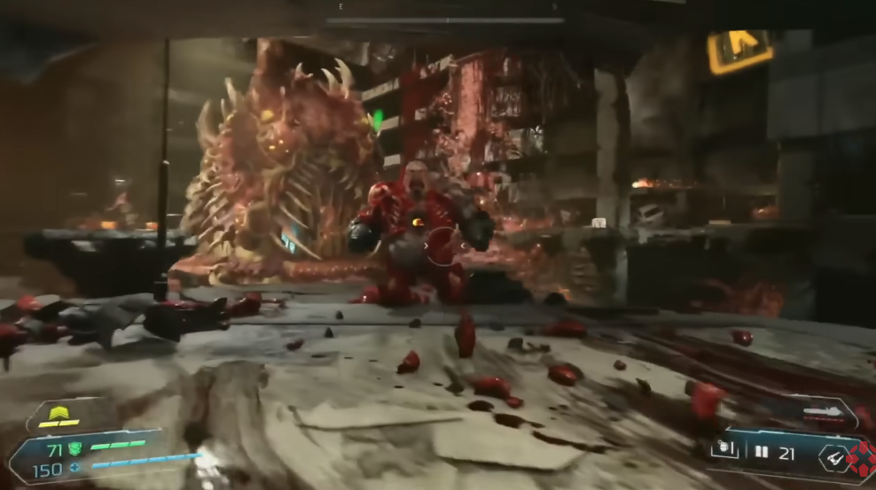
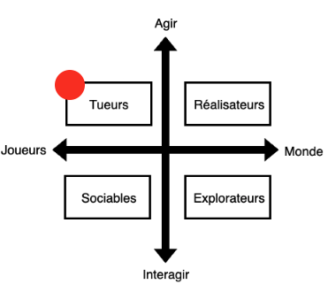

# Esthétique et public cible de DOOM Eternal

Exemple d'analyse d'esthétique de l'expérience multimédia interactive *DOOM Eternal*. Extrait vidéo : [7 Minutes of Doom: Eternal Gameplay - QuakeCon 2018 - YouTube](https://www.youtube.com/watch?v=p7cZDoKopkc)

|  | DOOM Eternal
|---|---|
| **Capture d'écran de l'interface utilisateur** |   |
| **Observations sur l'interface utilisateur** | L'IU est épurée (en contraste avec le reste) et retranchée dans les coins, en périphérie. Elle est translucide. Elle est effacée et presque invisible. |
| **3 mots pour décrire l'émotion** | Mature, anxiogène, violent | 
| **3 mots pour décrire le timbre** | Saturé, agressif, dense |  
| **3 mots pour décrire la structure** | Chaotique, frénétique, explosif | 
| **3 mots pour décrire les références** | Futuriste, guerrier, performant | 
| **Intention esthétique** | Maintenir une pression constante et plonger le joueur dans un état de surstimulation | 
| **Public cible** |   | 