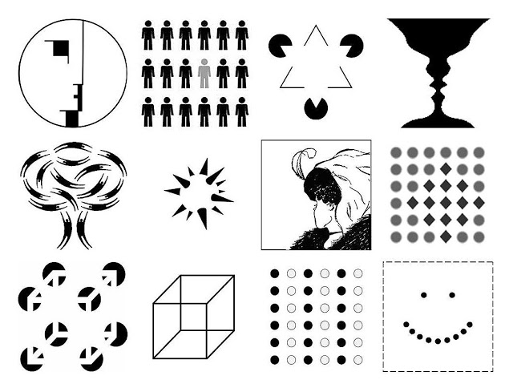

# Gestalt : Psychologie de la forme 

La psychologie de la forme (Gestalt) et s’applique à toutes les disciplines de la création : design, musique, cinéma, son, etc. 

Un bon design guide le regard en jouant sur : 
- Contraste (couleur, lumière, taille, forme) 
- Proximité / séparation 
- Mouvement ou direction

La **symétrie** et **l’alignement** structurent la composition et facilitent la lecture visuelle.
Lorsque des éléments sont alignés ou organisés de manière symétrique, le cerveau perçoit immédiatement un ordre et une cohérence. Cela permet au designer de créer des rythmes visuels, d’équilibrer les masses et de diriger l’attention vers certains points importants.

À l’inverse, rompre la symétrie ou casser un alignement attire l’œil et peut servir à créer une tension, une hiérarchie ou un effet de surprise dans la composition.

## La distinction figure vs fond  

La distinction figure / fond est une notion centrale en perception visuelle et sonore.  La relation figure/fond crée la hiérarchie visuelle et oriente la perception. 

## La figure 

- C’est l’élément que l’œil identifie comme principal, devant, porteur de sens. C’est ce que le spectateur « regarde ». 
- C’est le son saillant, celui sur lequel l’attention se focalise. 

Exemples : 
- Dans un portrait, le visage est la figure. 
- Sur une affiche, le texte ou le logo mis en avant est la figure. 
- Dans un paysage, un arbre isolé ou un personnage peut devenir la figure. 
- Une mélodie dans une chanson. 
- Une voix principale dans un film. 
- Un bruit soudain dans un environnement calme. 

## Le fond 

- C’est l’arrière-plan sur lequel la figure se détache. Il donne du contexte, de la profondeur, et met la figure en valeur sans attirer l’attention. 
- C’est le contexte sonore, souvent continu, qui soutient ou encadre la figure. 

Exemples : 
- Le ciel derrière un personnage. 
- La texture ou la couleur uniforme qui sert de toile de fond. 
- Le bruit ambiant. 
- Les réverbérations d’un espace. 

