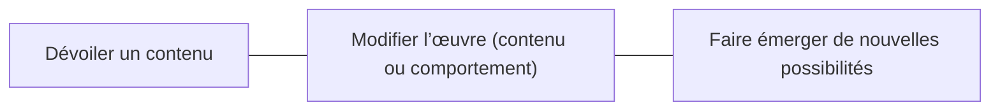

# Continuum de l'interactivité 

Il existe différents **degrés d’interactivité**. On peut les situer sur un continuum selon l’influence que les actions de l’utilisateur ont sur l’expérience.

Ce continuum ne constitue pas une hiérarchie : une interaction simple peut être parfaitement adaptée à l’intention d’une œuvre. Il permet plutôt de déterminer **dans quelle mesure l’utilisateur participe à la construction de l’expérience et dans quelle mesure le résultat est déterminé à l’avance par le concepteur**.

Continuum de l'interactivité :

À une extrémité, l’interaction sert principalement à **dévoiler un contenu prédéterminé** : l’utilisateur choisit ce qu’il découvre, mais ne transforme pas réellement l'expérience.

Au centre, les actions de l’utilisateur **modifient l’état de l’œuvre**. Le contenu peut être modifié et les comportements de l'expérience peuvent changer pour s'adapter aux interactions. S'il y a modification de contenu, ce nouveau contenu doit pouvoir être expérimenté par les utilisateurs suivants. 

À l’autre extrémité, l'expérience fonctionne comme un **système ouvert** dont les règles permettent l’apparition de comportements ou de résultats qui n’ont pas été entièrement prévus par les concepteurs. On parle alors d’**interactivité émergente** : les utilisateurs peuvent créer, par leurs actions et leurs interactions entre eux, des situations nouvelles qui deviennent à leur tour partie de l’expérience.

