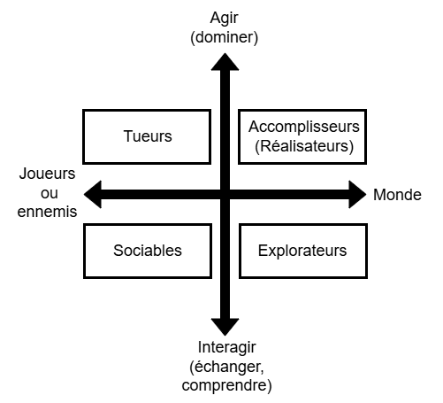

# Public cible

Le public cible est le groupe de personnes pour lequel une expérience multimédia est conçue. Il ne désigne pas seulement les personnes susceptibles d’utiliser ou de voir le projet, mais les personnes dont les caractéristiques, les besoins, les connaissances, les attentes et les motivations sont prises en compte dans la conception de l’expérience.

Le public cible permet au concepteur de déterminer **quelle expérience il souhaite faire vivre, à qui il souhaite la faire vivre et dans quelles conditions cette expérience doit être vécue**.

* Il définit à qui l’expérience s’adresse.
* Il influence les choix de contenu, de langage, d’esthétique et d’interaction.
* Il permet d’adapter le niveau de difficulté et de familiarité avec le média.
* Il influence les émotions, les comportements ou les apprentissages que l’expérience cherche à susciter.
* Il permet d’évaluer la qualité de l’expérience en fonction des personnes pour lesquelles elle a été conçue.

Le public cible n’est donc pas nécessairement l’ensemble des personnes qui peuvent accéder au projet. Il représente plutôt le groupe de référence à partir duquel le concepteur prend ses décisions et évalue si l’expérience répond à son intention.

- Certains interacteurs vont se désintéresser si l'expérience est trop simple. 
- Et d’autres qui fuient la complexité. 
- D'autres recherchent le conflit.
- Et aussi certains qui recherchent le calme.

## Graphique de la taxonomie de Richard Bartle

- Axe horizontal : Joueurs/Ennemis ⟷ Monde
    - Joueurs : L’intérêt est centré sur les autres joueurs ou sur les ennemis. Le joueur cherche l’affrontement, la coopération ou l’interaction sociale.
    - Monde : L’intérêt est centré sur le monde virtuel lui-même. Le joueur veut découvrir, construire, progresser ou maîtriser l’univers du jeu.
- Axe vertical : Agir (dominer) ⟷ Interagir
    - Agir (dominer) : Le joueur préfère agir sur son environnement ou sur les autres (imposer, conquérir, dominer, accomplir). C’est une posture active, orientée vers l’impact direct. Le joueur veut changer, transformer, contrôler.
    - Le joueur préfère interagir avec les autres ou le monde (dialoguer, échanger, explorer, comprendre). C’est une posture relationnelle, orientée vers l’échange ou la compréhension. Le joueur cherche à communiquer, collaborer, découvrir plutôt qu’imposer

### 4 grands profils

- Tueurs : agir sur les joueurs (compétition, PvP, domination) ou les ennemis → attaquer, battre, dominer.
- Accomplisseurs (réalisateurs) : agir sur le monde (avancer, accomplir, accumuler) → gagner des niveaux, accumuler des ressources, construire.
- Sociables : interagir avec les joueurs (coopération, amitié, communauté)  → discuter, créer des liens, coopérer .
- Explorateurs : interagir avec le monde (curiosité, découverte, compréhension) → explorer, observer, comprendre les mécaniques.

