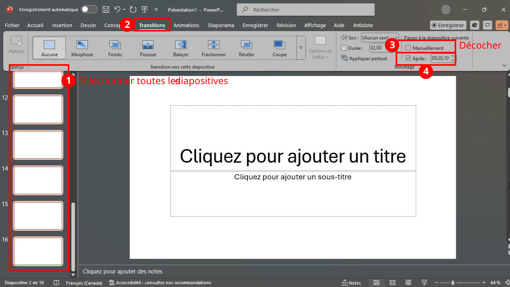
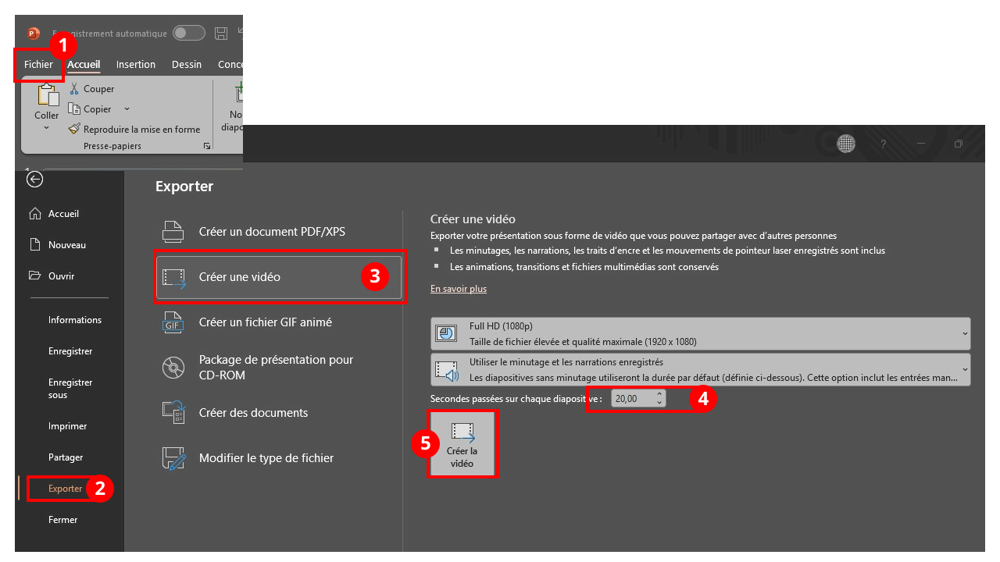

# Pecha Kucha**

Le format Pecha Kucha est une façon très particulière de faire une présentation orale. Il est couramment utilisé pour des :

* Événements créatifs ou artistiques (design, art, multimédia).
* Présentations d’équipe rapides (pitchs de projet, séances de remue-méninges).
* Conférences qui veulent garder un rythme vivant.

Le principe :

* **15 diapositives PowerPoint, exactement.**
* **20 secondes par diapositive, exactement.**
* Les diapositives avancent automatiquement.
* La présentation dure donc **exactement 5 minutes** au total.
* **Rythme rapide :** pas le temps de s’étendre ; chaque idée doit être claire et concise.
* **Visuel :** les diapositives sont surtout composées d’images, et non de longs textes.
* Il faut éviter d’inclure des vidéos, de l’audio et, surtout, des liens externes.

## Exemples de présentations Pecha Kucha**

* [Intellect Begets Art](https://www.youtube.com/watch?v=HmhhfbIsTSk)
* [Games as Interactive Art](https://www.youtube.com/watch?v=wb16067ptX8)
* [Video Games as Art (PechaKucha)](https://www.youtube.com/watch?v=Y-vc_2o8IR4)

## Comment automatiser le défilement d’une présentation PowerPoint**

Les deux méthodes suivantes exigent l’utilisation de l’application de bureau (et non de la version en ligne) de PowerPoint.

### Avec des transitions**

### En exportant une vidéo**

