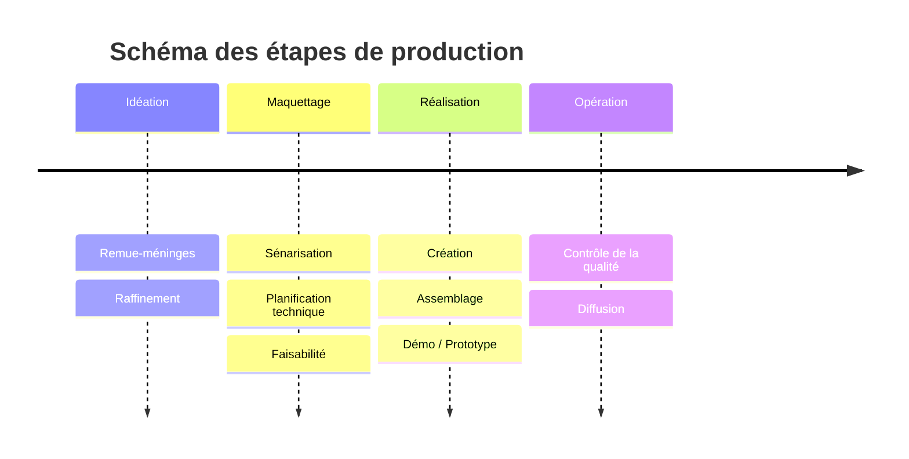

# Production

## Étapes de production 

- Idéation
    - Remue-méninges
    - Raffinement
- Conception
    - [Scénarisation](./scenarisation/)
    - [Planification technique](./planification/)
    - [Faisabilité](./faisabilite/)
    - Maquettage
- Réalisation
    - Création
    - Assemblage
    - Démo / Prototype
- Opération
    - Qualité
    - Présentation