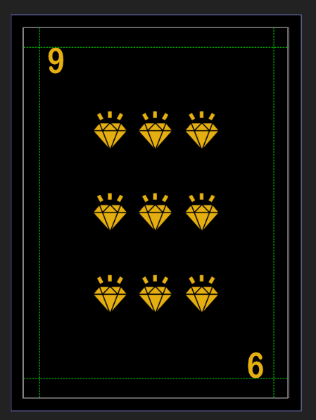
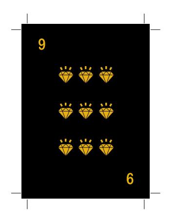
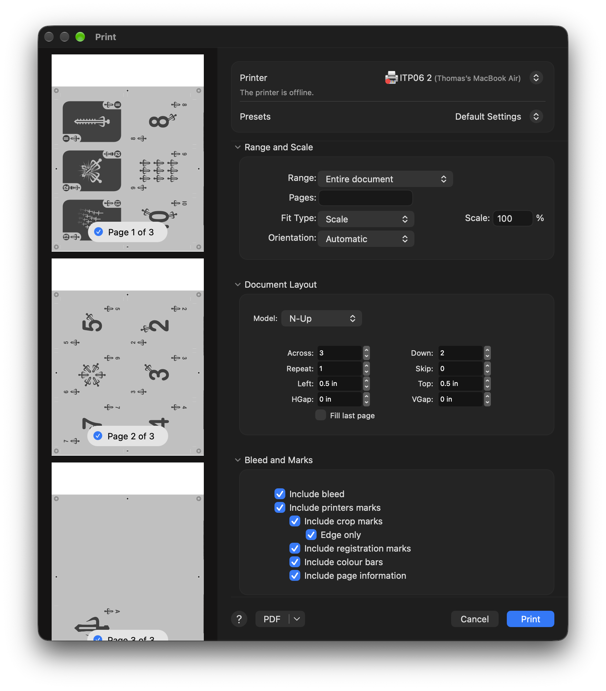
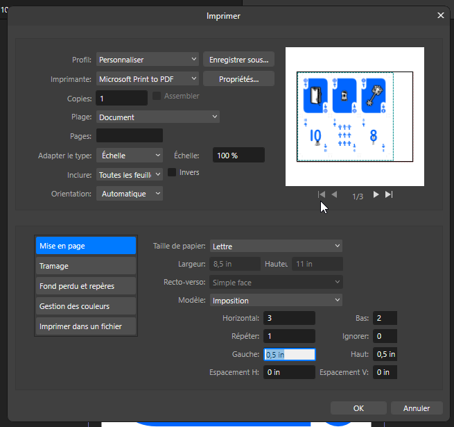
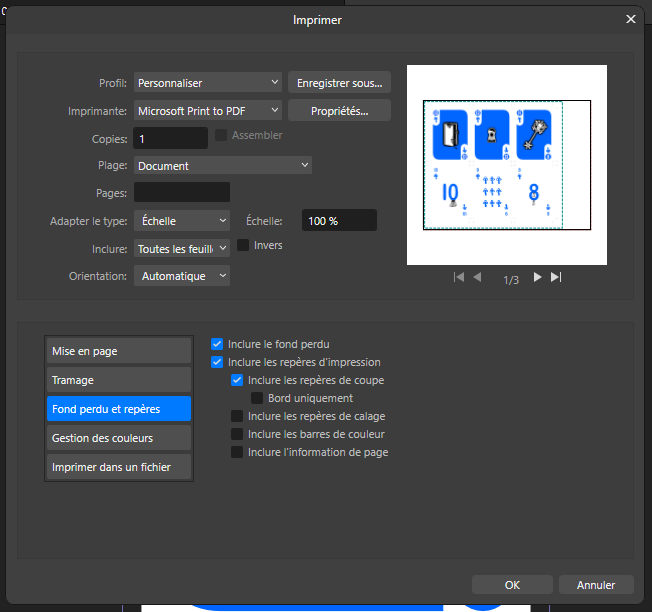

# Exemple : Guide de normes graphiques pour cartes

Cette page détaille la rédaction d'un guide normes graphiques pour la réalisation d'un jeu de cartes standard thématique de 54 cartes :

- 4 familles d'enseigne de 4 couleurs, mais réparties en deux groupes
- 3 figures et 1 as par enseigne
- 2 jokers différents

*Préparez ce document avec soin : il servira de référence absolue pour toute la durée de la production de votre jeu de cartes.*

## Structure du document

Le document doit être livré sous format numérique (exportation **pdf** d'un document Word ou PowerPoint) et structuré selon les sections suivantes.

### Général

*   **Page couverture :** Titre du paquet de cartes, nom de la thématique et nom(s) des créateurs et visuel inspirant.
*   **Introduction et concept :** Une description narrative de 5 à 10 lignes de l'univers thématique choisi et de l'ambiance recherchée.
* **Esthétique :** préciser les [4 domaines de l'esthétique](/creation/esthetique/banque/).
    * **L'émotion** : ce que l'expérience fait ressentir.
    * **Le timbre** : la qualité sensible et perceptuelle de l'expérience.
    * **La structure** : la manière dont l'expérience se déploie et évolue.
    * **Les références** : les univers, styles et imaginaires évoqués par l'expérience.
*   **Plusieurs planches d'inspirations (moodboard)** pour chacun des éléments suivants :
    - Thématique.
    - Typographies.
    - Dispositions.
    - Dos des cartes.
    - Figures.
    - Jokers.

> [!NOTE]
> Il faut une planche d'inspirations pour chacun des éléments et chaque planche
> doit présenter plusieurs inspirations !

### Couleurs

*   **Échantillons (Swatches) :** 
    - Couleur de fond de la carte.
    - Couleur de fond des indices.
    - Présentation des 4 couleurs principales et 4 couleurs secondaires utilisées.
    - Préciser comment la couleur est utilisé pour le texte.
*   **Codes de couleur :** Indication obligatoire des valeurs **RVB** (pour l'écran/web) ainsi que les codes hexadécimaux (**HEX**).
* **Accessibilité visuelle et contrastes :**
    *   **Contraste texte/fond :** Le ratio de contraste entre la couleur des indices/chiffres et le fond de la carte doit respecter les normes minimales d'accessibilité. Évitez le texte clair sur fond clair ou le texte sombre sur fond sombre.
    *   **Validation des contrastes :** Indiquez dans votre document les outils utilisés pour tester vos contrastes (ex: [WebAIM Contrast Checker](https://webaim.org/resources/contrastchecker/) ou l'analyseur intégré de votre suite logicielle de design).
* **Typographie** :
    * **Police des valeurs :** Nom de la police utilisée pour les valeurs (ex : As, 2, 10).
        - Taille en points pour les indices 
        - Taille en points lorsque le texte est au milieu de la carte.
    * **Texte des figures :** Indiquer les valeurs pour les figures, c'est-à-dire les trois valeurs qui suivent le 10 (cela peut être des nombres ou autre chose tant que c'est clair).
    * **Éléments textuels artistiques ou thématiques (si utilisé) :** Nom de la police secondaire pour les éléments textuels artistiques ou thématiques si utilisés.

### Éléments de jeu

Vous devez présenter les gabarits visuels préliminaires pour prouver la faisabilité du projet :

*  **Le dos de carte :** Croquis ou maquette du dos, en vérifiant qu'il respecte la symétrie (non orienté).
*  **Les enseignes :** Présentation graphique des symboles de vos 4 familles, adaptées à votre thème.
    *   Distinction des enseignes : Ne vous basez pas uniquement sur la couleur pour différencier les familles (ex : le rouge pour Cœur/Carreau et le noir pour Pique/Trèfle).
*  **Figure :** Croquis ou maquette rapide d'au moins une figure (ex : la Dame) démontrant l'intégration de la thématique.
*  **Joker :** Croquis ou maquette rapide d'un joker.
* **Lisibilité :** La valeur et la famille de la carte doivent être clairs à distance.

### Contraintes techniques d'impression

Pour valider que votre projet est techniquement viable, incluez les paramètres de production :

- **Résolution d'image de chaque carte :** Minimum 300 dpi.
- **Format de la carte :** Dimensions standard Poker : 63 x 88 mm ou 2,28 x 3,46 po.
- **Fonds perdus (bleed) :** Veuillez prévoir 1/8 po pour les fonds perdus. 
- **Zone de sécurité textuelle :** Garder les textes et indices à l'intérieur d'une marge sécurisée (1/8 po de chaque côté) pour éviter qu'ils ne soient coupés. 

Voici un exemple de l'application des contraintes techniques : [American-poker-size.pdf de makeplayingcards.com](American-poker-size.pdf)

## Notes sur l'impression

