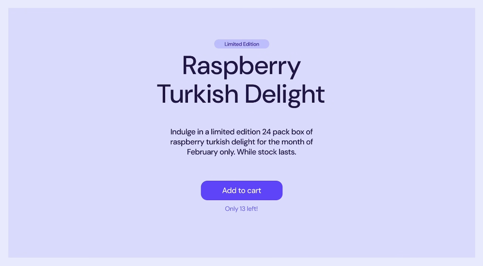
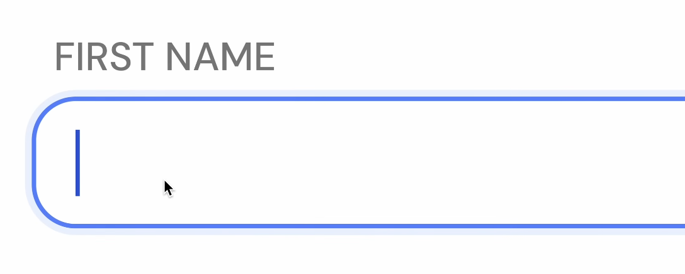
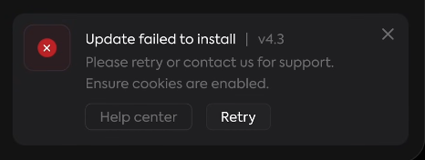
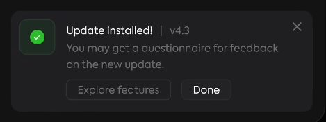

# IU : Couleur

Vidéo : [Every UI/UX Concept Explained in Under 10 Minutes - YouTube](https://www.youtube.com/watch?v=EcbgbKtOELY)

## Couleur de marque

## Couleurs sémantiques

Utiliser les couleurs avec intention, et non seulement pour de la décoration.

### Indicateurs

