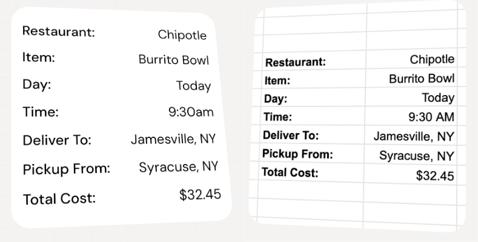
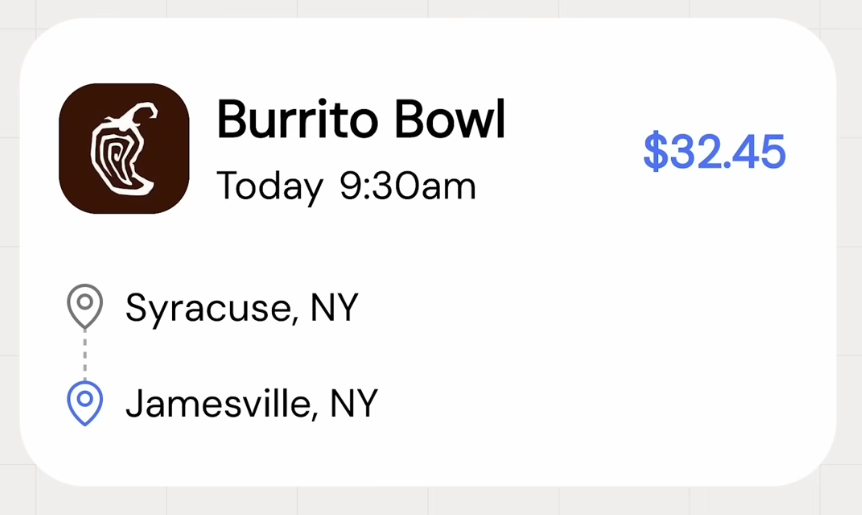

# IU : Hiérarchie visuelle

Organisation et mise en valeur des éléments par importance.

Vidéo : [Every UI/UX Concept Explained in Under 10 Minutes - YouTube](https://www.youtube.com/watch?v=EcbgbKtOELY)

