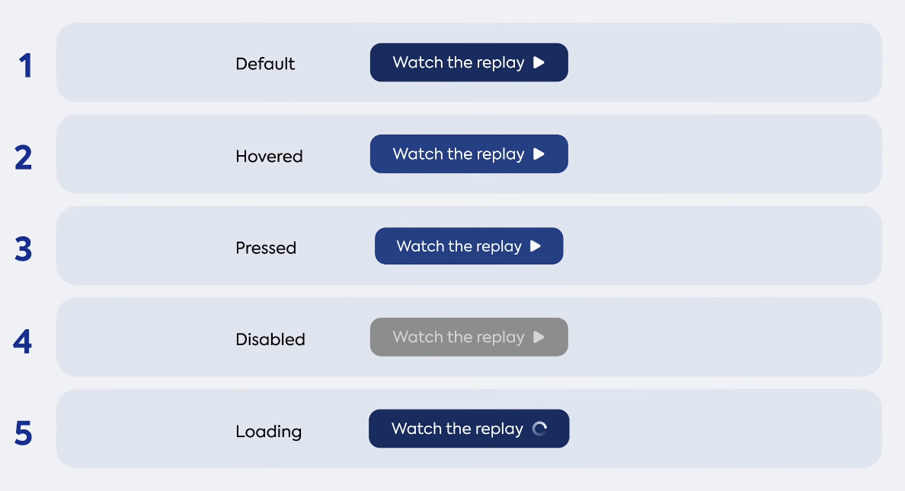
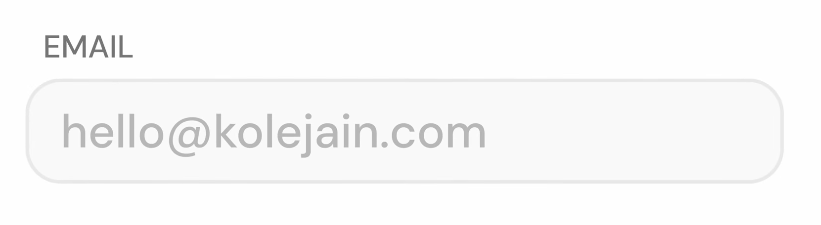
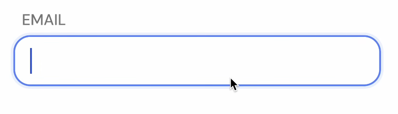
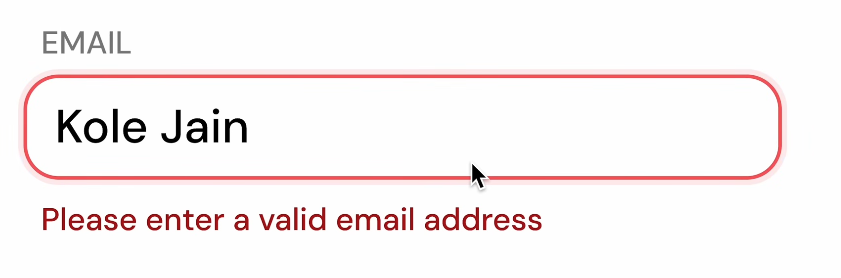
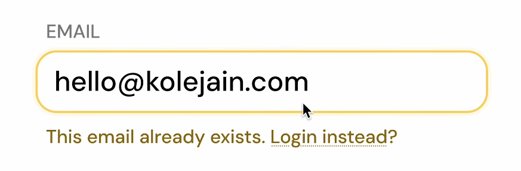
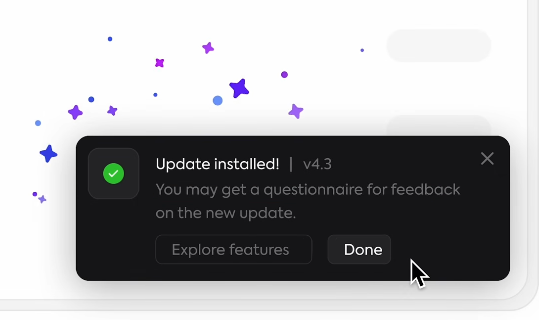
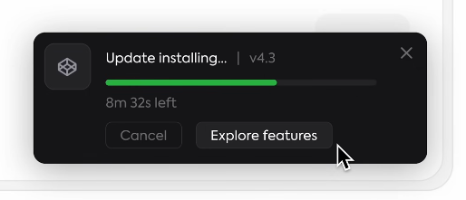

# Rétroaction (feedback)

> [!IMPORTANT]
> Chaque fois que l'interacteur fait quelque chose, le système doit répondre avec une réaction !

Vidéo : [Every UI/UX Concept Explained in Under 10 Minutes - YouTube](https://www.youtube.com/watch?v=EcbgbKtOELY)

## États de boutons

## Entrées

## Autres indicateurs

