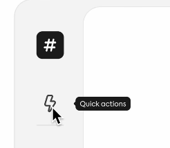

# IU : Signifiants de l'interface utilisateur

Un signifiant (tel que défini par la psychologie du design de Don Norman) est un indicateur visuel d'utilisabilité. 

Vidéo : [Every UI/UX Concept Explained in Under 10 Minutes - YouTube](https://www.youtube.com/watch?v=EcbgbKtOELY)

### Groupes

### Bascule

### Inactif

### Mise en évidence

### Infobulle

