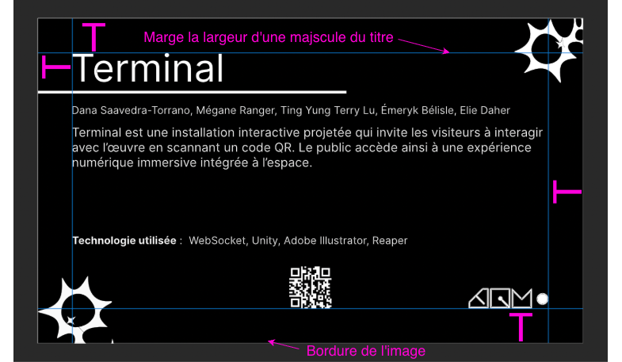
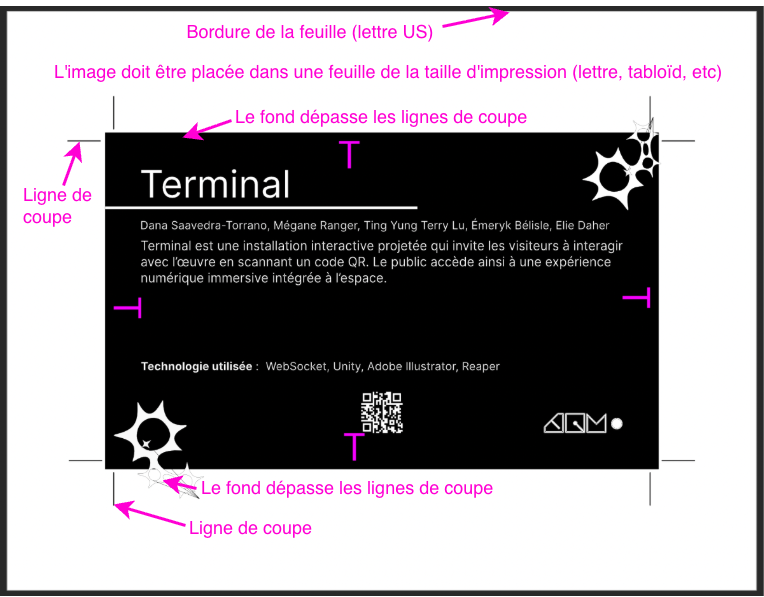
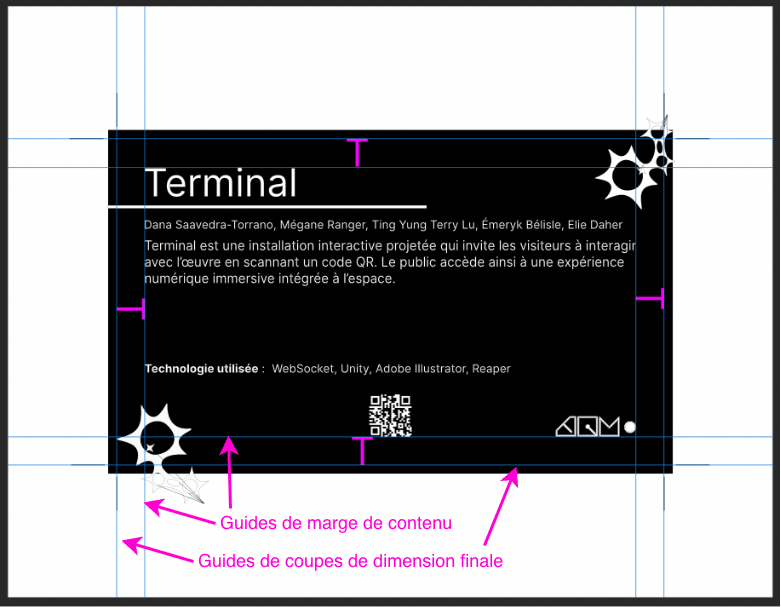

# Marges

Les marges doivent suivre une logique proportionnelle pour l'équilibre visuel du document.

## Marge de contenu de premier plan

Cette marge délimite la zone intérieure où doivent se trouver les textes et les logos pour garantir une lisibilité optimale et éviter qu'ils ne paraissent « écrasés » contre le bord.

**Unité de mesure typographique :** Nous utilisons comme référence une lettre majuscule du titre comme unité de mesure. La distance entre le contenu de premier plan et le bord du document (la marge) doit être égale à la dimension la plus grande entre la hauteur et la largeur de cette majuscule.

## Préparation pour l'impression

Pour l'impression, il est nécessaire d'ajouter une marge supplémentaire et il est nécessaire de placer l'image sur une feuille de la taille d'impression.

* **Lignes de coupe :** Les lignes de coupe indiquent à l'imprimeur l'endroit précis où la feuille sera tranchée pour obtenir le format final.
* **Fonds perdus (*Bleed*) :** Le fond doit dépasser légèrement les lignes de coupe. Cette partie du fond sera perdue lors de la coupe et garantie que le fond se poursuit jusqu'au bord du document final lorsqu'il sera coupé.
* **Support d'impression :** Le visuel doit être placé sur une feuille du format d'impression (lettre, tabloïd, etc.).

