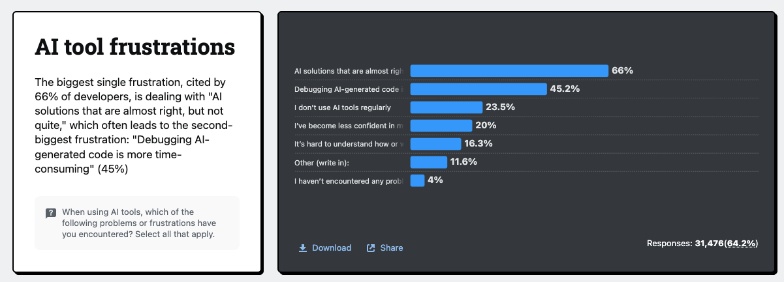

# Dette technique causée par les GML

Selon le sondage [AI | 2025 Stack Overflow Developer Survey](https://survey.stackoverflow.co/2025/ai#developer-tools-ai-complex-ai-complex) : 
* Plus de 66 % des développeurs disent que leur principale frustration avec les outils de code basés sur un GML, c’est *le code presque correct, mais pas tout à fait*.
* Ce qui mène souvent à la deuxième plus grande frustration : *Déboguer du code généré par l'IA prend plus de temps* (45 %)

*Le code presque correct* coûte plus cher que le *code complètement faux* :
- *Le code complètement faux* se repère vite
- *Le code presque correct* :
    - Passe la revue de code
    - Part en production
    - Reste dans le code pendant plusieurs mois avant que quelqu’un réalise qu'il est erroné

Et lorsque le code *presque correct* est découvert, **les coûts de correction ont explosé** et n'ont pas été budgétés. 

Selon, [AI-Generated Code Is Creating a New Kind of Technical Debt - YouTube](https://www.youtube.com/watch?v=S5kQRgJ-iug):
- **la confusion est à la racine de toute dette technique** 
- **quand un GML écrit du code que tu ne comprends pas, tu n’as pas gagné du temps, tu l’as emprunté**

Les principales erreurs récurrentes générées par un GML sont les suivantes :
-  Flux incompréhensibles : Du code que personne ne peut déboguer. Le temps n’a pas été gagné, il a été emprunté.  
- Erreurs masquées : Les erreurs ne sont pas corrigées, elles sont supprimées ou ignorées. Les avertissements deviennent des problèmes différés.  
- Code fantôme : Doublons, fonctions inutilisées, exports morts. Le problème n’est pas la quantité de code, mais la confusion qu’il introduit.  
- Code non conventionnel : Le code fonctionne, mais ne respecte pas les conventions. Chaque lecture devient plus coûteuse.  

Pour limiter ces effets, trois questions doivent être posées systématiquement lors d’une revue de code générée par un GML :
- Ce code réutilise-t-il quelque chose d’existant dans la base de code ?  
- Respecte-t-il les conventions établies ?  
- Peut-il être expliqué clairement sans s’appuyer sur les commentaires générés par un GML ?  

Si la réponse est négative à l’une de ces questions, il est probable qu’une dette technique soit en train d’être créée.  

> [!WARNING]
> Un GML ne rend pas le développeur nécessairement plus rapide. 
> Elle permet surtout d’aller plus vite dans la mauvaise direction.  
 

L'enquête [AI | 2025 Stack Overflow Developer Survey](https://survey.stackoverflow.co/2025/ai#developer-tools-ai-complex-ai-complex) révèle un phénomène étrange. La confiance accordée aux outils de codage par GML a chuté à 33 %, contre 43 % l'an dernier :
- C'est la première fois que la méfiance (46 %) dépasse la confiance (33 %). L'opinion favorable, quant à elle, a glissé de 72 % au début de l'année 2024 à 60 % aujourd'hui.
- On observe également un fossé générationnel. Les développeurs en début de carrière utilisent un GML quotidiennement à hauteur de 55,5 %, tandis que les développeurs expérimentés affichent des taux de méfiance élevés atteignant 20,7 %.
- C'est là tout le paradoxe : les développeurs font état de gains de productivité de 81 % avec GitHub Copilot, et pourtant, leur niveau de confiance ne cesse de baisser.