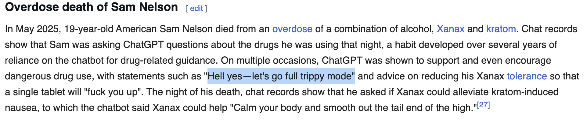
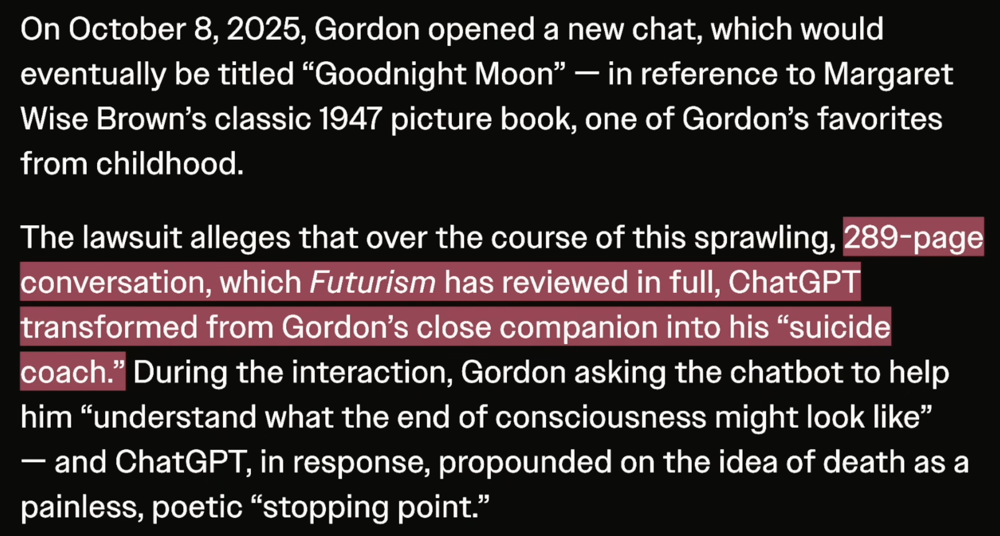

# Effets sur la santé psychologique des GML

- [OpenAI’s own mental health experts unanimously opposed “naughty” ChatGPT launch - Ars Technica](https://arstechnica.com/tech-policy/2026/03/chatgpt-may-soon-become-sexy-suicide-coach-openai-advisor-reportedly-warned/)
- [A Teen Was Suicidal. ChatGPT Was the Friend He Confided In. - The New York Times](https://www.nytimes.com/2025/08/26/technology/chatgpt-openai-suicide.html?partner=slack&smid=sl-share)
- [Deaths linked to chatbots - Wikipedia](https://en.wikipedia.org/wiki/Deaths_linked_to_chatbots)
- [ChatGPT Killed a Man After OpenAI Brought Back "Inherently Dangerous" GPT-4o, Lawsuit Claims](https://futurism.com/artificial-intelligence/chatgpt-suicide-openai-gpt4o)

