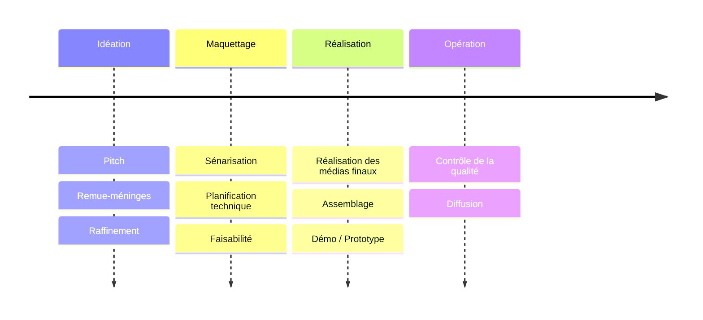

# Production

## Étapes de production 

```mermaid
timeline
    Idéation   : Pitch
               : Remue-méninges
               : Raffinement
    Maquettage : Sénarisation
               : Planification technique
               : Faisabilité
    Réalisation   : Réalisation des médias finaux
                  : Assemblage
                  : Démo / Prototype
    Opération  : Contrôle de la qualité
               : Diffusion
```
