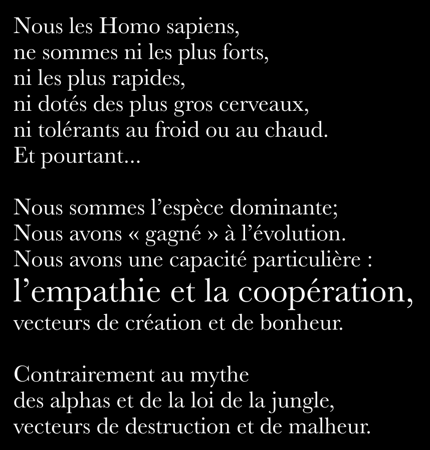

# Manifeste pour une éducation résiliente

## Construire une société

L’éducation ne sert pas qu’à décrocher un emploi. Elle vise à créer une société libre, juste et solidaire.

L'éducation doit libérer, plutôt que pousser à se conformer. Elle ne devrait pas former à la soumission, mais à l’émancipation. 

## Apprendre à réfléchir

Les élèves doivent avoir le temps et les outils pour réfléchir à ce qu’ils apprennent, découvrir ce qui les intéresse et acquérir les compétences nécessaires pour aller plus loin.

Apprendre à **résoudre des problèmes**, pas seulement à répondre à des questions. Développer l’**esprit critique**, la **créativité**, l’**initiative**. Trop souvent, les notes ne reflètent ni l'engagement, ni la curiosité, ni la profondeur de réflexion.

## Vivre ensemble

Les élèves doivent apprendre à être humains ensemble : **travailler avec leurs pairs**, **dialoguer avec les membres de la communauté**, **comprendre l’autre**. La société se construit à travers les échanges humains.

L’**art d’écouter** l’autre est une compétence fondamentale, qui doit être davantage développée. Dans le souci de se faire comprendre et d’échanger, les élèves doivent aussi **apprendre à s’exprimer**.

L'école est un lieu d’**apprentissage social** : **coopération**, **respect**, **empathie**.

### Recherches

#### Google

Le [Projet Aristotle](https://www.leaderfactor.com/learn/project-aristotle-psychological-safety) lancée par Google vers 2012, visait à comprendre pourquoi certaines équipes fonctionnent mieux que d'autres. L’étude a analysé plus de 180 équipes internes, en combinant entretiens, données comportementales et métriques de performance. Le résultat ? La composition des membres importe peu : c’est la nature des interactions au sein de l’équipe qui détermine son efficacité. Google a identifié que le premier prédicteur de réussite d’une équipe est **la sécurité psychologique**. Ce facteur se trouve bien au-dessus de la simple intelligence etdes compétences techniques individuelles ou des dynamiques démographiques.

**La sécurité psychologique** est la croyance partagée que chaque membre de l'équipe peut :
- s’exprimer librement,
- poser des questions,
- prendre des risques,
- admettre ses erreurs sans crainte de ridicule, de rejet ou de représailles.

Le modèle des 5 dynamiques de performance (Google) :
- Sécurité psychologique (fondation, elle permet aux autres dimensions de s’activer efficacemen)
- Fiabilité des membres (dependability)
- Structure et clarté des rôles et objectifs
- Sens du travail (meaning)
- Impact du travail (perception des retombées)

Les équipes affichant une forte sécurité psychologique obtiennent :
- 19 % de productivité en plus,
- 31 % d’innovation en plus,
- 27 % de baisse du turnover,
- un engagement 3,6 fois supérieur

#### Anita Williams Woolley de Carnegie Mellon

Anita Williams Woolley, professeure en comportement organisationnel à l’université Carnegie Mellon, est une spécialiste reconnue de l’intelligence collective. Dans [Evidence of a Collective Intelligence Factor in the Performance of Human Groups](https://www.researchgate.net/publication/47369848_Evidence_of_a_Collective_Intelligence_Factor_in_the_Performance_of_Human_Groups), elle a démontré que l’intelligence collective d’un groupe est un indicateur mesurable de sa performance. Et que plus le groupe démontrait de l'empathie et une sensibilité sociale, plus il avait une intelligence collecitve.

Woolley souligne que la performance d’un groupe dépend surtout :
- d’une répartition équitable de la parole,
- de l’absence de domination par une ou deux personnes,
- de normes de collaboration bien établies.

Ce qui fait la différence, ce ne sont pas les QI individuels, mais les compétences sociales et de communication.