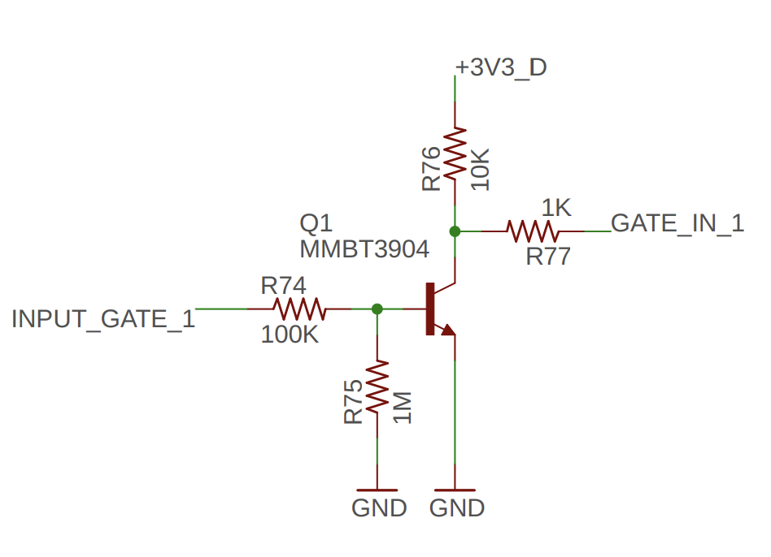
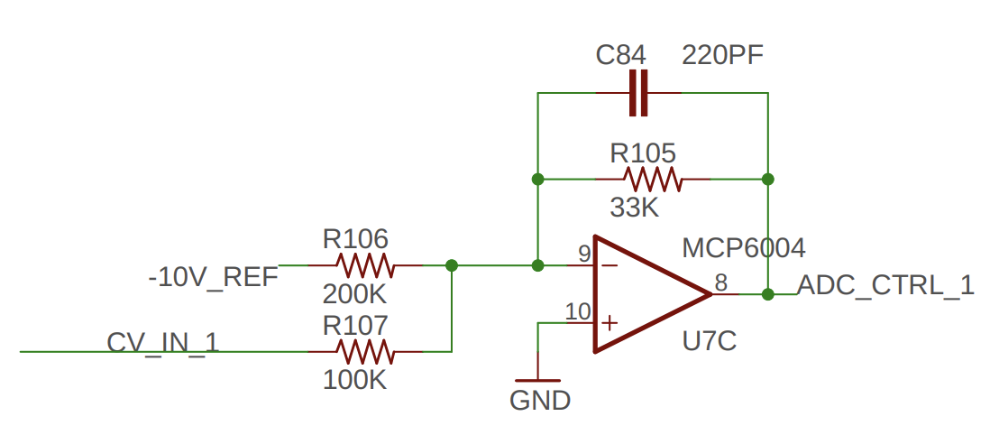
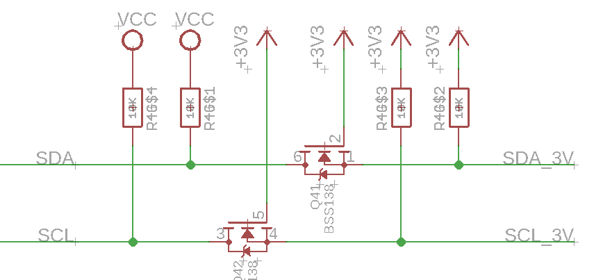

# Électronique : Entrées/Sorties 

<!-- toc -->

## Entrée numérique

### Entrée numérique à transistor

- `INPUT_GATE_1` peut monter à 10 volts
- Changer `3V3_D` pour la tension du microcontrôleur
- Brancher `GATE_IN_1` au microcontrôleur

## Entrée analogique

### Entrée analogique -10 V à 10 V

- `CV_IN_1` peut varier entre -10 à 10 volts
- Op-Amp est alimenté par -10 à 10 volts
- `ADC_CTRL_1` varie entre 0 et 3.3 V (à noter que le signal est inversé)
- Brancher `ADC_CTRL_1` au microcontrôleur

## Sortie numérique

- Vitesse de basculement : 30 kHz

## Sortie analogique

## Adaptation de niveau (*level shifting*)

Selon [What is STEMMA? | Adafruit STEMMA & STEMMA QT | Adafruit Learning System](https://learn.adafruit.com/introducing-adafruit-stemma-qt?view=all), la conversion de niveau est extrêmement peu coûteuse (un réseau de 4 résistances de 10 kΩ + deux [BSS138](https://www.digikey.com/product-detail/en/nexperia-usa-inc/BSS138BKS115/1727-6478-2-ND/2763891) est très compact et coûte environ 10 cents au total), et la conversion de niveau offre également une certaine protection du niveau de ligne contre une polarité inversée ou une surtension. Cela demande un peu plus d’effort, mais Adafruit estime que c’est essentiel pour offrir une bonne expérience. 

