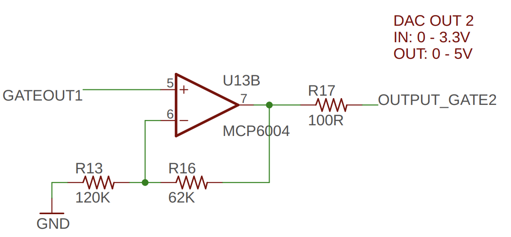
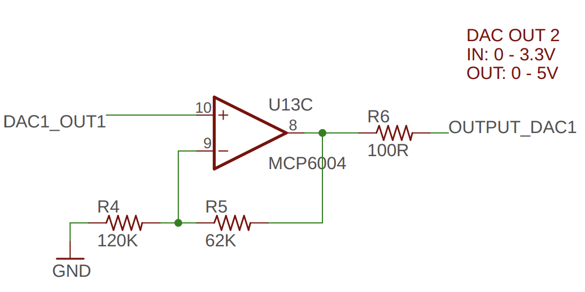

# Électronique : Entrées/Sorties 

<!-- toc -->

## Entrée numérique

### Entrée numérique à transistor

- `INPUT_GATE_1` peut monter à 10 volts
- Changer `3V3_D` pour la tension du microcontrôleur
- Brancher `GATE_IN_1` au microcontrôleur

## Entrée analogique

### Entrée analogique -10 V à 10 V

- `CV_IN_1` peut varier entre -10 à 10 volts
- Op-Amp est alimenté par -10 à 10 volts
- `ADC_CTRL_1` varie entre 0 et 3.3 V (à noter que le signal est inversé)
- Brancher `ADC_CTRL_1` au microcontrôleur

## Sortie numérique

- Vitesse de basculement : 30 kHz

## Sortie analogique

