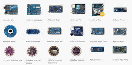

# Arduino

Le nom Arduino peut faire référence à plusieurs choses :

- Le langage de programmation *Arduino* : [Code Arduino](./code/).
- Le logiciel de développement *Arduino IDE* : [docs.arduino.cc/software/ide](https://docs.arduino.cc/software/ide/).
- L'organisme *Arduino* qui maintient le code à jour : [arduino.cc](https://www.arduino.cc/)
- Une carte *Arduino* : un petit circuit électronique programmable (pas nécessairement fabriqué par l'organisme Arduino).

## Modèles de carte

Il existe plusieurs modèles de cartes Arduino. Certains sont produits par la compagnie Arduino et d'autres sont des clones légaux. La fabrication et la vente de clones est légale, Arduino est en fait un clone de la plateforme [Wiring](http://www.wiring.org.co/). 

Pour plus d'informations sur l'ensemble des cartes disponibles, consultez le [Make: Boards Guide](https://makezine.com/comparison/boards).
