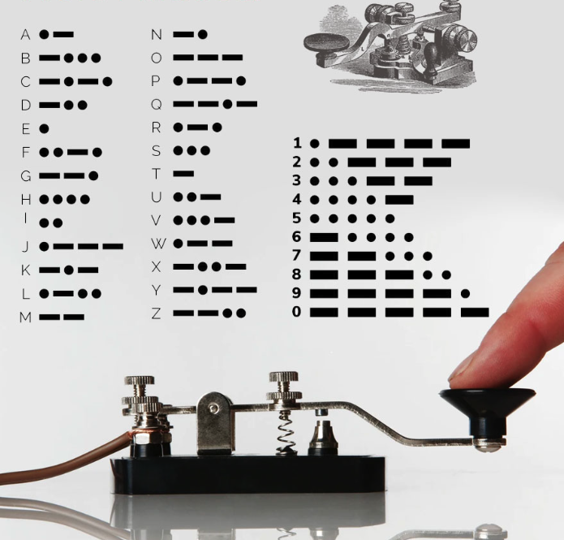
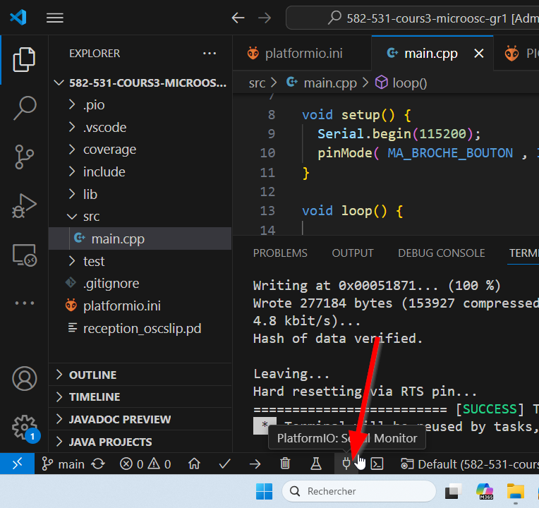
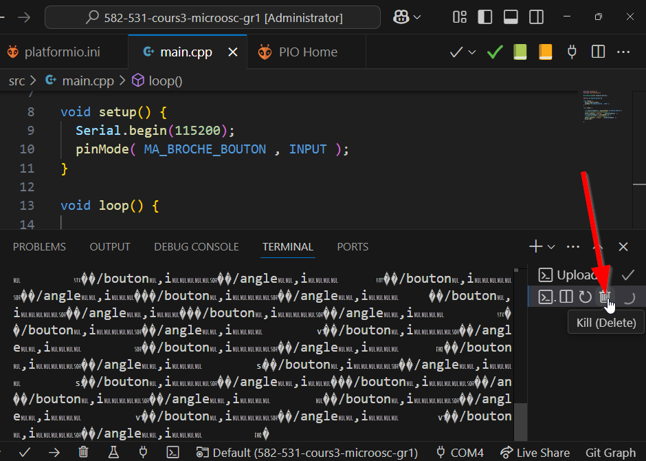

# Arduino Serial : communication sérielle

La **communication sérielle** est une méthode qui permet à votre carte Arduino d'échanger des données avec un autre appareil (comme votre ordinateur, un module Bluetooth ou un autre microcontrôleur) **bit par bit**.  C'est un peu comme envoyer un message texte mot par mot à la place d'un message entier en un bloc.


## `Serial`

La classe `Serial` permet de communiquer avec l'ordinateur ou un autre appareil par une liaison série.

Voici la méthode de configuration :

| Syntaxe | Description |
|---|---|
| `Serial.begin(VITESSE)` | À utiliser dans `setup()` habituellement. Initialise la communication série avec une vitesse de `VITESSE` bauds. Privilégier la vitesse `115200` (la vitesse `9600` est désuète depuis longtemps) |


Ensuite, il existe plusieurs façons d'encoder l'information :

- En ASCII
- En binaire
- En Open Sound Control (OSC)
- etc

## Encodage ASCII

Arduino fournit des méthodes de base pour encoder et décoder **ASCII** (*American Standard Code for Information Interchange*). C'est une table de correspondance universelle où chaque caractère (lettre, chiffre, symbole, ponctuation) est associé à un nombre décimal précis (de 0 à 127).

Pour bien comprendre ce principe, on peut faire le lien avec le **code Morse** :
Chaque lettre est convertie en une succession de signaux courts (**points**) et longs (**traits**), envoyés rigoureusement dans un ordre précis.  L'opérateur de l'autre côté doit décoder le flux temporel pour reformer les lettres et les mots.



En ASCII, pour envoyer la lettre `A`, l'Arduino convertit ce caractère en son code ASCII, c'est-à-dire le nombre décimal `65`, qui s'écrit `01000001` en binaire. Il envoie ensuite ces 8 bits, l'un après l'autre, sur le fil de transmission. 

Le récepteur (par exemple, votre ordinateur) capte ce flux, reconstitue l'octet `01000001`, et consulte la table ASCII pour comprendre que cette valeur correspond au caractère `A`.

| Déc | ASCII | Déc | ASCII | Déc | ASCII | Déc | ASCII |
| :---: | :---: | :---: | :---: | :---: | :---: | :---: | :---: |
| 0 | NUL | **32** | **(espace)** | 64 | @ | 96 | \` |
| 1 | SOH | 33 | ! | 65 | A | 97 | a |
| 2 | STX | 34 | " | 66 | B | 98 | b |
| 3 | ETX | 35 | # | 67 | C | 99 | c |
| 4 | EOT | 36 | $ | 68 | D | 100 | d |
| 5 | ENQ | 37 | % | 69 | E | 101 | e |
| 6 | ACK | 38 | & | 70 | F | 102 | f |
| 7 | BEL | 39 | ' | 71 | G | 103 | g |
| 8 | BS | 40 | ( | 72 | H | 104 | h |
| 9 | TAB | 41 | ) | 73 | I | 105 | i |
| **10** | **LF** | 42 | * | 74 | J | 106 | j |
| 11 | VT | 43 | + | 75 | K | 107 | k |
| 12 | FF | 44 | , | 76 | L | 108 | l |
| **13** | **CR** | 45 | - | 77 | M | 109 | m |
| 14 | SO | 46 | . | 78 | N | 110 | n |
| 15 | SI | 47 | / | 79 | O | 111 | o |
| 16 | DLE | 48 | 0 | 80 | P | 112 | p |
| 17 | DC1 | 49 | 1 | 81 | Q | 113 | q |
| 18 | DC2 | 50 | 2 | 82 | R | 114 | r |
| 19 | DC3 | 51 | 3 | 83 | S | 115 | s |
| 20 | DC4 | 52 | 4 | 84 | T | 116 | t |
| 21 | NAK | 53 | 5 | 85 | U | 117 | u |
| 22 | SYN | 54 | 6 | 86 | V | 118 | v |
| 23 | ETB | 55 | 7 | 87 | W | 119 | w |
| 24 | CAN | 56 | 8 | 88 | X | 120 | x |
| 25 | EM | 57 | 9 | 89 | Y | 121 | y |
| 26 | SUB | 58 | : | 90 | Z | 122 | z |
| 27 | ESC | 59 | ; | 91 | [ | 123 | { |
| 28 | FS | 60 | < | 92 | \ | 124 | \| |
| 29 | GS | 61 | = | 93 | ] | 125 | } |
| 30 | RS | 62 | > | 94 | ^ | 126 | ~ |
| 31 | US | 63 | ? | 95 | _ | 127 | DEL |

Un point crucial est que les nombres manipulés sont convertis en leur représentation textuelle ASCII (caractère par caractère) lors de l'envoi. Par exemple, le nombre `123` est envoyé sous forme de trois caractères distincts : `'1'`, `'2'` et `'3'`.

Voici les méthodes pour envoyer de l'ASCII :

| Syntaxe | Description |
|---|---|
| `Serial.print(VALEUR)` | Envoie `VALEUR` convertie en sa représentation ASCII sur la liaison série |
| `Serial.println(VALEUR)` | Envoie `VALEUR` convertie en sa représentation ASCII sur la liaison série suivi d'un saut de ligne (code 13 suivi du code 10 en ASCII) |

Voici les méthodes pour recevoir de l'ASCII :

| Syntaxe | Description |
|---|---|
| `Serial.available()` | Retourne le nombre de caractères ASCII disponibles à lire |
| `Serial.read()` | Lit un caractère ASCII reçu sur la liaison série |


## Moniteur série dans Visual Studio Code + PlatformIO 

Configurer le débit de la communication sérielle dans `platformio.ini` :
```
monitor_speed = 115200
```

Pour ouvrir le moniteur série :


Pour fermer le moniteur série :



## La structure [descripteur] [espace] [valeur] [saut de ligne (ln)]

Lorsque l'on souhaite envoyer des données structurées de l'Arduino vers l'ordinateur en ASCII, nous allons respecter cette règle de formatage précise : 
- un descripteur
- un espace
- une valeur
- suivi de `println()`.


Voici à quoi cela ressemble le code :
```cpp
Serial.print("TEMP"); // Descripteur
Serial.print(" "); // Espace
Serial.print(23); // Valeur
Serial.println(); // Saut de ligne
```

Voici à quoi cela ressemble le même code en version courte :

```cpp
Serial.print("TEMP ");  // Envoie le descripteur et son espace en un seul bloc
Serial.println(23);   // Envoie la valeur et ajoute automatiquement le saut de ligne final
```

Voici le résultat en ASCII (le retour à la ligne est invisible) :
```cpp
TEMP 23
``` 

-  Le descripteur donne un contexte à la donnée. Si l'ordinateur reçoit uniquement le nombre `23`, il est impossible de deviner s'il s'agit d'une température, d'une humidité ou d'une distance. Le descripteur permet au récepteur d'identifier immédiatement la nature de l'information.
- L'espace sert de séparateur clair. Sans cet espace, le texte et la valeur se colleraient ainsi : `TEMP23`. Cela rendrait l'analyse beaucoup plus complexe pour isoler la valeur numérique.
- La fonction `println()` ajoute un saut de ligne, correspondant aux codes ASCII `13` suivi de `10`. C'est indispensable, car la communication sérielle est un flux continu de caractères sans pause naturelle. Le saut de ligne agit comme un délimiteur de fin de message, permettant au récepteur de savoir exactement où s'arrête un message et où commence le suivant.
