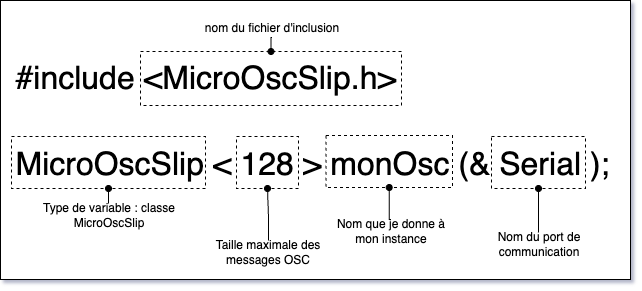
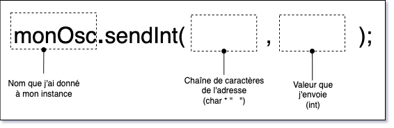
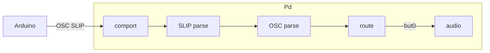

# MicroOsc SLIP

<!-- toc -->

## Installation

### Arduino IDE

Télécharger la bibliothèque logicielle `MicroOsc` dans le gestionnaire de bibliothèques d’Arduino.

### PlatformIO

Ajouter la ligne suivante à `lib_deps` dans `platformio.ini` :
```ini
lib_deps =
    https://github.com/thomasfredericks/MicroOsc.git
```

## Intégration 

### Dans l’espace global

```cpp
#include <MicroOscSlip.h>
MicroOscSlip<128> monOsc(&Serial); 
```



### Dans `setup()`

Dans `setup()`, n’oubliez pas de démarrer la communication série :
```cpp
  Serial.begin(115200);
```

> [!WARNING] 
> Il ne faut plus utiliser les envois ASCII `Serial.print()` ou `Serial.println()` quand on utilise **OSC SLIP** parce que les messages **ASCII** vont corrompre le flux de données **OSC SLIP** 

## Envoi


`MicroOsc` permet d’envoyer plusieurs types de données à un destinataire OSC. La plus utilisée est :  

- **`int`** : entier qui est toujours 32 bits signés (`int32_t`) en OSC.  

Pour envoyer une donnée, il suffit d’utiliser la méthode qui correspond au type de la donnée. Pour un entier, on utilise : 
```cpp
monOsc.sendInt(adresse, valeur);
```

Les arguments de `sendInt()` sont :
- `adresse` : une chaîne de caractères (`const char *`) comme `"/but0"`, `"/apha"` ou `"/beta"` qui défini l’adresse OSC du message.
- `valeur` : un entier (`int32_t`) qui est la valeur à envoyer.



Par exemple, pour envoyer la valeur de la variable `maVariable` à l’adresse OSC `/alpha` :
```cpp
monOsc.sendInt( "/alpha" , maVariable);
```

Un autre exemple qui envoie la valeur de la variable `maLectureAnalogique` à l’adresse OSC `/beta` :
```cpp
monOsc.sendInt( "/beta" , maLectureAnalogique);
```

## Exemple MicroOsc d’envoi OSC SLIP d’un Arduino Nano avec un bouton d’arcade vers Pd




Branchement sur Arduino Terminals :

| Bouton d’arcade | Arduino Terminals |
|---------|---------|
| Positif de la DEL (+)     | 3 (sortie analogique) |
| Négatif de la DEL (–)     | GND |
| Une broche de l’interrupteur | 2 (entrée numérique) |
| Autre broche de l’interrupteur | GND (via le négatif de la DEL) |


```cpp
#include <Arduino.h>

#include <Bounce2.h>
Bounce2::Button but0;

#include <MicroOscSlip.h>
MicroOscSlip<128> monOsc(&Serial); 

void setup()
{
    Serial.begin(115200);

    but0.attach(2, INPUT_PULLUP);
    but0.setPressedState(LOW);

    pinMode(3, OUTPUT);

}

void loop()
{
    but0.update();


    if (but0.pressed()) { // Bouton vient d’être appuyé
        /*
        // Ancienne méthode d’envoi ASCII 
        Serial.print("but0");
        Serial.print(" ");
        Serial.print(1);
        Serial.println();
        */
        monOsc.sendInt("/but0", 1);
    }

    if (but0.released()) { // Bouton vient d’être relâché
         /*
        // Ancienne méthode d’envoi ASCII 
        Serial.print("but0");
        Serial.print(" ");
        Serial.print(0);
        Serial.println();
        */
        monOsc.sendInt("/but0", 0);
    }

    if (but0.isPressed()) { // Bouton maintenu
        digitalWrite( 3 , HIGH );
    } else {
        digitalWrite( 3 , LOW );
    }

}
```

Le code Arduino peut être combiné avec ce patcher pour déclencher la lecture d’un fichier audio lorsqu’on appuie sur le bouton d’arcade.


Télécharger le patcher ici : [arduino_pd_slip_audio.pd](./arduino_pd_slip_audio.pd)
