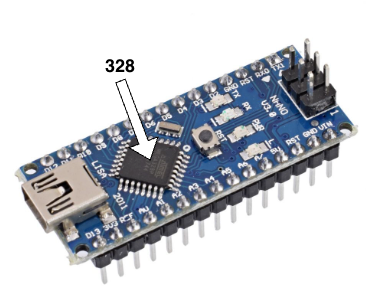

# Arduino Nano ATmega168 et ATmega32




En bref, la seule différence entre ces deux modèles est la quantité de mémoire disponible.

| Caractéristique        | Arduino Nano 168 | Arduino Nano 328 |
|------------------------|----------------|----------------|
| Microcontrôleur        | ATmega168      | ATmega328P     |
| Flash (pour code)      | 16 kB          | 32 kB          |
| SRAM (variables)       | 1 kB           | 2 kB           |
| EEPROM (persistante)   | 512 bytes      | 1 kB           |
| Vitesse d'horloge      | 16 MHz         | 16 MHz         |
| Broches numériques     | 14             | 14             |
| Broches analogiques    | 8              | 8              |
| Sketch maximum         | ~16 kB         | ~32 kB         |

## Configuration

### Configuration pour PlatformIO

#### 0. Préalable(s)

- Suivre les instructions pour [démarrer un nouveau projet dans PlatformIO](/fabrication/platformio/nouveau/). 

#### 1. Contenu à ajouter au fichier `platformio.ini`

##### Pour un `Arduino Nano ATmega328`

Contenu à ajouter au fichier `platformio.ini` :

```ini
[env:nanoatmega328]
platform = atmelavr
board = nanoatmega328
framework = arduino
monitor_speed = 115200
lib_deps =
```
