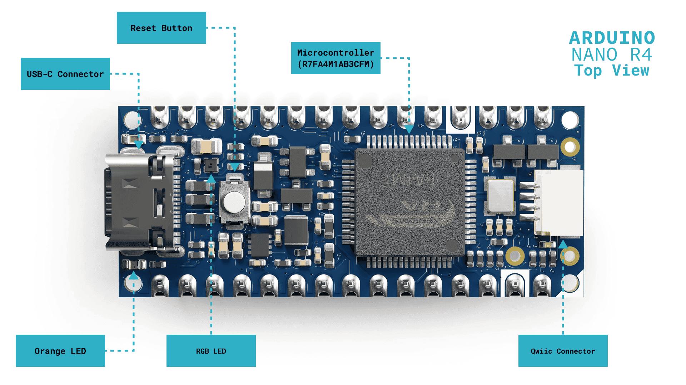
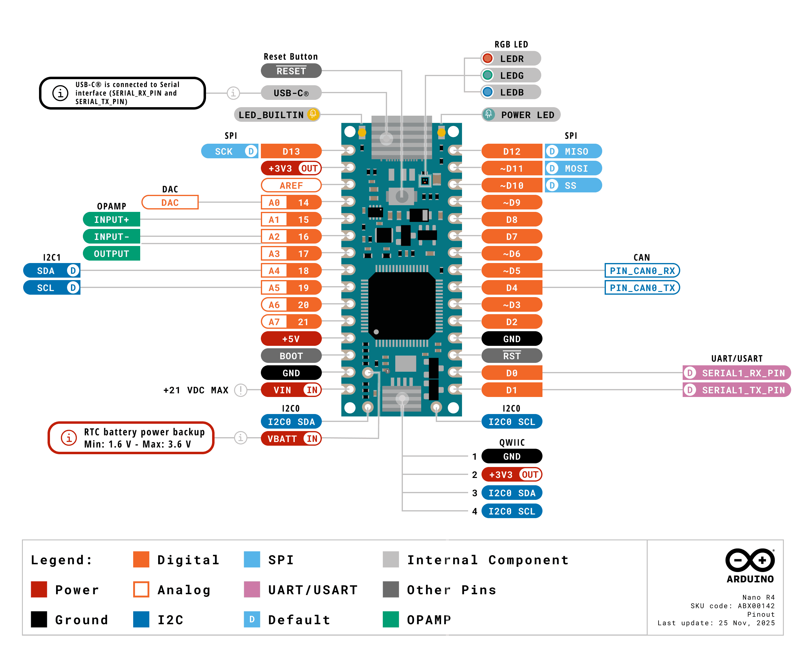

# Arduino Nano R4

La carte **Nano R4** représente l’évolution naturelle de la famille Nano. Elle combine le puissant microcontrôleur **RA4M1 de Renesas** avec le format compact et familier des cartes Nano. 

La Nano R4 intègre un microcontrôleur **32 bits haute performance (R7FA4M1AB3CFM)**, une connectivité étendue grâce à un connecteur **Qwiic** intégré, ainsi que des fonctionnalités avancées telles qu'un **DAC**, le **CAN** et des **amplificateurs opérationnels (OpAmp)**.

Avec ses dimensions compactes de **18 mm × 45 mm** et sa construction robuste, la Nano R4 constitue un excellent choix pour les projets nécessitant des capacités de **fusion de données provenant de plusieurs capteurs (sensor fusion)** ainsi qu'une puissance de calcul adaptée aux microcontrôleurs modernes.



## Principaux composants de la carte

* **Microcontrôleur** : au cœur de la Nano R4 se trouve un microcontrôleur de la famille **Renesas RA4M1 (R7FA4M1AB3CFM)**. Ce microcontrôleur monopuce, reconnu comme l'un des microcontrôleurs les plus économes en énergie du secteur, est basé sur un cœur **Arm Cortex-M4 cadencé à 48 MHz**. Il dispose de jusqu'à **256 Ko de mémoire Flash** et **32 Ko de mémoire SRAM**.

* **Connecteur USB-C** : la Nano R4 possède un connecteur USB-C moderne utilisé pour la **programmation**, l'**alimentation électrique** et la **communication série** avec des appareils externes.

* **Connecteur Qwiic** : la Nano R4 comprend également un connecteur Qwiic intégré permettant d'étendre ses capacités de communication via **I²C**. Il facilite la connexion à une grande variété de cartes, de capteurs, d'actionneurs et d'autres périphériques.

* **LED RGB programmable** : la Nano R4 possède une **DEL rouge-vert-bleue programmable** intégrée, permettant de fournir des indications visuelles sur différents états de fonctionnement.

* **LED_BUILTIN** : en plus de la DEL RGB programmable, la carte possède une **DEL orange programmable** supplémentaire destinée à fournir des indications d'état simples.

* **Fonctionnalités avancées du microcontrôleur** : le microcontrôleur **R7FA4M1AB3CFM** intègre plusieurs périphériques avancés, notamment :

  * un **convertisseur numérique-analogique (DAC) 12 bits** ;
  * un **bus CAN** destiné notamment aux communications industrielles ;
  * des **amplificateurs opérationnels (OpAmp) intégrés** ;
  * des capacités d'**émulation HID**, permettant notamment de simuler un **clavier ou une souris USB**.


## Configuration

### Configuration pour PlatformIO

### 0. Préalable(s)

- Suivre les instructions pour [démarrer un nouveau projet dans PlatformIO](/fabrication/platformio/nouveau/). 

### 1. Contenu à ajouter au fichier `platformio.ini`

Contenu à ajouter au fichier `platformio.ini` :

```ini
[env:nano_r4]
platform = renesas-ra
board = nano_r4
framework = arduino
monitor_speed = 115200
lib_deps =
```


## Fonctionnalités

Informations complètes sur ce modèle : [Nano R4 User Manual | Arduino Documentation](https://docs.arduino.cc/tutorials/nano-r4/user-manual/)



