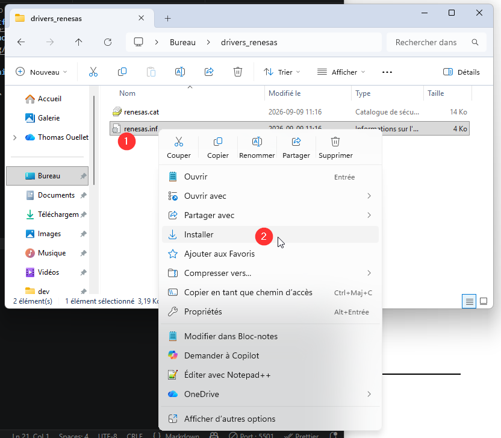

# Configuration Nano R4 PlatformIO

La carte Arduino Nano R4 fonctionne sous PlatformIO avec la [plateforme renesas-sa](https://docs.platformio.org/en/latest/platforms/renesas-ra.html#platform-renesas-ra) et la définition de carte [nano_r4](https://docs.platformio.org/en/latest/boards/renesas-ra/nano_r4.html).

## Contenu à ajouter au fichier `platformio.ini`

Contenu à ajouter au fichier `platformio.ini` :

```ini
[env:nano_r4]
platform = renesas-ra
board = nano_r4
framework = arduino
monitor_speed = 115200
lib_deps =
```

## Installer les pilotes Windows

Sous Windows, parfois les pilotes ne sont pas installés automatiquement et doivent être installés manuellement :

- Télécharger les pilotes : [drivers_renesas.zip](drivers_renesas.zip)
- Décompresser l'archive. 
- Installer le pilote avec un clic droit sur le fichier `renesas.inf`.

