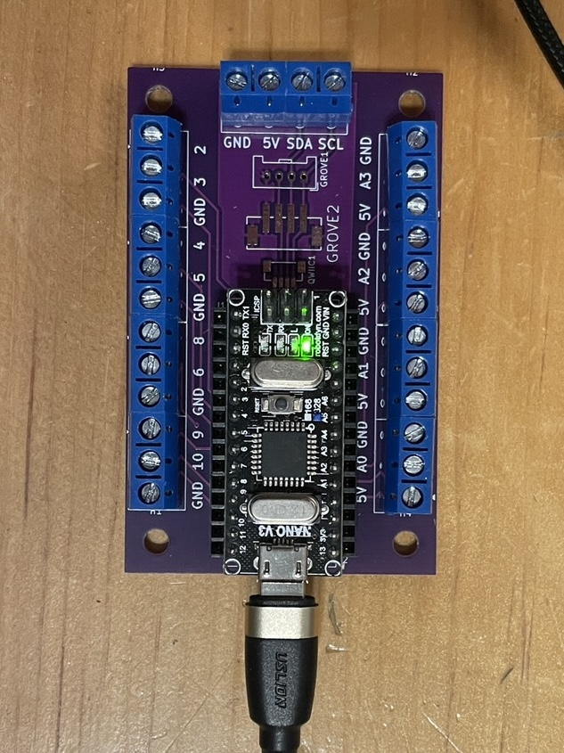

# Nano : Arduino Terminals

<!-- toc -->

[Arduino Terminals](https://codeberg.org/tim-montmorency/arduino_terminals) est un support pour cartes Arduino Nano doté de borniers à vis larges. Il permet un branchement simplifié du bus I2C, de 4 entrées analogiques et de 8 entrées/sorties numériques.



## Broches d'entrée analogique

Les broches analogiques disponibles sont :

- `A0`  
- `A1`  
- `A2`  
- `A3`  

Pour effectuer une lecture sur l’une de ces broches, il faut utiliser `analogRead()` en spécifiant la broche souhaitée en omettant le `A`, par exemple `1` pour la broche `A1` :

```cpp
int valeur = analogRead(1); // Lire la broche A1
```

## Broches d'entrée numérique

Les broches d’entrée numérique sont :

- `2`  
- `4`  
- `8`  
- `9`  

Pour lire l’état d’une de ces broches, il faut utiliser `digitalRead()` en spécifiant la broche, par exemple `8` :

```cpp
int valeur = digitalRead(8);
```

## Broches de sortie (analogique et numérique)

Les broches suivantes peuvent être utilisées comme sorties numériques et supportent également la modulation analogique :

- `3`  
- `5`  
- `6`  
- `10`  

Pour envoyer 5 V (niveau logique HIGH) sur une broche, il faut utiliser `digitalWrite()` en précisant la broche, par exemple `3`, ainsi que le mot-clé `HIGH` :

```cpp
digitalWrite(3, HIGH);
```

Pour envoyer 0 V (niveau logique LOW) :

```cpp
digitalWrite(3, LOW);
```

Pour générer une tension moyenne proportionnelle entre 0 et 5 V (analogique), il faut utiliser `analogWrite()` en précisant la broche et une valeur de type `uint8_t` comprise entre 0 et 255 (inclusivement) :

```cpp
analogWrite(3, intensity);
```


