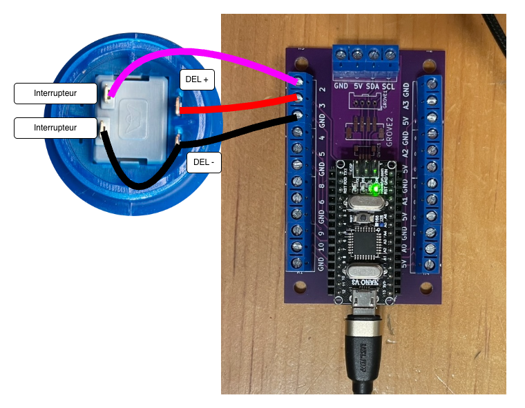

# Arduino Terminals : Bouton d’arcade

## Préparation du bouton

Un bouton d’arcade avec DEL intégrée nécessite la soudure de deux paires de fils (quatre fils au total) :

- Première paire : positif (+) et négatif (–) de la DEL. Il est essentiel de distinguer le positif du négatif. Le négatif sera raccordé au GND.
- Deuxième paire : les deux broches de l’interrupteur. Ces broches sont interchangeables. L’une d’elles sera raccordée au GND.

Les points de soudure et les étiquettes peuvent varier selon le modèle. L’exemple présenté utilise le modèle [bouton Arcade Button with LED – 30mm Translucent Red d'Adafruit ](https://www.adafruit.com/product/3489).

> [!NOTE]
> L’important est d’identifier correctement les broches et d’y souder idéalement quatre fils de couleurs différentes.

> [!NOTE]
> Une broche de l’interrupteur peut être soudée au négatif de la DEL, ce qui permet d’utiliser trois fils au lieu de quatre.

## Branchement

Le bouton doit être raccordé à l’Arduino selon la logique suivante :

| Bouton d’arcade | Arduino |
|-----------------|----------|
| Positif (+)     | Sortie (analogique ou numérique) |
| Négatif (–)     | GND |
| Une broche de l’interrupteur | Entrée numérique |
| Autre broche de l’interrupteur | GND |

Les deux connexions GND peuvent être communes.

Exemple de branchement sur Arduino Terminals :

| Bouton d’arcade | Arduino Terminals |
|-----------------|------------------|
| Positif (+)     | 3 (sortie analogique) |
| Négatif (–)     | GND |
| Une broche de l’interrupteur | 2 (entrée numérique) |
| Autre broche de l’interrupteur | GND (via le négatif de la DEL) |



## Utilisation 

Lecture de l’interrupteur :

```cpp
int valeur = digitalRead(2);
```

Allumage de la DEL :

```cpp
digitalWrite(3, HIGH);
```

Extinction de la DEL :

```cpp
digitalWrite(3, LOW);
```

Allumage de la DEL à environ 25 % de sa puissance :

```cpp
analogWrite(3, 63);
```