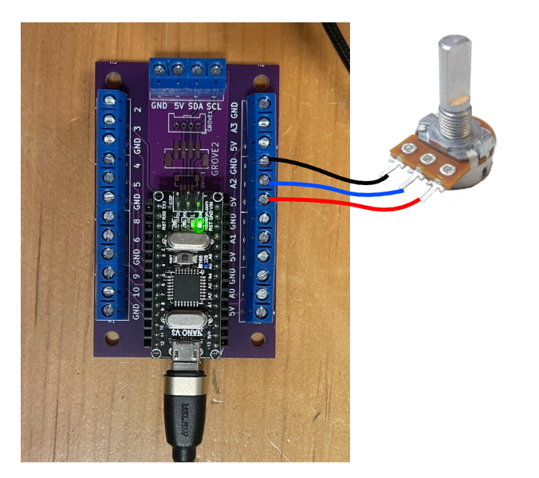

# Arduino Terminals : Potentiomètre

Un potentiomètre standard possède trois broches :

- Une broche reliée au **5V (ou 3.3V)**  
- Une broche reliée au **GND**  
- Une broche centrale appelée **curseur (signal)**  

Le curseur fournit une tension variable comprise entre 0 V et 5 V (ou 3.3 V selon la carte), en fonction de la position du potentiomètre.

Les deux broches extérieures peuvent être inversées, ce qui inversera simplement le sens de variation.  
La broche centrale doit être reliée à une entrée analogique.

## Branchement

Le branchement se fait selon la logique suivante :

| Potentiomètre | Microcontrôleur |
|---------------|-----------------|
| Broche extérieure | 5 volts (ou 3.3 volts) |
| Broche centrale (curseur) | Entrée analogique |
| Autre broche extérieure | GND |

Exemple de branchement sur Arduino Terminals :

| Potentiomètre | Arduino Terminals |
|---------------|------------------|
| Broche extérieure | 5V |
| Broche centrale (curseur) | A2 |
| Autre broche extérieure | GND |



## Utilisation

Lecture de la valeur :

```cpp
int valeur = analogRead(A2);
```