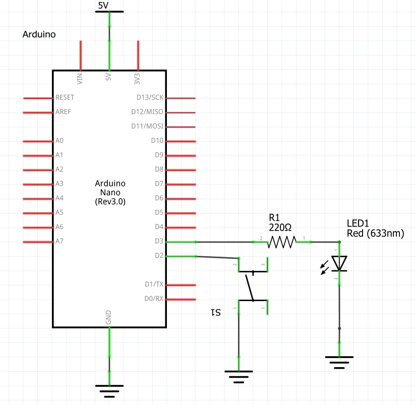
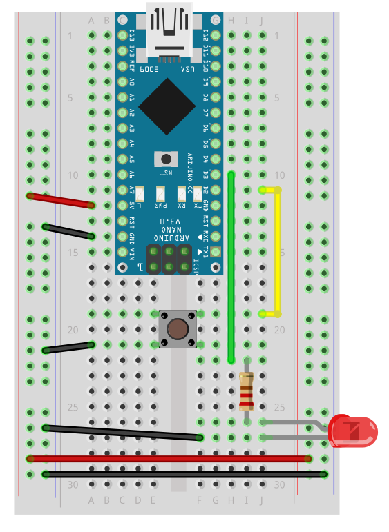
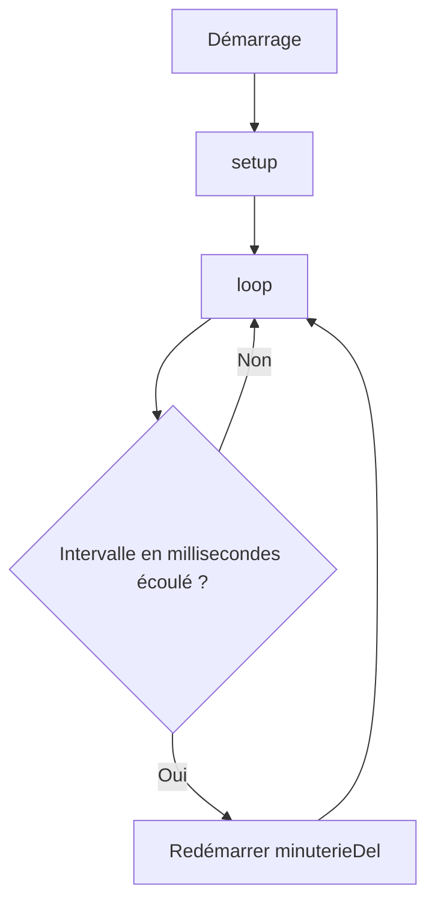
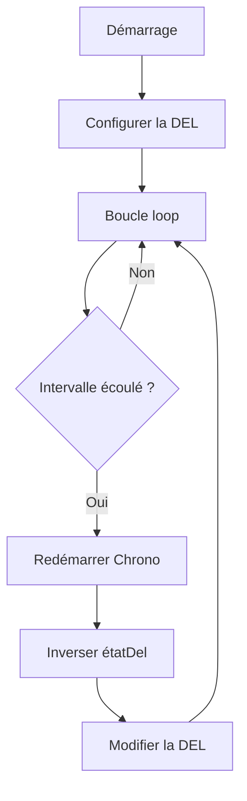
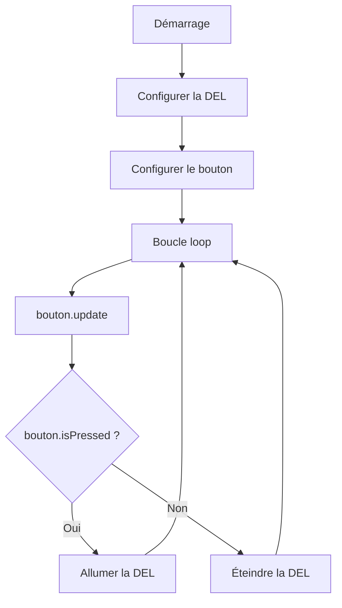
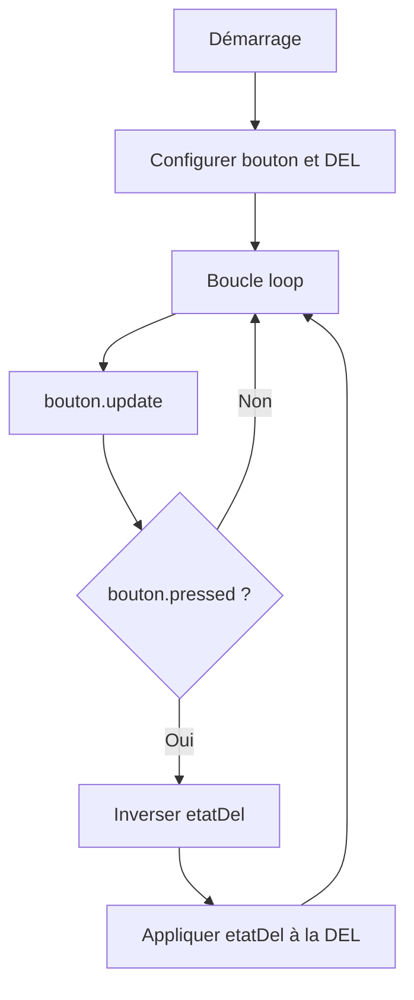
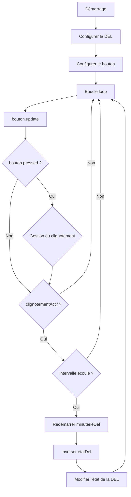

# Tutoriel Arduino clignotement interactif

<!-- toc -->

## Introduction


Ce tutoriel présente progressivement la création d'un système Arduino interactif composé d'une DEL et d'un bouton. 

Il présente :
- l'utilisation de la bibliothèque `Chrono` 
- introduit les fonctions `pinMode()` et `digitalWrite()` afin de commander la DEL
- l'utilisation de la bibliothèque  `Bounce2` et sa classe `Bounce2::Button` 
- combine tout pour permettre à un bouton de démarrer ou d'arrêter le clignotement de la DEL


À configurer dans `platformio.ini` :
```ini
lib_deps =
    https://github.com/thomasfredericks/Bounce2.git#v2.71
    https://github.com/SofaPirate/Chrono.git#v1.2.1
```

> [!IMPORTANT]
> Pour un Arduino Nano :
> `LOW` est la même chose que `0` ou `false` et correspond à `0 volts`
> `HIGH` est la même chose que `1` ou `true` et correspond à `5 volts`

## Circuit






## Chrono

L'instruction `#include <Chrono.h>` permet d'inclure la bibliothèque **Chrono** dans le programme.

```cpp
#include <Chrono.h>
```

Cette instruction crée un objet `minuterieDel` de type `Chrono :

```cpp
Chrono minuterieDel;
```

Elle donne accès à la classe `Chrono` et à ses méthodes, notamment :

| Méthode | Signification |
|---|---|
| `minuterieDel.hasPassed(INTERVALLE)` | Vérifie si une durée INTERVALLE en millisecondes s'est écoulée |
| `minuterieDel.restart()` | Redémarre la mesure du temps |


La minuterie fonctionne indépendamment du reste du programme : le processeur peut continuer à exécuter `loop()` pendant que le temps s'écoule.

### Schéma 



### Code

```cpp
#include <Arduino.h>
#include <Chrono.h>

#define INTERVALLE 1000

Chrono minuterieDel;

void setup()
{

}

void loop()
{
    if (minuterieDel.hasPassed(INTERVALLE))
    {
        minuterieDel.restart();
        
    }
}
```


## Clignotement

Premier objectif : faire clignoter sans délai.

La fonction `pinMode()` permet de configurer une broche :

| Instruction | Signification |
|---|---|
| `pinMode(BROCHE,INPUT)` | Configure la broche `BROCHE` comme entrée |
| `pinMode(BROCHE, INPUT_PULLUP)` | Configure la broche `BROCHE` comme entrée avec la résistance pull-up interne activée |
| `pinMode(BROCHE, OUTPUT)` | Configure la broche `BROCHE` comme sortie |

La fonction `digitalWrite()` permet d'envoyer une tension électrique sur une broche.

| Instruction | Signification |
|---|---|
| `digitalWrite(BROCHE, LOW)` | Envoie 0 volts à la broche `BROCHE` |
| `digitalWrite(BROCHE, HIGH)` | Envoie 5 volts à la  broche `BROCHE`  |


### Schéma



### Code

```cpp
#include <Arduino.h>
#include <Chrono.h>

#define BROCHE_DEL 3
#define INTERVALLE 1000

Chrono minuterieDel;

bool etatDel = 0;

void setup()
{
    pinMode(BROCHE_DEL, OUTPUT);
    digitalWrite(BROCHE_DEL, etatDel);
}

void loop()
{
    if (minuterieDel.hasPassed(INTERVALLE))
    {
        minuterieDel.restart();

         if ( etatDel == 0 ) {
            etatDel = 1;
        } else {
            etatDel = 0;    
        }

        digitalWrite(BROCHE_DEL, etatDel);
    }
}
```


## Bouton et DEL

La classe `Bounce2::Button` permet de gérer un bouton.

Cette instruction crée un objet nommé `bouton` de type `Bounce2::Button` :

```cpp
Bounce2::Button bouton = Bounce2::Button();
```

Ensuite, nous pouvons accéder aux méthodes suivantes :

| Instruction | Signification |
|---|---|
| `bouton.attach(BROCHE_BOUTON, INPUT_PULLUP)` | Associe le bouton à la broche `BROCHE_BOUTON` configurée comme entrée avec la résistance pull-up interne activée |
| `bouton.setPressedState(LOW)` | Considère que le bouton est appuyé lorsque la broche est à `LOW` |
| `bouton.update()` | Met à jour l'état du bouton. Doit être appelée à chaque passage dans `loop()` |
| `bouton.isPressed()` | Retourne `true` si le bouton est actuellement appuyé. Retourne `false` si le bouton n'est pas actuellement appuyé |

### Schéma logique



### Code

```cpp
#include <Arduino.h>
#include <Chrono.h>
#include <Bounce2.h>

#define BROCHE_DEL 3
#define BROCHE_BOUTON 2

#define INTERVALLE 1000

Chrono minuterieDel;
Bounce2::Button bouton = Bounce2::Button();

void setup()
{
    // Configuration de la DEL
    pinMode(BROCHE_DEL, OUTPUT);
    digitalWrite(BROCHE_DEL, LOW);

    // Configuration du bouton
    bouton.attach(BROCHE_BOUTON, INPUT_PULLUP);
    bouton.setPressedState(LOW);
}

void loop()
{
    // Mise à jour du bouton
    bouton.update();

    // La DEL suit l'état physique du bouton
    if (bouton.isPressed())
    {
        digitalWrite(BROCHE_DEL, HIGH);
    }
    else
    {
        digitalWrite(BROCHE_DEL, LOW);
    }

    // La minuterie fonctionne indépendamment du bouton
    if (minuterieDel.hasPassed(INTERVALLE))
    {
        minuterieDel.restart();
    }
}
```


## Basculer

On passe maintenant d'une logique basée sur un **état** à une logique basée sur un **événement**.

Une pression :
```text
DEL éteinte → DEL allumée
```

Une autre pression :
```text
DEL allumée → DEL éteinte
```

La méthode `pressed()` permet de savoir si une pression sur le bouton vient d'être détectée :

| Instruction | Valeur retournée | Signification |
|---|---|---|
| `bouton.pressed()` | `true` | Une pression vient d'être détectée |
| `bouton.pressed()` | `false` | Aucune nouvelle pression n'a été détectée |

La méthode `released()` permet de savoir si un relâchement du bouton vient d'être détecté :

| Instruction | Valeur retournée | Signification |
|---|---|---|
| `bouton.released()` | `true` | Un relâchement vient d'être détecté |
| `bouton.released()` | `false` | Aucun nouveau relâchement n'a été détecté |


Différence entre `isPressed()` et `pressed()` :

| Méthode | Signification |
|---|---|
| `bouton.isPressed()` | Le bouton est actuellement appuyé |
| `bouton.pressed()` | Une pression vient d'être détectée |
| `bouton.released()` | Un relâchement vient d'être détecté |
| `bouton.changed()` | L'état du bouton vient de changer |

### Schéma



### Code

```cpp
#include <Arduino.h>
#include <Bounce2.h>

#define BROCHE_DEL 3
#define BROCHE_BOUTON 2

Bounce2::Button bouton = Bounce2::Button();

bool etatDel = LOW;

void setup()
{
    // Configuration de la DEL
    pinMode(BROCHE_DEL, OUTPUT);
    digitalWrite(BROCHE_DEL, etatDel);

    // Configuration du bouton
    bouton.attach(BROCHE_BOUTON, INPUT_PULLUP);
    bouton.setPressedState(LOW);
}

void loop()
{
    // Mise à jour du bouton
    bouton.update();

    // Une nouvelle pression a-t-elle été détectée ?
    if (bouton.pressed())
    {
        if ( etatDel == 0 ) {
            etatDel = 1;
        } else {
            etatDel = 0;    
        }

        digitalWrite(BROCHE_DEL, etatDel);
    }
}
```


## Alterner clignotement

Une pression démarre le clignotement.

Une deuxième pression l'arrête.

### Schéma



### Code

```cpp
#include <Arduino.h>
#include <Chrono.h>
#include <Bounce2.h>

#define BROCHE_DEL 3
#define BROCHE_BOUTON 2

#define INTERVALLE 500

Bounce2::Button bouton = Bounce2::Button();
Chrono minuterieDel;

bool etatDel = LOW;
bool clignotementActif = false;

void setup()
{
    // Configuration de la DEL
    pinMode(BROCHE_DEL, OUTPUT);
    digitalWrite(BROCHE_DEL, etatDel);

    // Configuration du bouton
    bouton.attach(BROCHE_BOUTON, INPUT_PULLUP);
    bouton.setPressedState(LOW);
}

void loop()
{
    // Mise à jour du bouton
    bouton.update();

    // Gestion de l'événement de pression
    if (bouton.pressed())
    {
        if (clignotementActif)
        {
            clignotementActif = false;
        }
        else
        {
             clignotementActif = true;
        }
    }

    // Gestion indépendante du clignotement
    if (clignotementActif) {
        if ( minuterieDel.hasPassed(INTERVALLE)) 
        {
            minuterieDel.restart();

            etatDel = !etatDel;
            digitalWrite(BROCHE_DEL, etatDel);
        }
    } 
}
```

