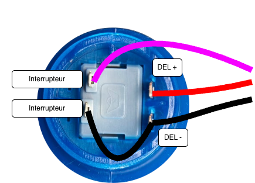
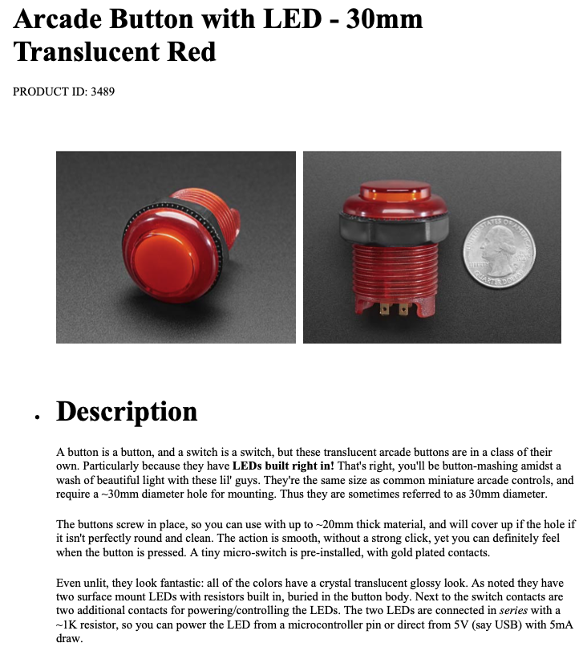
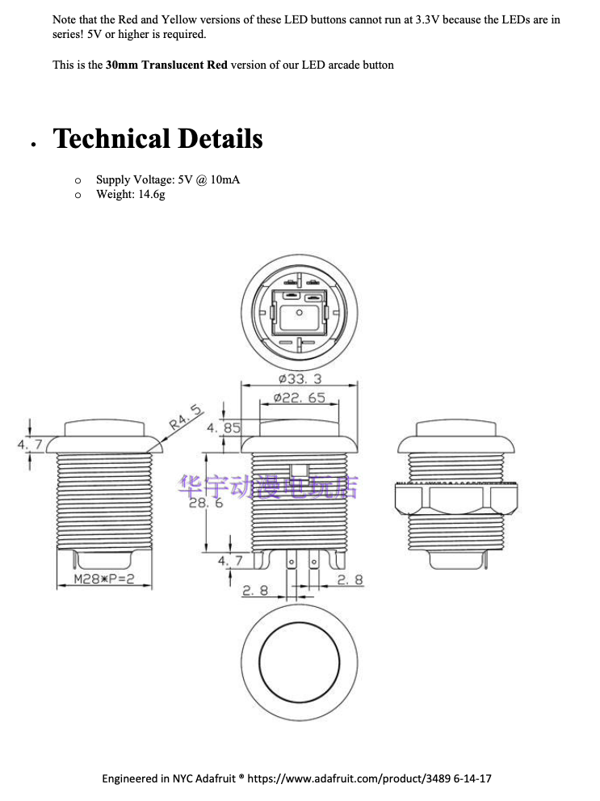

# Bouton d’arcade

## Préparation du bouton

Un bouton d’arcade avec DEL intégrée nécessite la soudure de deux paires de fils, soit quatre fils au total :

* **Première paire** : le positif (+) et le négatif (–) de la DEL. Il est essentiel de distinguer le positif du négatif. Le négatif sera raccordé au GND.
* **Deuxième paire** : les deux broches de l’interrupteur. Ces broches sont interchangeables. L’une d’elles sera raccordée au GND.

> [!NOTE]
> Puisque deux des quatre broches sont connectées au GND, on les relie ensemble afin d’avoir trois fils libres.

Les points de soudure et les étiquettes peuvent varier selon le modèle. 

> [!IMPORTANT]
> Il est important d’identifier correctement les broches et, idéalement, d’y souder quatre fils de trois couleurs différentes (la même couleur pour les fils GND).

L’exemple précédent utilise le modèle [Bouton Arcade Button with LED – 30 mm Translucent Red d’Adafruit - 3489](https://www.adafruit.com/product/3489).

