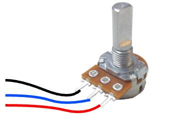

# Potentiomètre

Un potentiomètre standard possède trois broches :

- Une broche reliée au **5V (ou 3.3V)**  
- Une broche reliée au **GND**  
- Une broche centrale appelée **curseur (signal)**  

Le curseur fournit une tension variable comprise entre 0 V et 5 V (ou 3.3 V selon la carte), en fonction de la position du potentiomètre.

Les deux broches extérieures peuvent être inversées, ce qui inversera simplement le sens de variation.  
La broche centrale doit être reliée à une entrée analogique.

