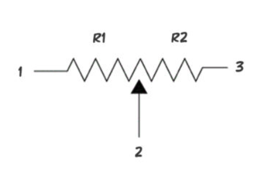
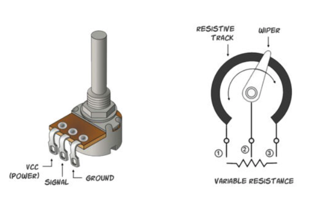
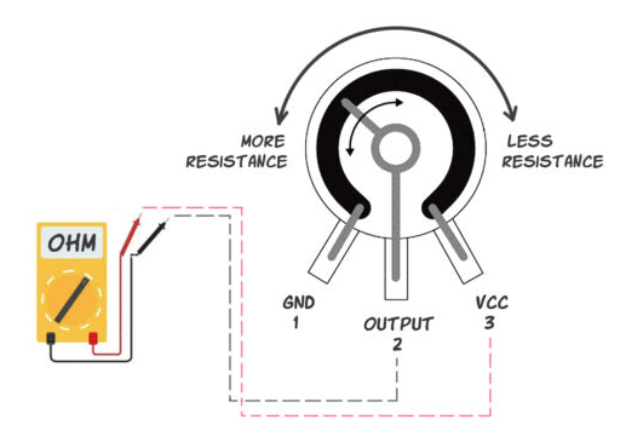
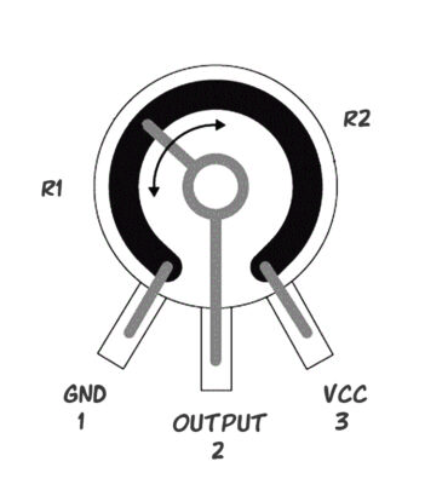
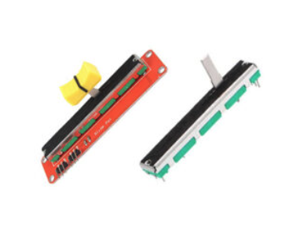
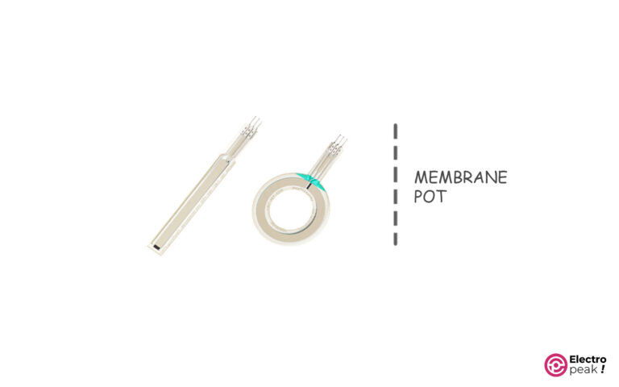

# Le potentiomètre


Le potentiomètre (souvent abrégé "pot") est un composant électronique passif qui permet de varier manuellement la résistance électrique dans un circuit. Il agit comme un diviseur de tension variable et constitue l’un des composants les plus courants pour commander des signaux analogiques.

## Symbole



## Structure interne



À l’intérieur, un potentiomètre se compose généralement de :
- Une trame résistive (en carbone, céramique ou métal)
- Un curseur mobile qui glisse le long de la trajectoire résistive
- Trois broches

## Résistance variable

Pour tester un potentiomètre avec un multimètre :
1. Réglez le multimètre en mode ohmmètre
2. Mesurez entre une broche extérieure et le curseur
3. Tournez le bouton : la valeur devrait changer de façon continue
4. Si la mesure saute brusquement ou reste fixe, le potentiomètre peut être défectueux



## Connexions et branchement


Un potentiomètre possède trois bornes de connexion :

| Broche | Fonction | Branchement typique |
|--------|----------|---------------------|
| Broche 1 | Extrémité 1 | VCC (alimentation, ex: 5V) |
| Broche 2 | Curseur (sortie) | Entrée analogique du microcontrôleur |
| Broche 3 | Extrémité 2 | GND (masse) |



> [!NOTE]
> Les deux broches extérieures peuvent être inversées sans dommage - cela inverse simplement le sens de variation du signal.
> La broche centrale doit toujours être connectée à une entrée analogique (ex: A0 sur Arduino).


## Tension de sortie

Lorsqu’un potentiomètre est alimenté avec 5V, son curseur fournit une tension variable comprise entre 0 V et 5 V, en fonction de la position de rotation.

```
V_sortie = V_CC x R_2 / (R_1 + R_2)
```
Où `R_1` et `R_2` sont les résistances de chaque côté du curseur.

| Position du curseur | Tension de sortie (VCC = 5V) | Valeur numérique (Arduino) |
|---------------------|----------------------------|---------------------------|
| Extrémité 1 (min) | 0,0 V | 0 |
| Milieu | 2,5 V | 512 |
| Extrémité 2 (max) | 5,0 V | 1023 |


## Différents types de potentiomètres

### Valeurs courantes

| Caractéristique | Valeurs typiques |
|-----------------|------------------|
| Résistance nominale | 1kOhm, 5kOhm, 10kOhm, 50kOhm, 100kOhm |
| Tolérance | +/-10% à +/-20% |
| Puissance maximale | 0,1 W - 0,5 W |
| Type de loi | Linéaire (B), Logarithmique (A) |

### Potentiomètre rotatif


Le plus courant, actionné par rotation. Idéal pour :
- Contrôle de volume audio
- Sélection de paramètres
- Réglage fin de tensions

### Potentiomètre à glissière (slider)


Actionné par déplacement linéaire. Utilisé principalement pour :
- Tables de mixage audio
- Contrôleurs MIDI
- Interfaces graphiques physiques



### Potentiomètre à membrane

Version plate sans pièces mécaniques mobiles. Avantages :
- Longévité accrue
- Étanche aux poussières
- Intégré dans certains claviers et contrôles tactiles


