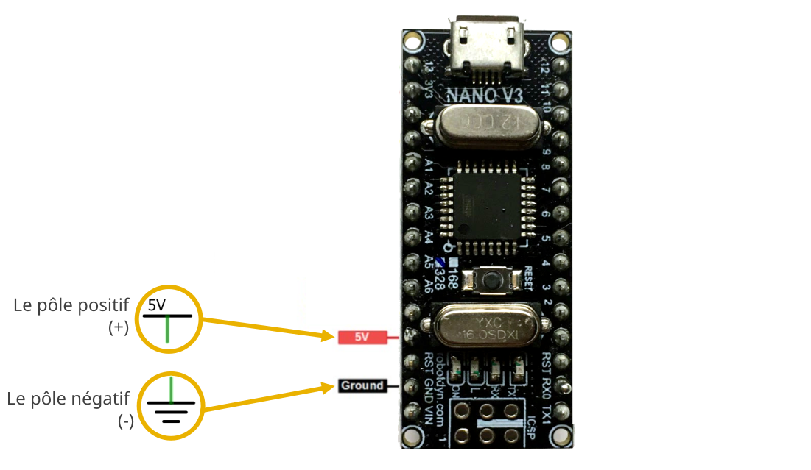
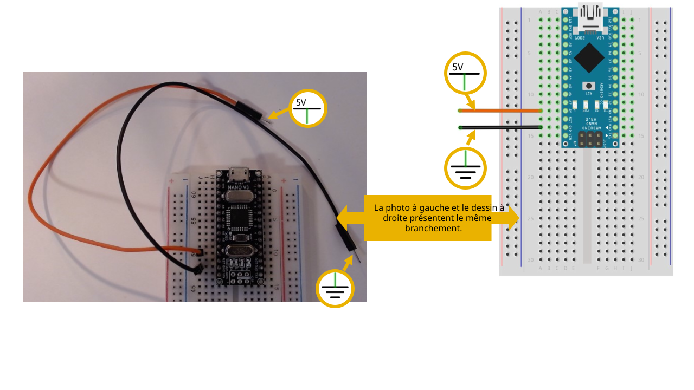
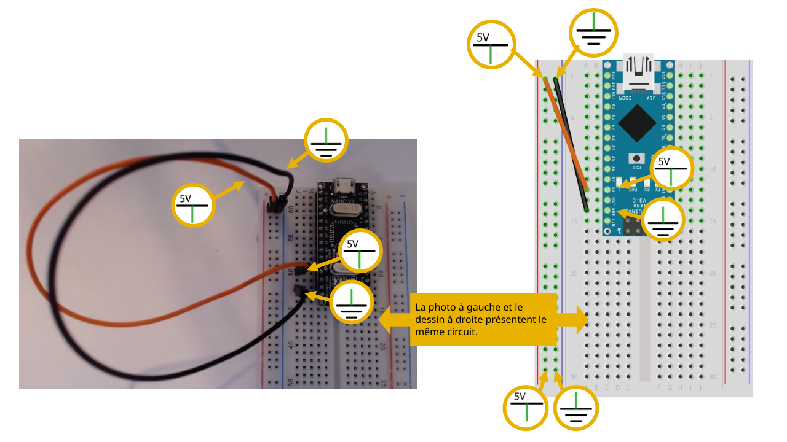
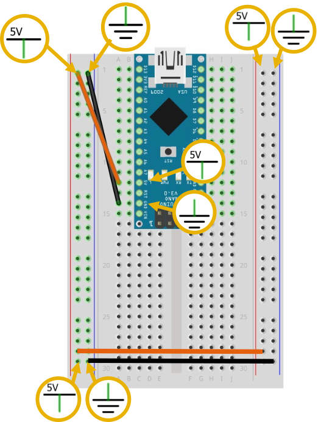

# Alimenter un *breadboard* avec une carte Arduino

## Pôles de la carte Arduino Nano

Sur certains modèles de carte Arduino Nano, le pôle positif (+) n’est malheureusement pas imprimé sur la carte. Cependant, la documentation indique que la broche du pôle positif (+) est adjacente à la broche étiquettée «RST». 

Le pôle négatif (-) est indiqué avec l'étiquette «GND» imprimée sur la carte. 

## Étape 1

Brancher un câble (orange ou rouge) dans la rangée de la broche du positif (+) de la carte Arduino. Ce câble transporte maintenant le positif (+).

Brancher un câble (brun ou noir) dans la rangée de la broche du négatif (-) de la carte Arduino. Ce câble transporte maintenant le négatif (-).

## Étape 2

Brancher le câble qui transporte le positif (+) dans la colonne **+** rouge de la platine d’expérimentation.

Brancher le câble qui transporte le négatif (-) dans la colonne **–** bleue de la platine d’expérimentation.

## Étape 3

Relier les deux autres colonnes de la patine d'expériementation.

