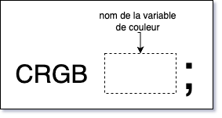
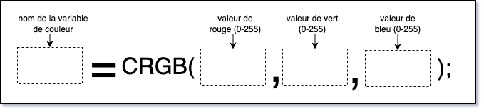

# M5Stack Atom Lite : Pixel intégré

## Introduction

Le pixel est relié à la broche `27` de l'ESP32 du Atom Lite.

## Bibliothèque

Le contrôle du pixel du M5Stack Atom Lite nécessite la bibliothèque suivante :
- FastLED 

### PlatformIO **platformio.ini**
```
lib_deps =
    FastLED
```

## À ajouter dans l'espace *global* 

Ajouter la bibliothèque FastLED:
```cpp
#include <FastLED.h>
```

Ajouter une variable de type CRGB pour le pixel :
```cpp
CRGB atomPixel;
```



Bien que cela ne soit pas absolument nécessaire, c'est une bonne idée d'utiliser un `#define` pour identifier le numéro de la broche :
```cpp
#define BROCHE_ATOM_PIXEL 27
```

## Configuration dans *setup()*

À ajouter dans *setup* :
```cpp
  // Initialiser FastLED pour contrôler le pixel RGB du M5Atom
  FastLED.addLeds<WS2812, BROCHE_ATOM_PIXEL , GRB>(&atomPixel, 1); 
```

## Changer la couleur du pixel dans *setup()* ou *loop()*

Pour changer la couleur du pixel:

1) On assigne une nouvelle valeur de couleur de type CRGB (couleur rouge, vert, bleu [RGB Color Codes Chart 🎨](https://www.rapidtables.com/web/color/RGB_Color.html)) à la variable :
```cpp
  atomPixel = CRGB(255,255,255); // BLANC
```



2) Après, il faut mettre à jour le pixel
```cpp
    FastLED.show();
```

## Exemple : animation de démarrage

### Avec `delay()`

Mettre à la fin de `setup()` :
```cpp
  // animation de démarrage de 3 secondes -------|
  atomPixel = CRGB(255,0,0); // ROUGE
  FastLED.show();
  delay(1000); // PAUSE 1 SECONDE
  atomPixel = CRGB(255,255,0); // JAUNE
  FastLED.show();
  delay(1000); // PAUSE 1 SECONDE
  atomPixel = CRGB(0,255,0); // VERT
  FastLED.show();
  delay(1000); // PAUSE 1 SECONDE
  atomPixel = CRGB(0,0,0);
  FastLED.show(); 
  // --------------------------------------------|
```

### Sans `delay()`
```cpp
// animation de démarrage de 3 secondes -------|
unsigned long chronoDepart = millis(); // temps de depart
while ( millis() - chronoDepart <= 3000 ) {  // boucler entre 0 et 3000 millisecondes 
  unsigned long duree = millis() - chronoDepart; 
  if ( duree < 1000 ) { // entre 0 et 999 millisecondes
    atomPixel = CRGB(255,0,0); // rouge
  } else if ( duree < 2000 ) { // entre 1000 et 1999 millisecondes
    atomPixel = CRGB(255,255,0); // jaune
  } else { // entre 1999 et 2999 millisecondes
    atomPixel = CRGB(0,255,0); // vert
  }
  FastLED.show();
  delay(1); // OPTIONNEL! libérer le cpu pour qu'il fasse d'autres choses comme gérer le wifi
}
// --------------------------------------------|
```