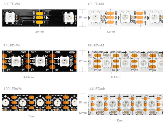
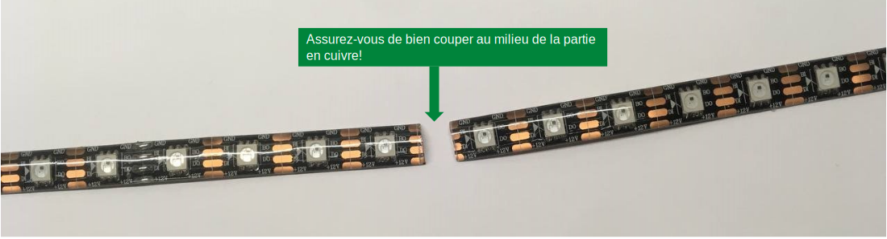
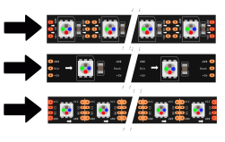
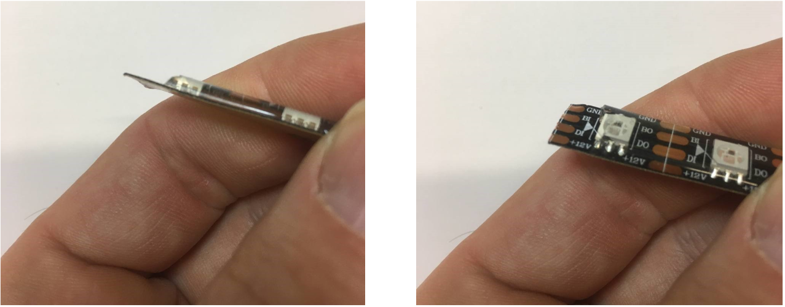
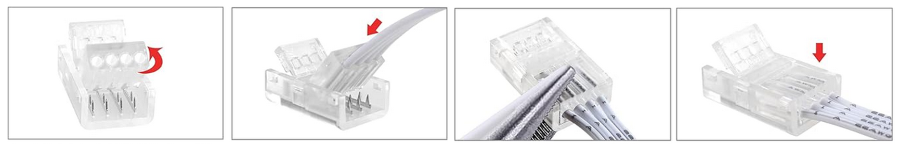
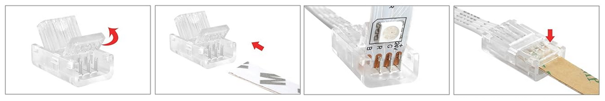
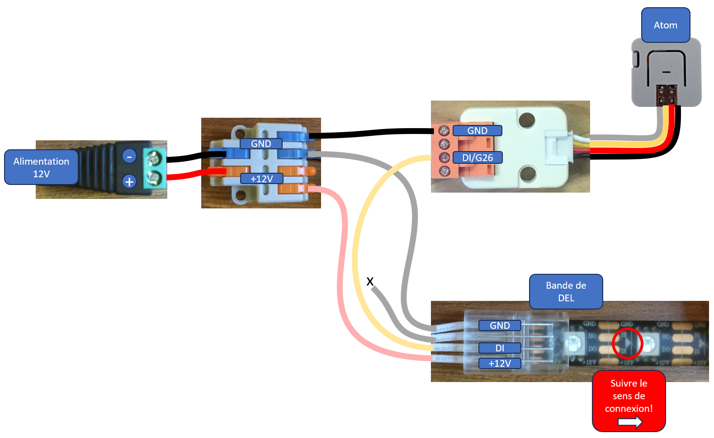
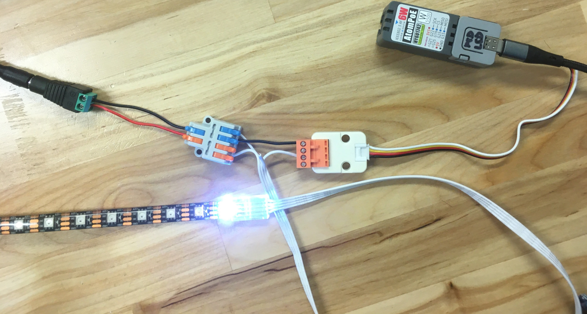
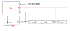

# Les bandes de pixels DEL

<!-- toc -->

## Introduction

Un ruban de pixels DEL regroupe plusieurs pixels pouvant être contrôlées à l’aide d’une ou deux broches. Chaque pixel est composé de plusieurs DEL, généralement une rouge, une verte et une bleue. Certains modèles intègrent également des DEL supplémentaires blanches, ambrées ou ultraviolettes. 

> [!NOTE]
> Selon le modèle de ruban de pixels DEL, l’ordre des couleurs peut varier : RGB, GRB, BGR, etc.  

Aussi connu sous le nom de **NeoPixel**, ce type de produit a été popularisé par la société Adafruit, qui propose [de nombreux modèles de NeoPixels](https://www.adafruit.com/category/168). Attention, les NeoPixels d’Adafruit fonctionnent en 5 volts.

| Fonction / Puce           | **WS2801**              | **WS2811**                | **WS2818**                | **WS2812**               | **SK6812**            | **APA102**               |
| ------------------------- | ----------------------- | ------------------------- | ------------------------- | ------------------------ | --------------------- | ------------------------ |
| **Protocole**             | SPI (données + horloge) | Monofil (une seule ligne) | Monofil                   | Monofil                  | Monofil               | SPI (données + horloge)  |
| **Fils requis**           | 4 (VCC, GND, CLK, DATA) | 3 (VCC, GND, DATA)        | 4 (VCC, GND, DATA, BACKUP)| 3 (VCC, GND, DATA)       | 3 (VCC, GND, DATA)    | 4 (VCC, GND, DATA, CLK)  |                  | 8 bits                | 8 bits                   |
| **Débit de données**      | Rapide (jusqu’à MHz)    | 800 kHz                   | 800 kHz                   | 800 kHz                  | 800 kHz               | Jusqu’à 20 MHz           |                   | ✅ Oui                 | ❌ Non                    |
| **Ligne de secours**      | ❌ Non                   | ❌ Non                     | ✅ Oui | ❌ Non                    | ❌ Non                 | ❌ Non                    |
| **Support RGBW**          | ❌ Non                   | ❌ Non                     | ❌ Non                     | ❌ Non                    | ✅ Oui                 | ❌ Non                    |
| **Compatibilité FastDEL** | ✅ Oui                   | ✅ Oui                     | ⚠️ Partielle / manuelle   | ✅ Oui                    | ✅ Oui                 | ✅ Oui                    |
| **Compatibilité NeoPixel**            | ❌ Non                   | ❌ Non                     | ❌ Non                     | ✅ Oui (Adafruit)         | ✅ Oui (NeoPixel RGBW) | ❌ Non (Adafruit DotStar) |
| **Idéal pour**            | Montages SPI fiables    | Bandes longues économiques| Bandes longues robustes   | La plupart des NeoPixels | Pixels RGBW / blancs  | Animations haute vitesse |

## Broches

Les bandes de pixels possèdent au minimum trois broches à connecter :  
- **GND** (masse)  
- **Alimentation V+** (5 V, 12 V ou 24 V selon les modèles)  
- **Entrée de données DI** (*Data In*)  

Certains modèles ont ces broches additionnelles :
- **Horloge CLK** (horloge)
- **Ligne de secours BI** (utilisée uniquement en cas de défaillance d’un segment)

## Branchement

Dans l'exemple qui suit, nous utilisons un ruban DEL WS281X fonctionnant avec une tension d’alimentation de 12 V.

  

  

  

  

  

  

  

### Bonnes pratiques

Adafruit recommande de suivre [ces bonnes pratiques de connexion](https://learn.adafruit.com/adafruit-neopixel-uberguide/best-practices) afin d’éviter les problèmes.

## Bibliothèques FastLED et NeoPixel

Plusieurs bibliothèques permettent de contrôler des bandes de pixels adressables avec Arduino ou PlatformIO. Parmi les plus utilisées, on retrouve **FastLED** et **Adafruit NeoPixel**. Ces deux bibliothèques permettent de contrôler des pixels individuellement dans une bande, en définissant pour chaque pixel une couleur composée de rouge, vert et bleu.

La bibliothèque [Adafruit NeoPixel](./neopixel/) est généralement la plus simple à utiliser. Elle offre une interface directe pour initialiser une bande de pixels, modifier la couleur d’un pixel et envoyer les données vers la bande. Elle est bien adaptée aux projets simples ou aux premières expérimentations.

La bibliothèque [FastLED](./fastled/), quant à elle, est plus puissante et plus flexible. Elle prend en charge un grand nombre de types de pixels et offre des fonctionnalités avancées comme la gestion efficace des couleurs, des palettes, des animations optimisées et des outils pour manipuler facilement de grands ensembles de pixels. Elle est également reconnue pour ses bonnes performances sur les microcontrôleurs.

Pour ces raisons, **FastLED est généralement la bibliothèque recommandée**, en particulier pour les projets plus complexes, les installations interactives ou les animations avancées. 