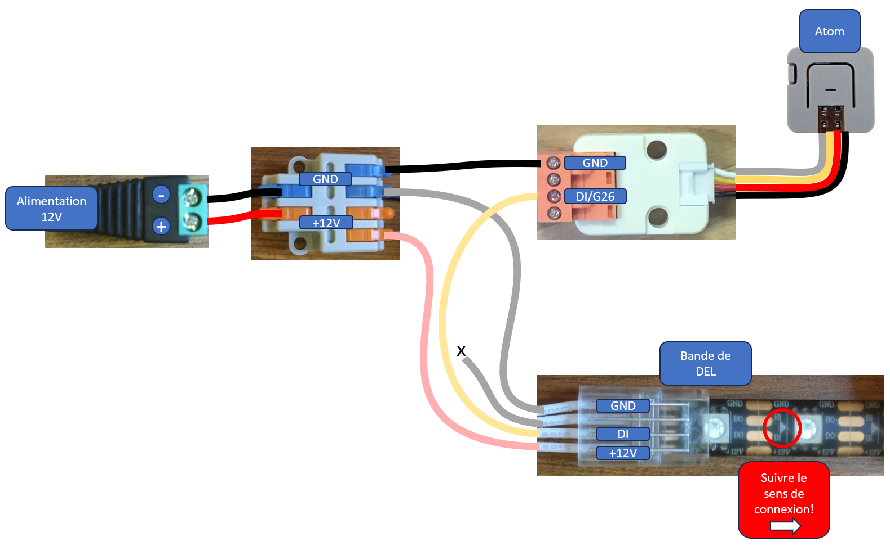
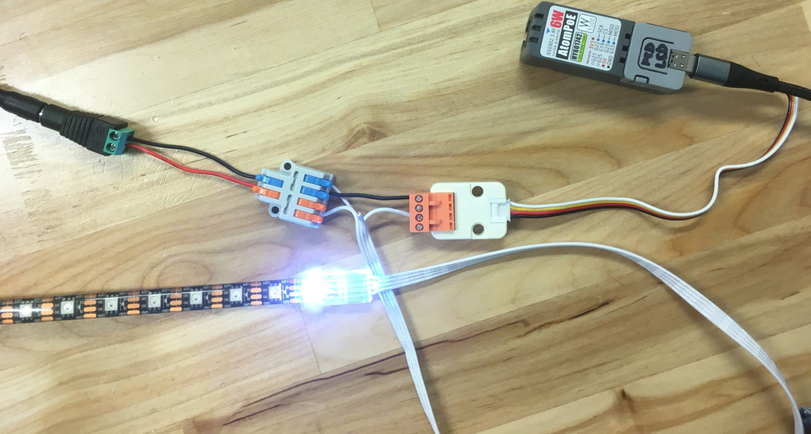

# Bande de pixels et Atom

Cette page décrit le câblage pour alimenter une **bande de LED 12 V** et transmettre le signal de données depuis un **Atom**.

 

Le montage comprend :

- Une **alimentation 12 V DC**
- Un **connecteur de distribution** pour le +12 V et le GND
- Un **Atom** servant de contrôleur
- Une **bande de LED adressables 12 V**
- Trois lignes électriques :
  - `+12V` : alimentation positive
  - `GND` : masse / 0 V
  - `DI` : signal de données

L'alimentation doit être raccordée au connecteur de distribution. Respecter impérativement la polarité.

La bande de LED possède trois connexions :

| Bande de LED | Fonction |
|---|---|
| `GND` | GND commun entre l'alimentation et l'Atom |
| `DI` | Signal de données |
| `+12V` | Alimentation 12 V |

Le câblage doit être :

```mermaid
flowchart LR
    A["+12V"] -->|+12V| LED["+12V"]
    G["GND"] -->|GND| LEDG["GND"]
    G -->|GND commun| ATG["GND"]
    AT["GPIO26 / G26"] -->|DI| DI["DI"]


LEDG --- LED
DI --- LED

subgraph ALIM["Alimentation 12 V"]
    A
    G
end

subgraph BANDE["Bande de DEL"]
    LED
    DI
    LEDG
end

subgraph ATOM["Atom"]
    AT
    ATG
end
````

Le `GND` de l'Atom et le `GND` de la bande LED doivent être **communs** afin que le signal de données ait la même référence électrique.

> [!WARNING]
> Ne jamais appliquer directement 12 V sur une entrée GPIO. Vérifier la tension d'alimentation réellement acceptée par le modèle exact d'Atom utilisé avant de raccorder son alimentation.


 

  