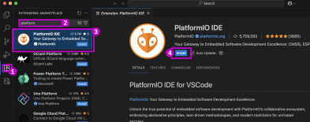
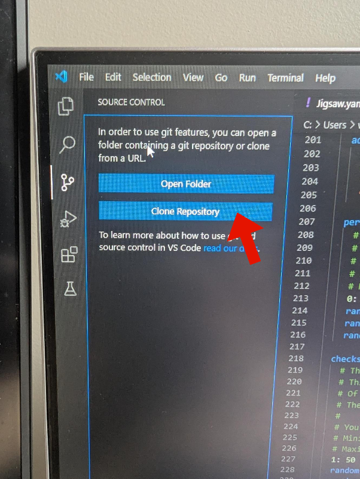
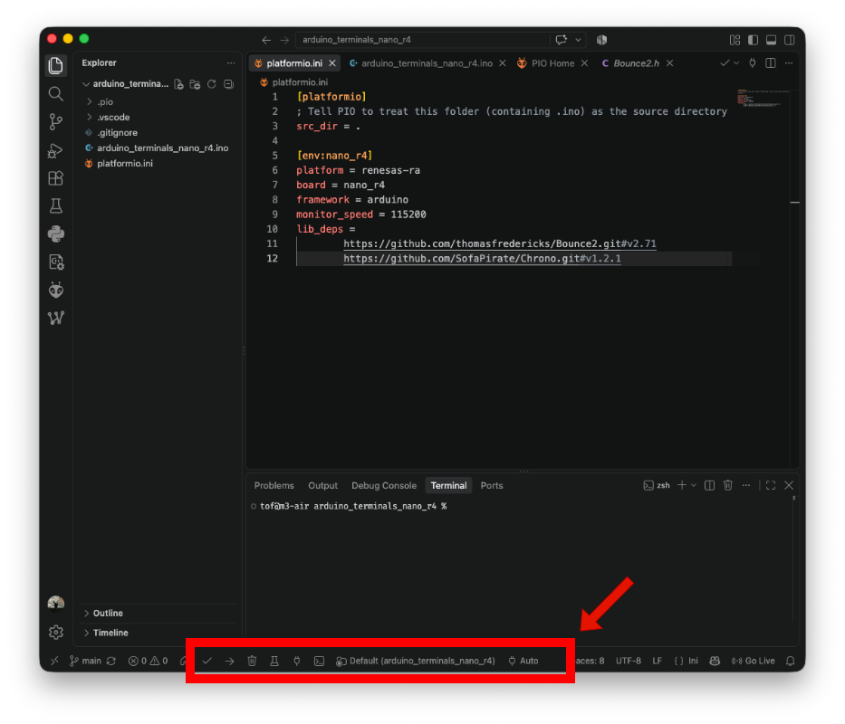

# Nouveau projet PlatformIO

## 0. Installation de PlatformIO dans Visual Studio Code




## 1. Créer d'un Git

- Créer un dépôt Git (avec un README.md) dont le nom :
    - ne contient pas d'espaces ou de caractères spéciaux sauf `_` ou `-`.


## 2. Cloner le dépôt Git l'ordinateur



## 3. Créer les fichiers

Créer les trois fichiers expliqués dans les prochaines sections :
```
📂 titre_du_projet 
    |- 📄 .gitignore 
    |- 📄 titre_du_projet.ino
    |- 📄 platformio.ini 

```

### 3.1 Fichier `.gitignore`

Créer un fichier `.gitignore`. 

> [!WARNING]
> Ne pas oublier le `.` au début du nom de fichier `.gitignore`

Y copier ceci :
```ini
.DS_Store
.pio
.vscode/.browse.c_cpp.db*
.vscode/c_cpp_properties.json
.vscode/launch.json
.vscode/ipch
```

### 3.2 Fichier `.ino`

Créer un fichier `.ino` qui porte le même nom que le dossier. Par exemple, si le dépôt se nomme `mon_projet_arduino`, nommer le fichier `mon_projet_arduino.ino`

> [!WARNING]
> Le fichier `.ino` doit avoir le même nom que le dossier !
> Ainsi le projet sera compatible avec le logiciel Arduino IDE.

Y copier ceci :
```cpp
// Le code minimal

#include <Arduino.h> 

void setup() {
  
}

void loop() {
 
}
```


### 3.3 Fichier `platformio.ini`

Créer un fichier `platformio.ini`. Y inclure cette section au début :
```ini
[platformio]
; Tell PIO to treat this folder (containing .ino) as the source directory
src_dir = .
```

> [!WARNING]
> Il faut ensuite ajouter la configuration spécifique au **bon** modèle de carte !


Suivre ces instructions suivantes pour le modèle indiqué :
* Arduino Nano ATMEGA328 : [configuration](/fabrication/arduino/nano/atmega#Configuration)
* Arduino Nano R4 : [configuration](/fabrication/arduino/nano/r4#Configuration)


## 4. Git commit

Ne pas oublier de faire un *commit* des modifications.

## 5. Rouvrir le projet dans  *Visual Studio Code*

Pour que *Visual Studio Code* charge le dossier en tant que projet *PlatformIO* il faut le rouvrir.

