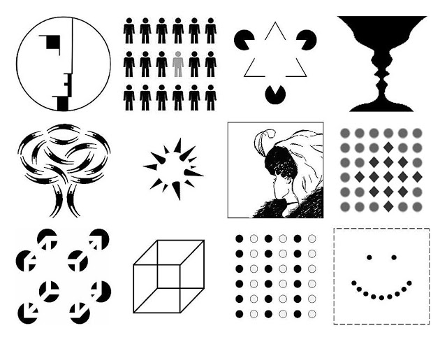

# Figure / fond 

## Gestalt 

La distinction figure / fond est une notion centrale en perception visuelle et sonore. Elle vient de la psychologie de la forme (Gestalt) et s’applique à toutes les disciplines de la création : design, musique, cinéma, son, etc. 

La relation figure/fond crée la hiérarchie visuelle et oriente la perception. 
Un bon design guide le regard en jouant sur : 
- Contraste (couleur, lumière, taille, forme) 
- Proximité / séparation 
- Mouvement ou direction

## La figure 

- C’est l’élément que l’œil identifie comme principal, devant, porteur de sens. C’est ce que le spectateur « regarde ». 
- C’est le son saillant, celui sur lequel l’attention se focalise. 

Exemples : 
- Dans un portrait, le visage est la figure. 
- Sur une affiche, le texte ou le logo mis en avant est la figure. 
- Dans un paysage, un arbre isolé ou un personnage peut devenir la figure. 
- Une mélodie dans une chanson. 
- Une voix principale dans un film. 
- Un bruit soudain dans un environnement calme. 

## Le fond 

- C’est l’arrière-plan sur lequel la figure se détache. Il donne du contexte, de la profondeur, et met la figure en valeur sans attirer l’attention. 
- C’est le contexte sonore, souvent continu, qui soutient ou encadre la figure. 

Exemples : 
- Le ciel derrière un personnage. 
- La texture ou la couleur uniforme qui sert de toile de fond. 
- Le bruit ambiant. 
- Les réverbérations d’un espace. 

