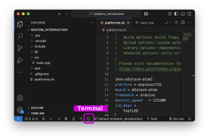
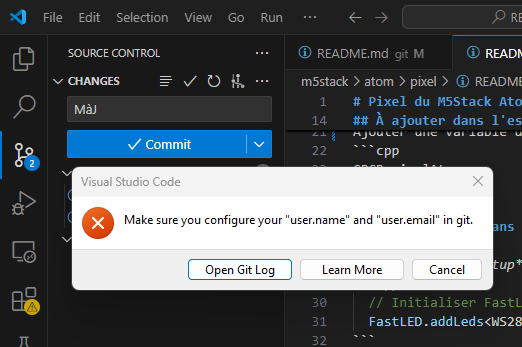

# Git — Ajout d'un projet à un dépôt

Voici les étapes pour ajouter un projet local à un dépôt Git hébergé sur un serveur distant.


## Créer votre projet localement

Dans **Visual Studio Code** ou un autre éditeur, créer un projet.


## Initialiser Git

Ouvrir un terminal dans le dossier du projet, et y exécuter les commandes qui suivent.



Pour créer le dépôt Git local :
- Initialiser un nouveau dépôt Git local dans le dossier courant. Cela crée un dossier caché `.git` qui contient l’historique de version.
- Créer et basculer sur une nouvelle branche nommée `main`.
- Ajouter tous les fichiers du projet à l’index Git (ce qui prépare les fichiers pour le commit).

Pour ce faire, exécuter les trois commandes suivantes :
```bash
git init
git checkout -b main
git add .
```

## Créer un dépôt distant

Créer un nouveau dépôt sur une plateforme comme :

* [Codeberg.org](https://codeberg.org/)
* [GitHub.com](https://github.com/)
* [GitLab.com](https://gitlab.com/)
* ou autre.

Copier dans le presse-papier l’URL HTTPS du dépôt une fois créé. 
Cette URL devrait ressembler à celle-ci :
```bash
 https://github.com/mon-nom/projet.git
```

Dans le terminal, connecter le dépôt local au dépôt distant `origin` en remplaçant `https://github.com/mon-nom/projet.git` par l'adresse URL HTTPS du dépôt distant copiée juste plus haut :
```bash
git remote add origin https://github.com/mon-nom/projet.git
```
> [!WARNING]
> Seulement si par accident la mauvaise adresse URL HTTPS a été ajoutée, la mauvaise adresse peut être enlevée avec la commande suivante `git remote remove origin`

Il faut ensuite :
- Récupérer les informations du dépôt distant.
- Créer une révision (*commit*) avec les fichiers du projet et y associer un message décrivant la révision.
- Envoyer la branche `main` (et ses commits) vers le dépôt distant.
L’option `-u` indique à Git de suivre cette branche par défaut — il sera ensuite possible d’utiliser simplement `git push` sans arguments.

Pour ce faire, exécuter les trois commandes suivantes :
```bash
git fetch origin
git commit -m "Initialisation"
git push -u origin main
```

> [!WARNING]
> Seulement si la commande `git push` précédente n'a pas fonctionné (parce que le dépôt distant contient un README.md par exemple), exécuter la commande `git merge origin/main --allow-unrelated-histories -m "Fusion"` et ensuite refaire le `git push` précédent.

Une fois ces étapes complétées, le projet est versionné localement *et* synchronisé avec le dépôt distant.

## Visual Studio Source Control

Pour utiliser **Visual Studio Source Control**, *git* doit être bien configuré sur l'ordinateur. Dans l'image suivante, on constate que Git n'est pas configuré :



Pour régler le problème, il suffit de configurer l'identité de l'utilisateur Git : [Configuration de l'identité Git](../configuration_identite/)