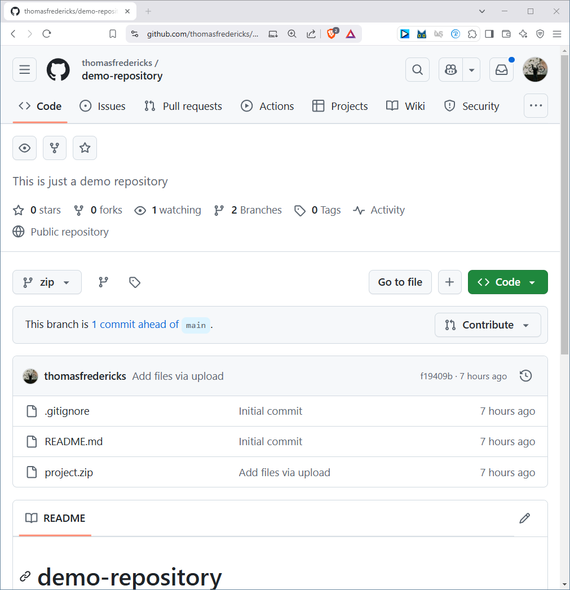
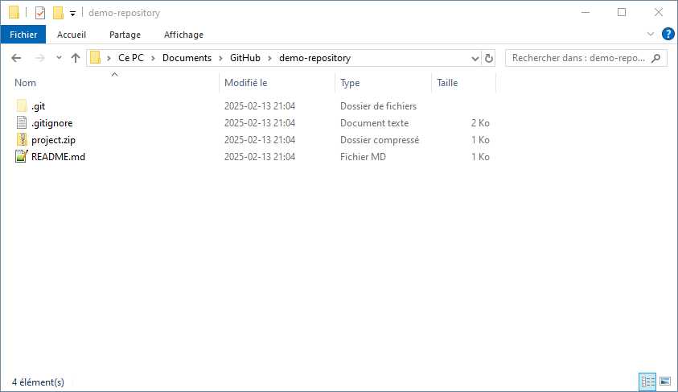
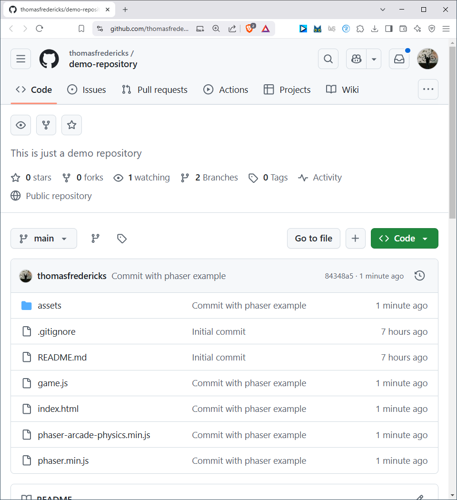
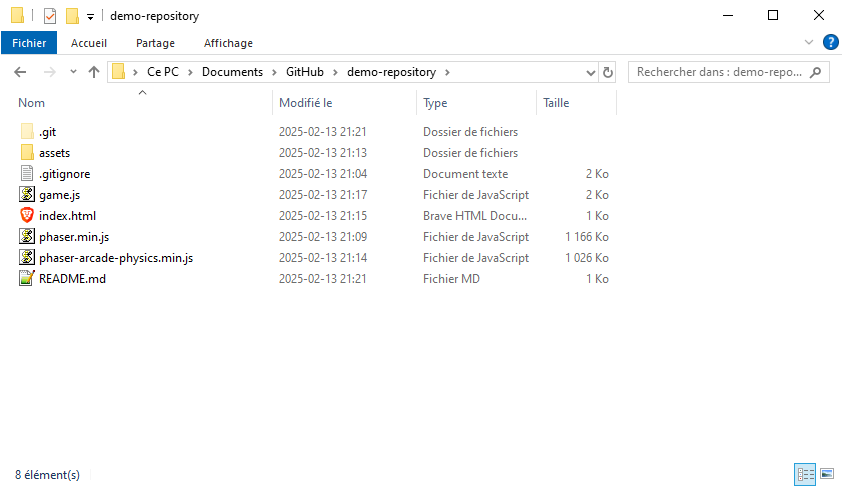
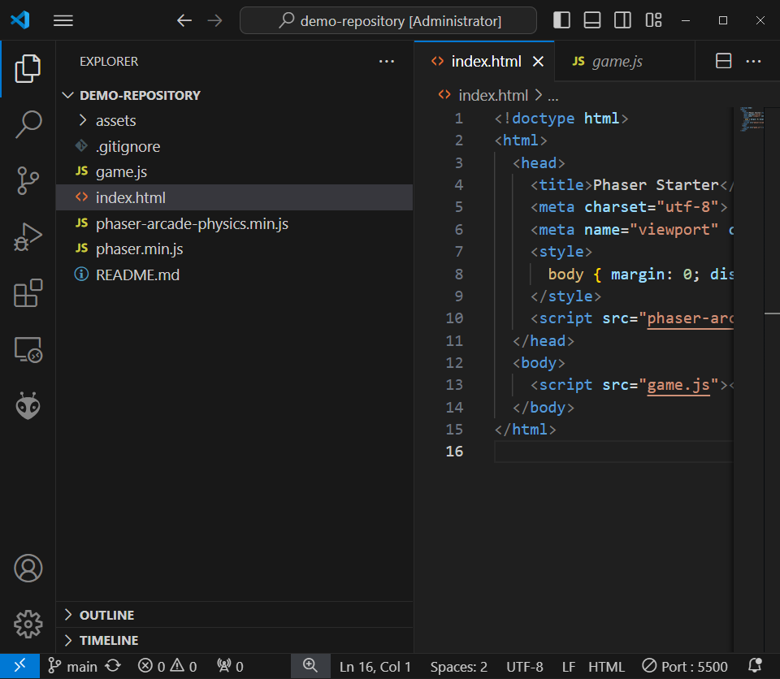
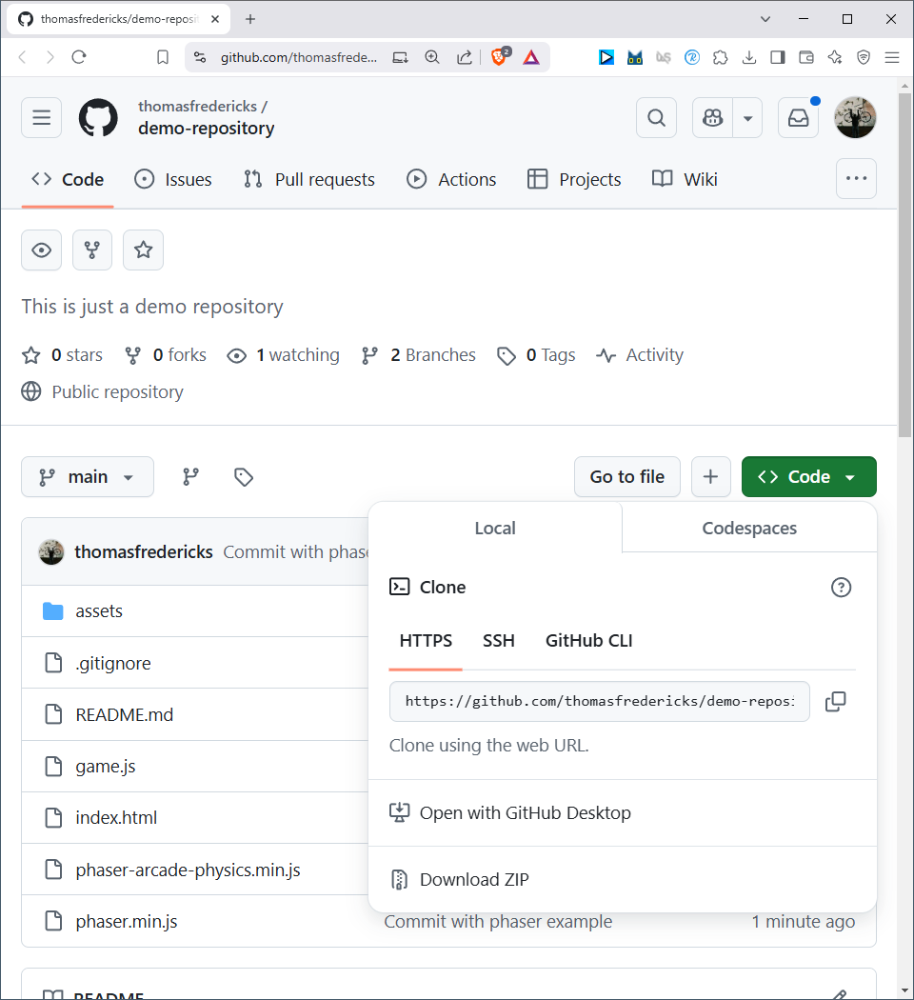
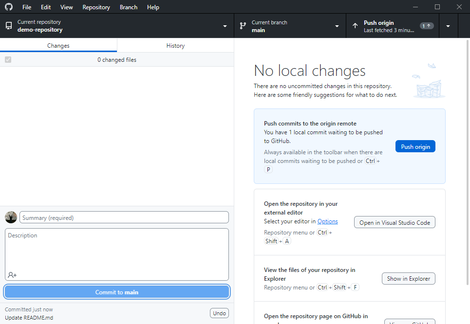
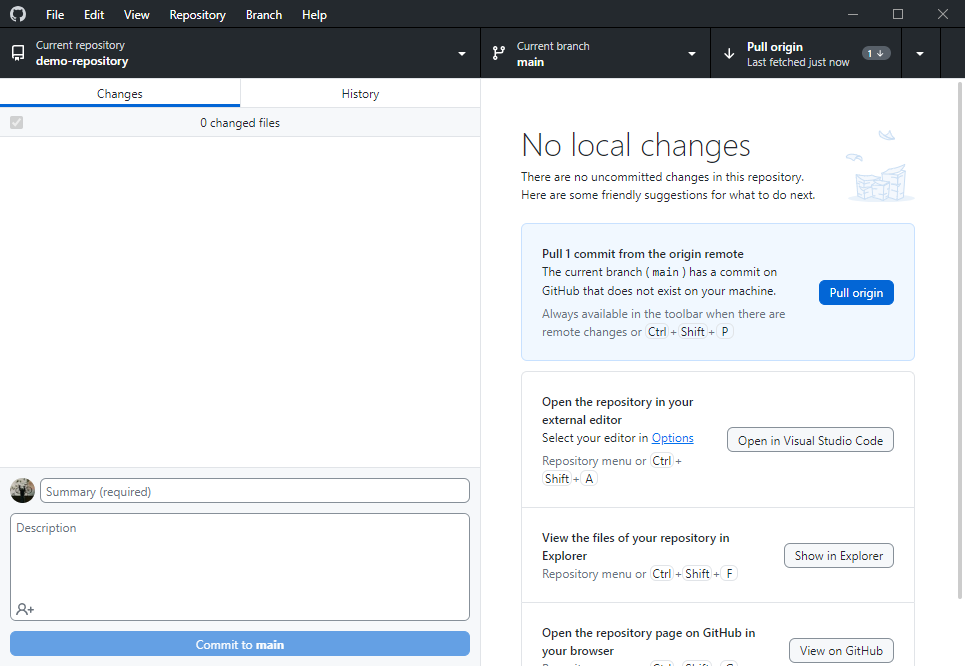

# GitHub

GitHub permet de synchroniser un projet sur un ordinateur, avec un clone en ligne ainsi qu'un clone avec des tierces personnes. 

## Ne pas utiliser GitHub pour archiver un projet

## Travailler directement dans le répertoire du projet

## Pour cloner un projet qui est en ligne vers l'ordinateur

## Après avoir modifié un projet, effectuer un «Commit» et un «Push

## Si quelqu'un d'autre modifie le projet, effectur un «Pull» pour récupérer les modifications

