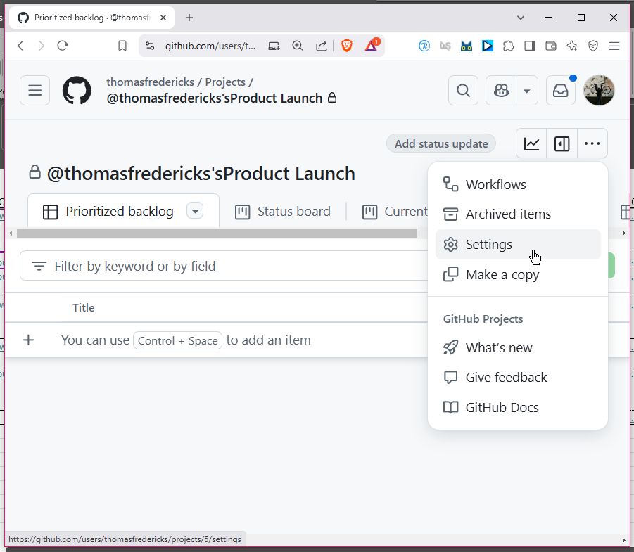
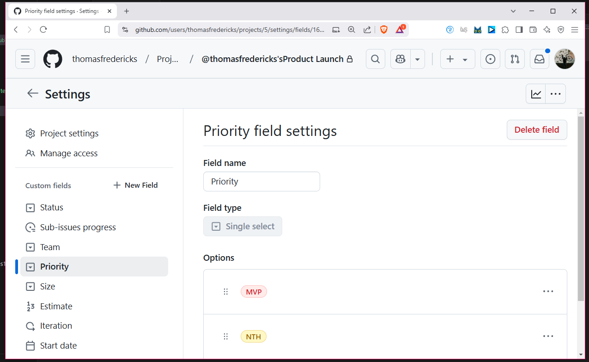
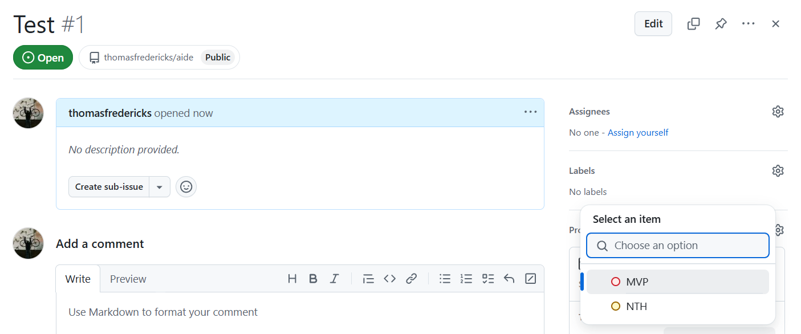

# Configurer les priorités

## Ouvrir les paramètres du projet

## Configurer les priorités pour avoir au minimum MVP et NTH

* MVP : *Minimum Viable Product*
* NTH : *Nice to Have*

## Assigner des priorités à vos *issues*

