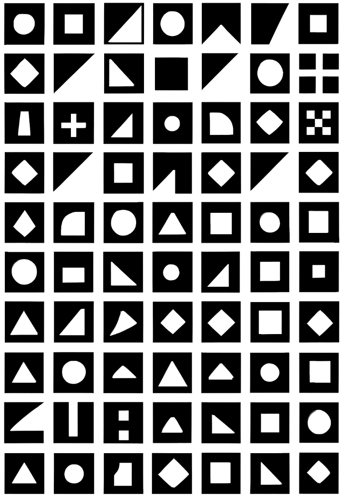

# Atelier graphique : 10x10

- Remplir une feuille avec une grille de 10x10.
- Itérer 100 fois sur le même concept.
- Durée : 60 minutes

## Exemples

### Concept de produit

Vous avez été engagé par une entreprise de sodas pour créer l’emballage d’une boisson énergisante biologique et abordable. Votre public cible : des jeunes de vingt ans aisés.

Commencez par trouver un nom et rédiger une description de la boisson. Ensuite, consacrez soixante minutes à réaliser cent croquis explorant différents designs possibles pour la boisson, en réfléchissant à la forme du contenant et à la typographie.

Ajouter un bloc de trente dernières minutes à la fin, où vous affinez vos cent croquis pour n’en retenir que trois versions finales, intégrant toutes vos meilleures idées.

### Op art (art optique)

Les œuvres d'op art sont essentiellement abstraites. Les pièces donnent l'impression de mouvement, d'éclat de lumière et de vibration ou de mouvements alternés.

Remplir les 100 cases avec des itérations uniques de noir et de blanc de formes géométriques.

