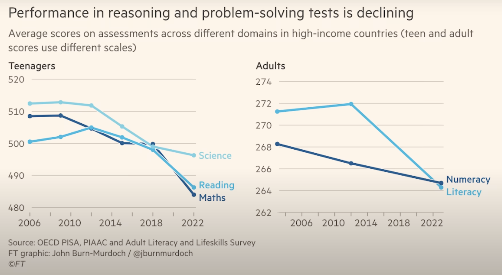

# Intelligence artificielle

## Types d'IA

Le terme « IA » sans qualitatif est un buzzword marketing qui embrouille le public.

* IA générative (GLM) : Chat GPT, Claude, Grok, etc
* IA générale (AGI) : hypothétique - n'existe pas
* IA spécifique bien délimitée : plus limité mais aussi plus durable

| **Critère** | **IA générative (GLM)** | **IA générale (AGI)** | **IA spécifique bien délimitée** |
|-------------|-------------------------------|------------------------|----------------------------------|
| **Domaine d'application** | Large éventail de tâches dans plusieurs domaines | Tous domaines, avec adaptation contextuelle comme un humain | Restreint, bien défini |
| **Contrôle et gouvernance** | ❌ Moins contrôlable, comportements complexes et parfois imprévus | 🤔 Autonome, nécessiterait des formes avancées de régulation et d’éthique | Fortement encadrée par des règles explicites |
| **Fiabilité et sécurité** | ❌ Risques de biais, d’erreurs ou de dérives | ❌❌ Risques amplifiés : imprévisibilité, potentiel d’action autonome | Prévisible et testable |
| **Transparence** | 🤔 Plus opaque, explicabilité partielle | 🤔 Potentiellement difficile à comprendre voire ininterprétable | Explicable, logique traçable |
| **Pertinence en contexte éducatif/public** | 🤔 Utile mais nécessite un encadrement | ❌ Hypothétique et potentiellement risquée sans garanties strictes | Idéale pour soutenir des objectifs ciblés |
| **Impact environnemental, énergétique et extractif** | ⛽️ Élevé : modèles massifs, infrastructure lourde | 🌎💥 Très élevé (hypothétique) : besoin d’énormes ressources pour l'entraînement, l’autonomie et la simulation générale | Faible à modéré |
| **Durabilité** | ❌ Moins durable, dépendance aux géants du cloud | ❌❌ Inconnue, mais probablement insoutenable dans sa forme actuelle | Soutenable et adaptable localement |
| **Coûts** | 💰💰💰 Très élevés : en données, calcul, maintenance | 💰💰💰💰💰💰 Extrêmement élevés (hypothétiques), en R&D, énergie, gouvernance | Faibles à modérés |
| **État actuel** | En usage courant (LLM, assistants IA) | Hypothétique, pas encore réalisée | Déjà largement déployée |

> [!NOTE]
> Contrairement à ce que l’on pourrait croire, les technologies IA ne sont pas récentes. Elles sont en développement depuis près de 75 ans, avec des racines remontant aux premiers modèles symboliques des années 1950.

> [!WARNING]
> Contrairement à la confusion véhiculée par le marking techno-solutionniste, un grand modèle de langage (GML) ne peut pas évoluer en intelligence artificielle générale (IAG). Ce sont deux technologies fondamentalement distinctes par leur architecture que par leur fonctionnement. 

## Questions critiques

### Sur l'enseignement

- **Utiliser ChatGPT pendant l'apprentissage pourrait nuire aux capacités de pensée critique**
  Une équipe de neurologues et spécialistes en IA du Media Lab du MIT a mené une étude sur l’impact des grands modèles de langage (LLM), comme ChatGPT, sur le cerveau des utilisateurs lors de tâches d’écriture, un groupe utilisant ChatGPT, un autre utilisant Google Search, et un dernier sans aucun outil. Les résultats montrent que le groupe sans assitance présentait la plus forte activité cérébrale et engagement mental, le groupe Google était intermédiaire, et le groupe ChatGPT avait la connectivité cérébrale la plus faible. Après plusieurs mois, ceux qui avaient utilisé ChatGPT précédemment ont montré une activité cérébrale plus faible et une mémoire moins performante. Ils ressentaient moins de sentiment de propriété sur leurs essais et avaient plus de difficultés à s’en souvenir ou à les citer. [Using ChatGPT to write essays may be eroding critical thinking skills](https://phys.org/news/2025-06-chatgpt-essays-eroding-critical-skills.html)

- **La personne qui utilise ou « prompte » une IA doit avoir une solide expertise du métier.**  
  Même si l’outil accomplit certaines tâches à sa place, **tout doit être vérifié, validé, corrigé**. Sans cette compétence métier, l’IA devient un générateur d’erreurs crédibles mais dangereuses.

- **Allons-nous enseigner à nos étudiants des outils ou des techniques voués à disparaître dans trois ans ?**  
  La rapidité des cycles d’innovation et d’obsolescence impose une réflexion de fond sur **ce qu’il est réellement pertinent de transmettre** : des compétences techniques à court terme, ou des capacités critiques, créatives et adaptatives qui résisteront au temps ?

- **Les diplômés seront remplacés par une IA générale (AGI)?**  
  Si l’on adhère au discours technosolutionniste selon lequel les machines finiront par surpasser les humains, alors **pourquoi continuer à former des étudiants** ? Que devient le sens de l’éducation dans un monde où l’AGI est censée tout faire à notre place ?

### Précédents

- **Les promoteurs de l’IA en éducation sont les mêmes qui ont introduit les téléphones intelligents et les réseaux sociaux.**  
  Or, nous avons vu **les impacts négatifs de ces technologies sur les jeunes** — isolement, détresse mentale, distraction permanente. Et maintenant, on nous dit : *« Cette fois-ci, ce sera différent ? »*

- **L’IA est un outil puissant, mais pas une transformation systémique en soi.**  
  L’exagération actuelle autour de l’IA rappelle les discours précédents sur le **bitcoin**, la **blockchain**, ou la **réalité virtuelle**. Il faut rester critique : **toute technologie n’est pas une panacée**.

### Promesses

- **La vision de la Silicon Valley sur l’IA est-elle fondée ?**  
  On nous promet que l’IA guérira le cancer, mettra fin à la faim dans le monde, etc. — mais **il n’y a actuellement aucune preuve scientifique concrète** que ces affirmations soient réalisables.

- **Comment peut-on vouloir reproduire l’intelligence humaine alors même que la science ne s’entend pas sur ce qu’est l’intelligence humaine ?**  
  Il n’existe **aucun consensus scientifique clair** sur la nature de l’intelligence, de la conscience, ou de l’intention.

### Droit d'auteur

-  **Événement révélateur sur le droit d'auteur**
    Le 8 mai 2025, le président Trump a congédié **Carla Hayden**, bibliothécaire du Congrès, **un jour après** la publication par l’US Copyright Office d’un rapport préliminaire sur **l’IA et le droit d’auteur**.  Ce rapport indiquait que l’entraînement des IA sur des œuvres protégées **ne relève probablement pas du fair use**, ce qui **remet en cause la légalité** de nombreuses pratiques actuelles.

### Quel futur nous propose-t-on vraiment ?

- **Un futur d’extractivisme numérique** :  
  - Disparition de la vie privée  
  - Surveillance accrue  
  - Précarité des emplois  
  - Productivité accrue sans gain salarial

- **Le sentiment d’inévitabilité est une construction narrative.**  
  Silicon Valley cultive l’idée que « le futur est déjà écrit ». Mais **l’histoire des empires technologiques montre que tous peuvent s’effondrer** : IBM, les États-Unis, Yahoo, Nokia… Et bien d’autres.

### Nous vivons présentement l'âge d'or de l'IA, sur le point de se terminer

- **Le coût d’utilisation des grands modèles de langage (GML) est aujourd’hui artificiellement bas.**  
  Leur accès est **fortement subventionné** par le capital-risque, ce qui donne l’illusion qu’ils sont peu coûteux, voire gratuits. Mais ces subventions sont en train de s’évaporer...
- Nous constatons le développement de  **Sycophant AI** : des IA conçues pour dire ce que l'utilisateur veut entendre, sans esprit critique.
  - [AI-Fueled Spiritual Delusions Are Destroying Human Relationships](https://www.rollingstone.com/culture/culture-features/ai-spiritual-delusions-destroying-human-relationships-1235330175/)
- Le **marketing** est au cœur du discours sur l’IA et prochainement de ses produits :  
  - **Kate Rouch**, ancienne de Meta, est aujourd’hui la première directrice du marketing d’OpenAI.
- Les erreurs abondent :
  - CamoGPT, une IA développée par l’armée américaine, a récemment été utilisée pour supprimer automatiquement des contenus jugés non conformes à de nouvelles directives politiques. Cette opération a mené à des erreurs notables, comme la suppression d’archives historiques liées au bombardier Enola Gay, simplement à cause de son nom contenant le mot "Gay". L’IA a également écarté d’autres documents importants liés à des figures militaires historiques, révélant les limites graves de ces systèmes lorsqu’ils manquent de compréhension contextuelle. Ces incidents soulignent l’importance d’une supervision humaine dans les usages sensibles de l’IA.
  - [Therapy Chatbot Tells Recovering Addict to Have a Little Meth as a Treat](https://futurism.com/therapy-chatbot-addict-meth)
- Les manipulations abondent :  
  - L’IA **Grok**, développée par xAI (Elon Musk), a été accusée de **diffuser de fausses informations**, comme la théorie du « génocide blanc » en Afrique du Sud.
- **Atteinte du plafond du développement de l'IA générative**
  Le développement de l’IA générative a progressé à un rythme effréné, mais il pourrait exister une limite mathématique infranchissable — un plafond — qui marquerait la fin de son évolution fulgurante.
  Beaucoup misent sur l’idée de rendre l’IA générative toujours plus intelligente — mais que se passe-t-il si les données nécessaires à son développement n’existent tout simplement plus ? [AI Has a Fatal Flaw—And Nobody Can Fix It - YouTube](https://www.youtube.com/watch?v=_IOh0S_L3C4)

### Perfomances d'un GLM 

Un GML, c’est un très bon imitateur qui peut parler comme un philosophe, un ingénieur ou un poète — mais qui ne comprend pas vraiment ce qu’il dit.  On y projette  des intentions ou des capacités qu’il n’a pas.

#### Complétences humaines vs machines

| **Compétences**                                           | **Humains** | **Machines** |
|-----------------------------------------------------------|-------------|-----------------|
| Opérations mathématiques                                  |             | ✅              |
| Mémoire et rappel                                         |             | ✅              |
| Raisonnement général (tests de QI)                        |             | ✅              |
| Prise de décision (scénarios de type jeu)                 |             | ✅              |
| Programmation de base                                     |             | ✅              |
| Bon sens                                                  | ✅          |                 |
| Créativité                                                | ✅          |                 |
| Prise de décision (dans le monde réel)                    | ✅          |                 |
| Mathématiques (résolution de problèmes complexes/créatifs)| ✅          |                 |

#### Capacité d'un GLM pour jouer à un jeu

| Type de jeu                               | Performance d’un LLM | Remarques                                                               |
| ----------------------------------------- | ------------------------- | ----------------------------------------------------------------------- |
| **Échecs, Go, Shōgi**                     | ❌ Faible                  | Suit mal l’état du jeu, oublie les règles ou fait des coups illégaux    |
| **Morpion (Tic-Tac-Toe)**                 | ✅ Bonne                   | Jeu simple, facile à suivre en texte                                    |
| **Énigmes logiques**                      | 🤷 Moyenne                | Raisonnement souvent instable ou incohérent                             |
| **Jeux de stratégie (Catan, Risk, etc.)** | 🤔 Inconstante            | Peut simuler des dialogues ou des choix, mais sans planification réelle |
| **Jeux avec grille (Connect Four, etc.)** | 😬 Limite                 | Possible sur quelques tours, mais perd le fil rapidement                |

#### Limites d'un GLM à extrapoler

## Le monde devient plus idiot

La majeure partie de cette section est tirée de [AI Is Making You Dumber - YouTube](https://www.youtube.com/watch?v=G-cdVurdoeA).

### Témoignages d'étudiants

- « J’ai l’impression de trop dépendre de l’IA, et que ça m’a enlevé ma créativité. »
- « Je suis devenu plus paresseux. L’IA rend la lecture plus facile, mais elle fait lentement perdre à mon cerveau la capacité de penser de manière critique ou de comprendre chaque mot. »
- « C’est utile, mais j’ai peur qu’un jour, on préfère lire uniquement des résumés générés par l’IA plutôt que les nôtres, et qu’on devienne très dépendants de l’IA. »

L'IA est comme une dépendance, qui graduellement réduit notre capacité intelectuelle lorsqu'utilisé dans un contexte académique.

### Recherches corporatives

- « Microsoft Research a découvert que plus les gens avaient confiance en l’IA, moins ils faisaient preuve de pensée critique lorsqu’ils l’utilisaient. »
- « Une étude menée par Anthropic, qui développe le programme d’IA Claude, a révélé que les étudiants l’utilisaient pour déléguer les tâches de réflexion difficile. L’étude ajoute qu’il existe des inquiétudes légitimes : les systèmes d’IA pourraient devenir une béquille pour les étudiants, freinant le développement des compétences fondamentales nécessaires à une pensée de plus haut niveau. »

Les entreprises qui développent l’IA — ce produit qu’elles affirment pouvoir révolutionner positivement la société humaine — nous disent aussi que leur produit est littéralement en train de nous rendre plus bêtes.
C’est comme si les fabricants de cigarettes découvraient qu’elles provoquent le cancer, mais disaient ensuite :
« Non non, le cancer est une fonctionnalité. Le cancer arrive, et il va falloir s’adapter. »
Cela va aussi éliminer beaucoup d’emplois… ainsi que ceux qui les occupent.

## Comment avoir un avantage compétif en tant que futur diplômé

- 💡 **Le piège de l’IA** : 
  - Utiliser ChatGPT ou toute autre IA pour remplacer ta propre réflexion affaiblit réellement la machine neurologique entre tes deux oreilles.
  - Elle devient plus faible et moins performante.

- 🧠 **L'avantage du cerveau humain** : 
  - Les étudiants qui ont écrit leurs dissertations avec leur cerveau humain unique et magnifique ont obtenu de meilleurs résultats.
  - Et surtout, ils n’ont pas régressé intellectuellement par la suite, même en utilisant l’IA plus tard.

- 🚫 **Ne laisse pas l’IA penser à ta place** : 
  - Refuser de laisser l’IA penser à ta place te rend non seulement plus intelligent, mais aussi plus résistant aux effets d’affaiblissement cognitif liés à l’IA.

- ✊ **Bonne nouvelle** :  
  - C’est encourageant.
  -  **Même si l’IA semble écrasante, nous pouvons riposter en insistant pour utiliser notre esprit humain.**

- 🎓 **Un conseil simple aux étudiants** 
  - Tu veux dépasser tous les autres qui utilisent l’IA pour faire leurs devoirs ? 
  - Alors n’utilise pas l’IA pour faire les tiens.

- 📝 **Oui, ce sera dur...**
  - Tu devras écrire toi-même.
  - Tu te sentiras peut-être bête.
  - Tu galéreras avec des problèmes.
  - Ce sera long et agaçant.

- 🧠 **...Mais tu seras plus intelligent**
  - Tu deviendras plus intelligent.
  - Et donc plus capable que ceux qui t’entourent — pour le reste de ta vie.

- 🏋️ **Comme aller à la salle de sport**
  - C’est pénible sur le moment,
  - mais tu t’en porteras mieux toute ta vie.

