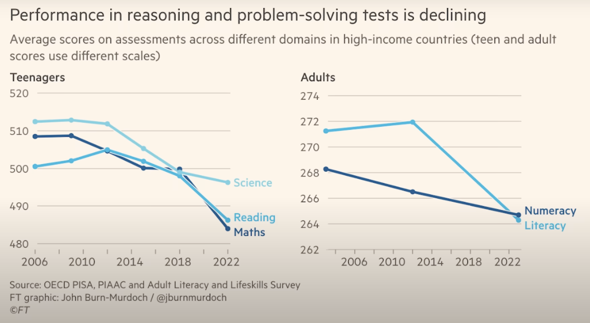
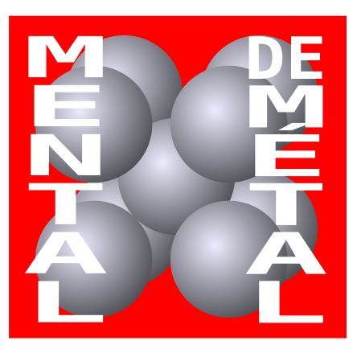

# IA : impact sur l'enseignement

- **Utiliser ChatGPT pendant l'apprentissage pourrait nuire aux capacités de pensée critique**
  Une équipe de neurologues et spécialistes en IA du Media Lab du MIT a mené une étude sur l’impact des grands modèles de langage (IAG), comme ChatGPT, sur le cerveau des utilisateurs lors de tâches d’écriture, un groupe utilisant ChatGPT, un autre utilisant Google Search, et un dernier sans aucun outil. Les résultats montrent que le groupe sans assitance présentait la plus forte activité cérébrale et engagement mental, le groupe Google était intermédiaire, et le groupe ChatGPT avait la connectivité cérébrale la plus faible. Après plusieurs mois, ceux qui avaient utilisé ChatGPT précédemment ont montré une activité cérébrale plus faible et une mémoire moins performante. Ils ressentaient moins de sentiment de propriété sur leurs essais et avaient plus de difficultés à s’en souvenir ou à les citer. [Using ChatGPT to write essays may be eroding critical thinking skills](https://phys.org/news/2025-06-chatgpt-essays-eroding-critical-skills.html)

- **La personne qui utilise ou « prompte » une IAG doit avoir une solide expertise du métier.**  
  Même si l’outil accomplit certaines tâches à sa place, **tout doit être vérifié, validé, corrigé**. Sans cette compétence métier, l’IA générative devient un générateur d’erreurs crédibles mais dangereuses.

- **Allons-nous enseigner à nos étudiants des outils ou des techniques voués à disparaître dans trois ans ?**  
  La rapidité des cycles d’innovation et d’obsolescence impose une réflexion de fond sur **ce qu’il est réellement pertinent de transmettre** : des compétences techniques à court terme, ou des capacités critiques, créatives et adaptatives qui résisteront au temps ?

- **Les diplômés seront remplacés par une IA générale (AGI)?**  
  Si l’on adhère au discours technosolutionniste selon lequel les machines finiront par surpasser les humains, alors **pourquoi continuer à former des étudiants** ? Que devient le sens de l’éducation dans un monde où l’AGI est censée tout faire à notre place ?

### Autres commentaires

## Le monde devient plus idiot

La majeure partie de cette section est tirée de [AI Is Making You Dumber - YouTube](https://www.youtube.com/watch?v=G-cdVurdoeA).

### Témoignages d'étudiants

Voici des témoignages d'étudiants recueillis par [The Chronicle of Higher Education | Higher Ed News, Opinion, & Advice](https://www.chronicle.com/) :
- « J’ai l’impression de trop dépendre de l’IA, et que ça m’a enlevé ma créativité. »
- « Je suis devenu plus paresseux. L’IA rend la lecture plus facile, mais elle fait lentement perdre à mon cerveau la capacité de penser de manière critique ou de comprendre chaque mot. »
- « C’est utile, mais j’ai peur qu’un jour, on préfère lire uniquement des résumés générés par l’IA plutôt que les nôtres, et qu’on devienne très dépendants de l’IA. »

Lorsqu'elle est utilisée dans un contexte académique, l'IA générative est comme une dépendance, qui réduit graduellement notre capacité intelectuelle.

### Recherches corporatives

- « Microsoft Research a découvert que plus les gens avaient confiance en l’IA, moins ils faisaient preuve de pensée critique lorsqu’ils l’utilisaient. »
- « Une étude menée par Anthropic, qui développe le programme d’IA Claude, a révélé que les étudiants l’utilisaient pour déléguer les tâches de réflexion difficile. L’étude ajoute qu’il existe des inquiétudes légitimes : les systèmes d’IA pourraient devenir une béquille pour les étudiants, freinant le développement des compétences fondamentales nécessaires à une pensée de plus haut niveau. »

Les entreprises qui développent l’IA — ce produit qu’elles affirment pouvoir révolutionner positivement la société humaine — nous disent aussi que leur produit est littéralement en train de nous rendre plus bêtes.
C’est comme si les fabricants de cigarettes découvraient qu’elles provoquent le cancer, mais disaient ensuite : « Non non, le cancer est une fonctionnalité. Le cancer arrive, et il va falloir s’adapter. »
Cela va aussi éliminer beaucoup d’emplois… ainsi que ceux qui les occupent.

## Comment avoir un avantage compétif en tant que futur diplômé

- 💡 **Le piège des IAG** : 
  - Utiliser ChatGPT ou toute autre IAG pour remplacer ta propre réflexion dans un contexte éducatif affaiblit réellement tes capacités cognitives.
  - Ton intellect devient plus faible et moins performant.

- 🧠 **Renforcer son cerveau : mental de métal** : 
  - Les étudiants qui ont réalisé leurs travaux avec leur cerveau obtiennent *à long terme* de meilleurs résultats.
  - Et surtout, leur intellect ne régresse pas en utilisant une IAG plus tard.
  - Refuser de laisser l’IA générative penser à ta place te rend plus résistant aux effets d’affaiblissement cognitif liés à l’IA générative.

- ✊  **Un conseil simple aux étudiants** 
  - Tu veux dépasser tous ceux qui utilisent l'IA générative pour faire leurs travaux, surtout quand vous serez sur le marché du travail (pour faire plus d'argent 🤑) ?
  - Alors n’utilise pas d'IAG pour faire tes travaux!

- 🏋️ **Oui, ce sera dur... comme aller à la salle de sport...**
  - Tu devras écrire toi-même.
  - Tu te sentiras peut-être bête.
  - Tu galéreras avec des problèmes.
  - Ce sera long, agaçant et pénible sur le moment,
  - mais tu t’en porteras mieux toute ta vie.

- 🏆 **...Mais tu seras meilleur que tous les autres**
  - Tu deviendras plus résistant intellectuellement et auras développé de meilleures facultés cognitives.
  - Tu seras donc plus capable que ceux qui t’entourent — pour le reste de ta vie.

