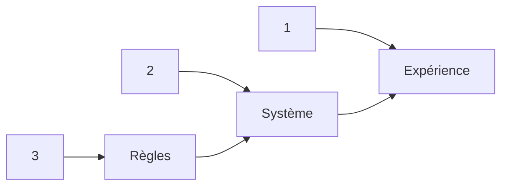

# Design de l'interactivité

## Règles → Système → Expérience

Concevoir l’interactivité implique de penser à **trois niveaux**, étroitement liés.

1. **Les règles sont les briques de base.**  
2. **Le système applique les règles.**  
3. **L’expérience est la perspective du joueur.**  

Illustration rapide - prenons *La chaise musicale* :  
- **Règles :** La musique joue, on tourne autour des chaises ; quand elle s’arrête, il faut s’asseoir ; on enlève une chaise à chaque manche.  
- **Système :** Un non-joueur contrôle la musique. Les joueurs rivalisent pour des ressources limitées, ce qui crée élimination et tension croissante.  
- **Expérience :** Chaos ludique, attente nerveuse, éclats de rire, compétition rapide.  

### Concevoir l’interactivité, c’est travailler **à rebours** :  

La conception s'effectue **à rebours** : 
- **3. Expérience :** Que veux-tu que les joueurs ressentent ?  
- **2. Système :** Quels dynamiques et motifs produisent ce ressenti ?  
- **1. Règles :** Quelles instructions simples vont générer ce système ?  

### Règles 

-  Instructions explicites qui définissent ce qui est permis, interdit ou obligatoire.  
- Énoncés simples comme « Les joueurs ne peuvent se déplacer qu’en diagonale », « Tu dois piocher une carte par tour », « Tu ne peux pas parler ».  
- Les règles sont abstraites. Elles ne décrivent pas *le comportement*, elles le prescrivent.  

Exemple :  
- Règle : *Aux échecs, les fous se déplacent uniquement en diagonale.*  

### Système
- L’assemblage qui résulte des règles qui interagissent entre elles et avec des ressources (espace, objets, temps, joueurs).  
- L'ensemble produit des motifs, des stratégies, des contraintes, de la complexité émergente.  
- Les systèmes sont ce qu’on peut analyser : boucles de rétroaction, équilibre, rythme, progression.  

Exemple :  
- Système : *Les échecs sont un duel stratégique où les contraintes de mouvement, la capture des pièces et le tour par tour se combinent en un vaste espace de décision. Plus la partie progresse, plus il y a de conflits et mons les joueurs ont de pièces*  

### Expérience
-  La dimension *ressentie* — ce que vivent les joueurs : tension, joie, frustration, maîtrise, flow, rire.  
- Subjective, mais façonnée par le système.  
- L’expérience est l’objectif final : les concepteurs ne créent pas seulement des règles, ils conçoivent les conditions pour un ressenti.  

Exemple :  
- Expérience : *Les échecs se vivent comme un affrontement tendu, réfléchi et compétitif, qui récompense la prévoyance et punit les erreurs.*  
