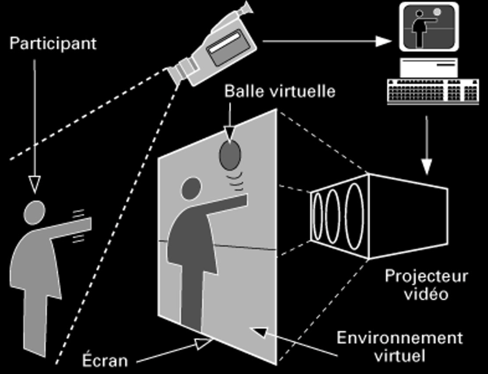

# Petite histoire de l'installation interactive​

## Ada Lovelace

Ada Lovelace a écrit le premier programme informatique en 1842.

## Hilma af Klint (1915)

Pionnière de l'art abstrait​. 

> « Les peintures se sont peintes directement à travers moi, sans esquisse préliminaire et avec grande force Je n'avais aucune idée de ce que ces images allaient représenter, néanmoins je travaillais vite et avec assurance, sans changer aucun trait de pinceau. »​

## Marcel Duchamp (1920)

Duchamp ne s'intéresse pas à ce qu'il appelle « l'art rétinien ». Un art qui n'est que visuel — et cherche d'autres modes d'expression. ​

Les ready-mades soulèvent de très nombreuses questions. Par exemple, parce qu'ils n'ont pas été réalisés par l'artiste, ils rendent problématiques un certain nombre de concepts, voire de certitudes, concernant la définition de l'art et le rôle de l'artiste, et plus spécifiquement les notions d'original, de savoir-faire, de virtuosité et d'œuvre. ​

Pour Marcel Duchamp, « c'est le regardeur qui fait le tableau ».​ [Rotary Glass Plates (Precision Optics). 1969 on Vimeo](https://vimeo.com/29887718)

## GRAV

Les artistes opto-cinétiques Horacio Garcia Rossi, Julio Le Parc, François Morellet, Francisco Sobrino, Joël Stein, Yvaral se sont réunis dans un collectif, le Groupe de recherche d'art visuel (GRAV) avec pour but de permettre à tous de pouvoir approcher leur art. Ils distribuent leur manifeste lors de la 3e biennale de Paris en octobre 1963 sous forme de tract s’intitulant « Assez de mystifications » et contenant les lignes suivantes :  

> « Nous voulons intéresser le spectateur, le sortir des inhibitions, le décontracter.  
> Nous voulons le faire participer.  
> Nous voulons le placer dans une situation qu'il déclenche et qu'il transforme.  
> Nous voulons qu'il s'oriente vers une interaction avec d'autres spectateurs.  
> Nous voulons développer chez le spectateur une forte capacité de perception et d'action ».  

Source : Le GRAV sur le site d'Artmag [archive](http://www.artmag.com/galeries/c_frs/mordoch/grav/grav.html).

## Ivan Sutherland (1963, 1965)

- [Head Mounted Display - YouTube](https://www.youtube.com/watch?v=7B8aq_rsZao)
- [Ivan Sutherland Sketch Pad Demo - Short version - YouTube](https://www.youtube.com/watch?v=YB3saviItTI)

## Myron Kreuger (1975,1989)

> « L’esthétique de l’image et du son est secondaire. La réactivité est le médium principal. »​ - Myron Krueger

- [Videoplace - Myron Krueger](https://aboutmyronkrueger.weebly.com/videoplace.html)
- [Myron Kreuger - Video Place - 1989 - YouTube](https://www.youtube.com/watch?v=dqZyZrN3Pl0)

Myron Krueger de l’Artificial Reality Corporation est reconnu comme le premier chercheur en informatique à avoir trouvé un moyen d’entrer dans le monde virtuel. Son « Videoplace » est devenu un point de rencontre pour les hackers de la réalité. Imaginez devenir votre propre ombre et pouvoir interagir avec les ombres d’autres personnes dans un espace simulé, les toucher et être touché. L’objectif de Krueger est de créer justement un tel monde d’ombres où les gens peuvent se relier les uns aux autres d’une manière tout à fait impossible dans le monde physique.

Et cela fait partie du concept général de « Videplace », où des personnes se rassemblent dans la réalité artificielle. En d’autres termes, ce qui se passe maintenant entre les deux personnes, c’est que nous interagissons d’une manière que les humains n’ont jamais pu expérimenter auparavant. L’une des principales attractions est aussi la juxtaposition du grand et du petit, de sorte que les deux personnes vont désormais interagir et, dans une certaine mesure, découvrir quelles sont les possibilités, ce que suggère émotionnellement l’échelle.